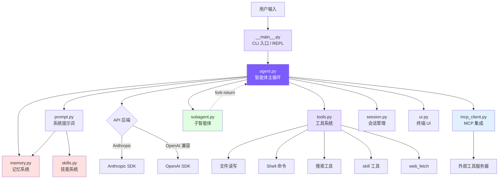

# 引言：为什么从零造一个 Claude Code？

## 本章目标

> 本教程已按当前仓库整理为 Python-only 版本：本项目实现均位于 `mini_claude/`，命令入口为 `mini-claude` 或 `python -m mini_claude`。涉及 Claude Code 上游源码时，只作为架构对照；真正要阅读和运行的代码都在本仓库的 Python 文件里。

理解项目定位、技术栈选择和整体架构，5 分钟内跑起来你自己的编程智能体。

这份教程不是 API 手册，也不是把源码逐行翻译一遍。更合适的读法是：先知道一次请求会经过哪些模块，再回到代码里看每个模块为什么只负责这一小块。读完本章后，你应该能打开 `mini_claude/agent.py` 不再害怕它的长度，因为你知道里面大致分成：初始化、会话入口、压缩、工具执行、Plan Mode、子智能体、Anthropic 后端、OpenAI 兼容后端这几段。

## 为什么要从零造？

### AI 编程的三个阶段

AI 辅助编程大致经历了三个阶段：**代码补全**（Copilot）→ **聊天助手**（Cursor Chat）→ **自主 Agent**（Claude Code）。

前两个阶段的共同限制是：**模型不能执行操作**。它只能给建议，无法自己跑测试看结果。

Claude Code 是一个质的飞跃。你说"给这个项目加用户注册功能"，它会自己搜索路由定义、读取数据库模型、创建 handler 文件、注册路由、写测试、运行测试命令、看到失败、修复、再跑——循环十几次，直到通过为止。

这就是 **受控工具循环 Agent**：模型是决策者，代码只是执行环境。

### Agent-first 意味着什么

传统程序里，代码逻辑决定行为——`if/else` 都是程序员预先写好的。Agent 架构反过来：**模型决定下一步做什么**，代码只提供循环框架和工具。

这并不表示代码变得不重要。恰恰相反，Agent 程序里的代码负责划清边界：模型可以提出“我要读这个文件”“我要运行测试”“我要编辑这一段”，但真正能不能执行、怎么执行、执行结果怎么回到上下文，都由代码控制。你可以把模型看成驾驶员，把工具系统、权限系统、上下文管理看成车辆本身的方向盘、刹车和仪表盘。

在当前 Python 版里，这个边界主要体现在 `mini_claude/agent.py` 和 `mini_claude/tools.py`。`agent.py` 负责循环：调用模型、解析工具调用、执行工具、把结果喂回模型。`tools.py` 负责能力：读写文件、搜索、运行命令、权限判断。模型只能通过这些定义好的工具影响真实世界，不能直接越过代码去操作文件系统。

整个系统的核心是一个 `while (true)` 循环：

```
while (true) {
    调用模型 → 模型返回响应
    if (响应包含工具调用) → 执行工具 → 把结果喂回模型 → 继续循环
    if (响应只是文本) → 任务完成，退出循环
}
```

**只有当模型的响应不包含任何工具调用时，循环才会退出**——是模型，而不是代码逻辑，决定任务是否完成。

### 为什么不直接读源码

Claude Code 的开源快照有 50 万行代码：66+ 工具、React/Ink TUI、MCP 协议、OAuth 认证、多代理系统……直接读很容易迷失在边界情况和抽象层里。

我们的做法：**只保留最小必要组件**，用约 3800 行 Python 代码复现核心能力（记忆、技能、多智能体、权限规则、分级压缩、预算控制、规划模式），每一步都尽量落到当前仓库的真实代码上。它不像完整 Claude Code 那样覆盖所有边界场景，但主干足够完整：模型能看项目、能调用工具、能写文件、能被权限拦住、能压缩上下文，也能把复杂任务交给子智能体。

## 核心概念速览

**智能体循环**：思考—行动—观察的循环。模型收到请求后决定调用哪个工具，系统执行工具并把结果反馈给模型，模型继续思考，直到不再发出工具调用。

**工具系统**：工具是智能体和真实世界交互的桥梁。我们在系统提示词里描述每个工具的名字和参数，模型需要时返回结构化的工具调用请求，代码执行后把结果喂回去。

工具系统的关键不是“有几个函数”，而是“模型和代码之间有一份契约”。工具定义告诉模型参数格式，执行函数把参数变成真实操作，权限层决定操作是否允许。后面第 2 章会展开这个契约怎么写、怎么执行、怎么防止误操作。

**上下文工程**：模型的表现完全取决于它看到了什么。上下文窗口有限（200K tokens），但复杂任务可能跑几十轮——所以需要压缩。我们实现了 4 级压缩：裁剪大块输出 → 摘要工具结果 → 模型总结整段对话，每级比上一级激进，系统尽量用最轻的方式解决问题。

这里的“上下文”包括系统提示词、用户消息、助手回复、工具调用、工具结果、项目规则、记忆和技能说明。很多 Agent 问题表面上看是“模型不聪明”，实际是上下文没给对：它没看到文件、没看到项目规则、看到了过期工具结果，或者上下文里塞了太多无关内容。第 7 章会讲怎么裁剪和摘要，第 8 章会讲长期记忆为什么不能简单等同于会话历史。

**系统提示词**：每次 API 调用前组装的第一条消息，告诉模型当前操作系统、工作目录、Git 状态、项目规则（CLAUDE.md）、可用工具列表。这些上下文直接影响模型的决策质量。

系统提示词不是静态说明书。当前项目的 `build_system_prompt()` 会动态收集当前目录、日期、平台、Git 状态、`CLAUDE.md`、`.claude/rules/*.md`、记忆、技能和子智能体描述。也就是说，同一个模型在不同项目目录下会看到不同工作规则，这是它能“适应项目”的基础。

**权限与安全**：能执行任意 Shell 命令的智能体需要安全控制。我们实现了 5 种权限模式，从"全部放行"到"全部询问用户"——写文件前检查是否允许，危险操作需要确认。

## 架构全景



主线很清晰：**用户输入 → CLI → 智能体循环 → 模型决策 → 工具执行 → 结果反馈 → 循环直到完成**

各组件职责：

- **`mini_claude/__main__.py`**：解析命令行参数，提供交互式 REPL
- **`mini_claude/agent.py`**：核心引擎（~1290 行）。组装消息、调用 API、解析响应、执行工具、压缩上下文、控制预算
- **`mini_claude/prompt.py`**：把静态提示词模板和动态环境信息（OS、目录、Git 状态、记忆、技能）拼成系统提示词
- **`mini_claude/tools.py`**：13 个工具的定义 + 执行逻辑 + 权限检查 + 延迟加载
- **`mini_claude/memory.py` / `mini_claude/skills.py`**：记忆让智能体跨会话记住信息（支持语义召回），技能提供可复用的操作序列，两者都在启动时注入系统提示词
- **`mini_claude/subagent.py`**：当任务超出单个上下文窗口时，分叉子智能体处理子任务，完成后返回结果
- **`mini_claude/mcp_client.py`**：MCP 协议客户端，通过标准输入输出上的 JSON-RPC 连接外部工具服务器
- **`mini_claude/session.py`**：把对话历史写到磁盘，支持 `--resume` 恢复
- **`mini_claude/ui.py`**：终端颜色和格式化输出

| 文件 | 行数 | 职责 |
|------|------|------|
| `mini_claude/agent.py` | ~1290 | 智能体主循环：消息构造、API 调用、工具编排、流式执行、子智能体、4 层压缩、预算控制、规划模式 |
| `mini_claude/tools.py` | ~700 | 工具定义 + 执行：内置工具、5 种权限模式、mtime 防护、延迟加载 |
| `mini_claude/__main__.py` | ~300 | 命令行入口、参数解析、交互式循环 |
| `mini_claude/memory.py` | ~380 | 记忆系统：4 类型、文件存储、语义召回、异步预取 |
| `mini_claude/mcp_client.py` | ~250 | MCP 客户端：标准输入输出上的 JSON-RPC、工具发现与调用转发 |
| `mini_claude/ui.py` | ~200 | 终端输出：颜色、格式化、Plan 审批、子智能体提示 |
| `mini_claude/skills.py` | ~170 | 技能系统：目录发现、元数据头解析、inline/fork 双模式 |
| `mini_claude/subagent.py` | ~170 | 子智能体配置：3 个内置类型 + 自定义智能体发现 |
| `mini_claude/prompt.py` | ~240 | 系统提示词构造：模板、@include、变量替换、记忆/技能注入 |
| `mini_claude/session.py` | ~50 | 会话持久化：JSON 文件存储 |
| `mini_claude/frontmatter.py` | ~50 | YAML 元数据头解析器 |

## 第一次读代码的路线

如果你是第一次看这个项目，不建议从 `agent.py` 第 1 行一直读到最后。那样很容易被流式输出、双后端、预算控制这些细节打断。更舒服的路线是按一次真实请求走：

1. 先看 `mini_claude/__main__.py` 的 `main()`：命令行参数如何变成一个 `Agent` 实例。
2. 接着看 `run_repl()`：用户输入一行文字后，最终只是调用 `await agent.chat(text)`。
3. 跳到 `mini_claude/agent.py` 的 `chat()`：这里决定连接 MCP、选择 Anthropic 还是 OpenAI 兼容后端。
4. 看 `_chat_anthropic()` 或 `_chat_openai()`：这就是智能体循环。它把用户消息加入历史，调用模型，看到工具调用就执行工具，再把工具结果塞回历史。
5. 工具真正怎么执行，去 `mini_claude/tools.py` 看 `execute_tool()`；权限为什么会拦截，接着看 `check_permission()`。
6. 如果好奇模型为什么知道有哪些工具、项目规则和记忆，回到 `mini_claude/prompt.py` 的 `build_system_prompt()`。

这条线读完后，你再看记忆、技能、子智能体和 MCP，就不会觉得它们是额外魔法。它们本质上只是给主循环增加更多上下文或更多工具。

## 技术栈

当前项目只保留 Python 实现，下面所有运行命令和本项目源码路径均以 Python 版本为准。

#### Python

```
Python 3.11+         — 简洁易读
anthropic            — Anthropic 官方 SDK
openai               — OpenAI 兼容后端支持
```

没有框架、没有构建工具链，只有最基础的依赖。

## 快速开始

#### Python

```bash
git clone https://github.com/Windy3f3f3f3f/claude-code-from-scratch.git
cd claude-code-from-scratch
pip install -e .
export ANTHROPIC_API_KEY=sk-ant-xxx
mini-claude "hello"
```

启动后：

```
  Mini Claude Code — A minimal coding agent

  Type your request, or 'exit' to quit.
  Commands: /clear /cost /compact /memory /skills /plan

>
```

试试 `read mini_claude/agent.py and explain the main loop`。

### 其他选项

```bash
mini-claude --yolo "run all tests"          # 跳过所有确认
mini-claude --plan "analyze this codebase"  # 只分析不修改
mini-claude --accept-edits "refactor"       # 自动批准文件编辑
mini-claude --dont-ask "check style"        # 需确认的操作自动拒绝
mini-claude --thinking "analyze this bug"   # 启用 Extended Thinking
mini-claude --resume                        # 恢复上次会话
mini-claude --max-cost 0.50 --max-turns 20  # 预算控制
```

## 各章概览

| 章节 | mini-claude 文件 | Claude Code 对应模块 |
|------|-----------------|---------------------|
| **Phase 1: 构建一个可用的编程智能体** | | |
| [1. 智能体循环](01-agent-loop.md) | `mini_claude/agent.py` 的 `_chat_anthropic()` / `_chat_openai()` | 查询循环 |
| [2. 工具系统](02-tools.md) | `mini_claude/tools.py` | Tool 抽象 + 内置工具 |
| [3. 系统提示词](03-system-prompt.md) | `mini_claude/prompt.py` | 提示词模板与 CLAUDE.md 加载 |
| [4. CLI 与会话](04-cli-session.md) | `mini_claude/__main__.py` + `mini_claude/session.py` | CLI 入口与命令 |
| [5. 流式输出](05-streaming.md) | `mini_claude/agent.py` 的两套 stream 方法 | API streaming 服务 |
| [6. 权限与安全](06-permissions.md) | `mini_claude/tools.py` 的 `check_permission()` + 规则配置 | `src/utils/permissions/` (52KB) |
| [7. 上下文管理](07-context.md) | `mini_claude/agent.py` 的 `_check_and_compact()` | `src/services/compact/` |
| **Phase 2: 进阶能力** | | |
| [8. 记忆系统](08-memory.md) | `mini_claude/memory.py` | memory 模块 |
| [9. 技能系统](09-skills.md) | `mini_claude/skills.py` | skills 模块 + SkillTool |
| [10. Plan Mode](10-plan-mode.md) | `mini_claude/agent.py` + `mini_claude/tools.py` + `mini_claude/__main__.py` | `EnterPlanMode` / `ExitPlanMode` |
| [11. 多 Agent](11-multi-agent.md) | `mini_claude/subagent.py` + `mini_claude/agent.py` | `src/tools/AgentTool/` |
| [12. MCP 集成](12-mcp.md) | `mini_claude/mcp_client.py` | MCP client 服务 |
| [13. 架构对比](13-whats-next.md) | 全局对比 | 全局对比 |
| [15. 代码导读](15-code-reading-guide.md) | 全部 Python 文件 | 从一次请求串起所有模块 |

---

> **下一章**：从最核心的部分开始——智能体循环，这是整个编程智能体的心脏。

## 本章小结：这章应该建立什么心智模型

这一章最重要的不是记住每个文件名，而是先建立一个整体模型：**Mini Claude 是一个“模型决策 + 代码执行”的系统**。模型负责判断下一步要读文件、搜索、编辑还是运行命令；代码负责把这些动作变成受控工具调用，并在必要时做权限检查、结果截断和会话保存。

实现上，这个模型落在三条线里。第一条是入口线：`__main__.py` 接收用户输入并调用 `Agent.chat()`。第二条是循环线：`agent.py` 调 API、执行工具、把结果塞回消息历史。第三条是能力线：`tools.py`、`memory.py`、`skills.py`、`subagent.py`、`mcp_client.py` 给循环提供更多可用能力。

这章里的架构图可以反复回看。后面每一章其实都在回答同一个问题：为了让这个循环更好用、更安全、更能处理长任务，我们给它加了哪一层能力？
