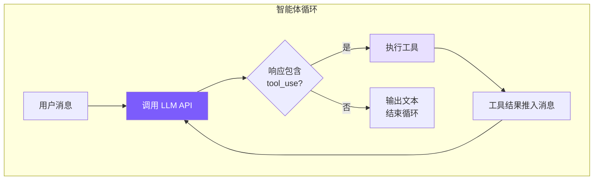

# 1. 智能体循环：让模型自己决定下一步

## 本章目标

实现编程智能体的心脏：一个 `while True` 循环，不断调用模型 → 检查是否需要执行工具 → 执行工具 → 把结果喂回模型 → 重复，直到模型不再请求工具。

读这一章时，先记住一句话：**代码不负责判断任务是否完成，模型负责判断；代码只负责把模型的决定安全地执行出来。** 这也是智能体和普通脚本最大的区别。



## Claude Code 怎么做的

### 双层架构

Claude Code 把智能体循环拆成两层：

- **QueryEngine**（~1155 行）：会话级，管整个对话生命周期——用户输入处理、USD 预算检查、Token 统计、会话恢复
- **queryLoop**（~1728 行）：单轮级，管一次查询的执行——消息压缩、API 调用、工具执行、错误恢复

这样拆的好处是关注点分离：QueryEngine 不需要知道"PTL 错误怎么恢复"，queryLoop 不需要知道"用户输入怎么解析"。

### queryLoop：异步生成器

queryLoop 签名是 `async function*`——异步生成器。选这个而不是回调/事件的原因：

1. **背压控制**：消费端不处理完，生产端不继续，天然防止事件堆积
2. **线性控制流**：所有循环分支用普通 `continue` / `break` 表达，不需要状态机

### 七种 Continue Reason

循环有 7 个继续位置，对应 7 种不同场景：

| # | 名称 | 触发场景 | 处理策略 |
|---|------|---------|---------|
| 1 | `next_turn` | 模型调用了工具 | 执行工具，结果推入消息，继续 |
| 2 | `collapse_drain_retry` | PTL 错误，有暂存的折叠操作 | 提交折叠释放空间，重试 |
| 3 | `reactive_compact_retry` | PTL 错误，折叠空间不够 | 强制全量摘要压缩，重试 |
| 4 | `max_output_tokens_escalate` | 输出 Token 截断，首次 | 升级到更高 Token 限制（16K→64K），重试 |
| 5 | `max_output_tokens_recovery` | 输出 Token 截断，升级不可用 | 注入续写提示，最多重试 3 次 |
| 6 | `stop_hook_blocking` | 任务完成但 Stop Hook 拦截 | 继续执行循环 |
| 7 | `token_budget_continuation` | API 侧 Token 预算耗尽 | 继续生成 |

我们的简化实现只处理第 1 种：有 tool_use 就继续，否则停。

### 错误扣留策略

这是个值得单独说的设计：**可恢复的错误不立即暴露给上层**。

当输出 Token 被截断时，如果直接 yield 错误给 QueryEngine，UI 会显示报错——但 queryLoop 后续的恢复逻辑其实能自动处理这个问题。所以 Claude Code 的做法是先"扣留"错误，执行恢复逻辑，成功了用户完全无感知，失败了才最终暴露。大多数 `max_output_tokens` 和 `prompt_too_long` 错误都被这样静默处理掉了。

### 并行工具执行

Claude Code 用 `StreamingToolExecutor` 在 API 流式响应期间并行执行工具：

```
串行：
  [========= API 流式响应 =========][tool1][tool2][tool3]

并行（Claude Code）：
  [========= API 流式响应 =========]
       ↑ tool1 的 JSON 完成 → 立即执行
            ↑ tool2 的 JSON 完成 → 立即执行
```

一个典型 API 响应有 5-30 秒的流式窗口，在这个时间里多个工具可以并发完成。

## 我们的实现

当前仓库把双层架构合并成一个 `Agent` 类。对外入口是 `chat()`，它先做 MCP 懒连接，再根据后端选择 `_chat_anthropic()` 或 `_chat_openai()`。这两个方法长得不完全一样，因为两家 API 的工具消息格式不同，但循环结构一样。

如果你只想先理解主干，建议先看 `mini_claude/agent.py` 里的 `_chat_anthropic()`：Anthropic 的 `tool_use` / `tool_result` 结构更直观，也最接近 Claude Code 的原始形态。

#### Python
```python
# agent.py — _chat_anthropic 方法（核心智能体循环）

async def _chat_anthropic(self, user_message: str) -> None:
    self._anthropic_messages.append({"role": "user", "content": user_message})
    # 在 turn boundary 触发 auto-compact：此时最后一条是纯文本 user，
    # _compact_anthropic 内部的 [:-1] 不会切断 tool_use ↔ tool_result 配对（详见第 7 章）
    await self._check_and_compact()

    while True:
        if self._aborted:
            break

        self._run_compression_pipeline()
        response = await self._call_anthropic_stream()

        self.total_input_tokens += response.usage.input_tokens
        self.total_output_tokens += response.usage.output_tokens
        self.last_input_token_count = response.usage.input_tokens

        tool_uses = [b for b in response.content if b.type == "tool_use"]

        self._anthropic_messages.append({
            "role": "assistant",
            "content": [self._block_to_dict(b) for b in response.content],
        })

        if not tool_uses:
            if not self.is_sub_agent:
                print_cost(self.total_input_tokens, self.total_output_tokens)
            break

        tool_results = []
        for tu in tool_uses:
            if self._aborted:
                break
            inp = dict(tu.input) if hasattr(tu.input, 'items') else tu.input
            print_tool_call(tu.name, inp)

            # 权限检查（详见第 6 章）
            perm = check_permission(tu.name, inp, self.permission_mode, self._plan_file_path)
            if perm["action"] == "deny":
                tool_results.append({"type": "tool_result", "tool_use_id": tu.id,
                                     "content": f"Action denied: {perm.get('message', '')}"})
                continue
            if perm["action"] == "confirm" and perm.get("message") \
               and perm["message"] not in self._confirmed_paths:
                confirmed = await self._confirm_dangerous(perm["message"])
                if not confirmed:
                    tool_results.append({"type": "tool_result", "tool_use_id": tu.id,
                                         "content": "User denied this action."})
                    continue
                self._confirmed_paths.add(perm["message"])

            result = await self._execute_tool_call(tu.name, inp)
            print_tool_result(tu.name, result)
            tool_results.append({"type": "tool_result", "tool_use_id": tu.id, "content": result})

        self._anthropic_messages.append({"role": "user", "content": tool_results})
```

这段代码有 4 个读点：

1. **用户消息先进历史**：`append({"role": "user", ...})` 不是为了保存聊天记录而已，下一次 API 调用会把这个数组整体发给模型。
2. **压缩只在回合边界做**：`_check_and_compact()` 放在工具循环开始前，避免切断 `tool_use` 和 `tool_result` 的配对。这个细节在第 7 章会展开。
3. **工具调用先进入 assistant 消息**：模型说“我要调用工具”本身也是上下文，必须保存。否则下一轮模型只看到工具结果，看不到自己为什么调用它。
4. **工具结果伪装成 user 消息**：这是 Anthropic API 的协议要求。它不是用户真的说了一句话，而是系统把观察结果交还给模型。

### 一次请求的真实轨迹

假设你输入：

```text
帮我看看 README 里有没有错别字
```

代码里的轨迹大致是这样：

1. `__main__.py` 的 `run_repl()` 读到这一行，调用 `await agent.chat(...)`。
2. `agent.chat()` 确认 MCP 是否已连接，然后进入 `_chat_anthropic()`。
3. `_chat_anthropic()` 把用户消息放进 `_anthropic_messages`。
4. `_call_anthropic_stream()` 调 API，模型返回 `read_file` 或 `grep_search` 的 `tool_use`。
5. `_execute_tool_call()` 统一处理特殊工具、MCP 工具、技能工具，最后普通工具会落到 `tools.execute_tool()`。
6. 工具结果作为 `tool_result` 放回 `_anthropic_messages`。
7. 循环再次调用模型。模型这次看到了 README 内容，可能继续调用 `edit_file`，也可能直接回答“没有发现明显问题”。
8. 当响应里没有工具调用时，循环结束，`chat()` 打印分隔线并自动保存会话。

这就是项目里所有高级能力的底座。记忆、技能、MCP、子智能体都不是另一套系统，它们只是让第 4 步“模型能看到什么、能调用什么”变得更丰富。

### 消息数组的增长方式

理解智能体循环的关键：消息数组是怎么增长的。

消息数组可以理解为模型的“短期工作记忆”。每次 API 调用并不是只发送最新一句用户输入，而是把当前会话中仍然保留的消息一起发过去。模型之所以能继续上一轮的操作，是因为它能看到自己刚才调用了什么工具、工具返回了什么结果，以及用户最初要解决什么问题。

```
第 1 轮:
  messages = [
    { role: "user",      content: "帮我修复 bug" }
    { role: "assistant", content: [text + tool_use(read_file)] }
    { role: "user",      content: [tool_result("文件内容...")] }
  ]

第 2 轮（LLM 看到文件内容后决定编辑）:
  messages = [
    ...前 3 条,
    { role: "assistant", content: [text + tool_use(edit_file)] }
    { role: "user",      content: [tool_result("编辑成功")] }
  ]

第 3 轮（LLM 认为任务完成）:
  messages = [
    ...前 5 条,
    { role: "assistant", content: [text("已修复!")] }  ← 无 tool_use → break
  ]
```

每轮循环消息数组增长两条：一条 assistant，一条 user（工具结果）。模型每次都能看到完整历史，这是它能"记住"之前做过什么的原因。工具结果用 `role: "user"` 推入是 Anthropic API 的协议要求，结果必须通过 `tool_use_id` 关联回对应的调用。

这里有一个容易忽略的实现细节：工具调用本身也必须保存到 assistant 消息里。否则下一轮模型只看到“工具返回了文件内容”，却看不到“这个文件内容是因为什么工具调用得到的”。Anthropic 通过 `tool_use_id` 把工具调用和工具结果配对，OpenAI 兼容后端则用 `tool_call_id` 配对。两套协议名字不同，但目的相同：让模型知道哪个结果对应哪个调用。

这也是为什么第 7 章的上下文压缩不能随便删消息。如果删掉一个工具结果，却留下对应的工具调用，API 会认为消息历史不合法；如果删掉工具调用，却留下工具结果，模型也会失去因果关系。Agent Loop 看起来只是 while 循环，实际上它还在维护一份严格的消息协议。

### 中断：让当前任务停下来

#### Python
```python
async def chat(self, user_message: str) -> None:
    self._aborted = False
    try:
        if self.use_openai:
            await self._chat_openai(user_message)
        else:
            await self._chat_anthropic(user_message)
    finally:
        pass
    if not self.is_sub_agent:
        print_divider()
        self._auto_save()

def abort(self) -> None:
    self._aborted = True
```

当前 Python 版没有实现浏览器/Node 风格的 `AbortController`，而是用 `_aborted` 布尔值做轻量中断。`Ctrl+C` 会调用 `agent.abort()`，循环在下一次检查 `self._aborted` 时退出。它的好处是实现简单；限制是正在等待的 API 请求无法立即从网络层取消，只能等请求返回后停止后续工具执行。

---

> **下一章**：循环的核心动力是工具——没有工具，LLM 只是一个聊天机器人。我们来看工具系统的实现。

## 本章小结：为什么循环是整个项目的中心

智能体循环的作用，是把一次用户请求拆成多次“模型判断”。普通聊天应用通常只调用一次模型；但编程任务不是一次回答就能完成的。模型可能先读文件，再搜索引用，再修改代码，再运行测试，最后根据测试结果继续修复。这个过程必须靠循环完成。

代码里的实现点在 `_chat_anthropic()` 和 `_chat_openai()`。它们都维护一份消息历史：用户消息、助手文本、工具调用、工具结果都会按协议放进去。下一次调用模型时，模型能看到前面发生过什么，所以它可以基于工具结果继续决策。

这个循环有一个非常关键的边界：**退出条件是“模型没有再调用工具”**。代码并不知道“bug 是否真的修好”，它只知道模型这轮返回的是最终文本还是新的工具调用。测试、搜索、编辑这些判断都由模型通过工具结果来推理。理解这一点，后面工具、权限、上下文压缩就都能串起来。
