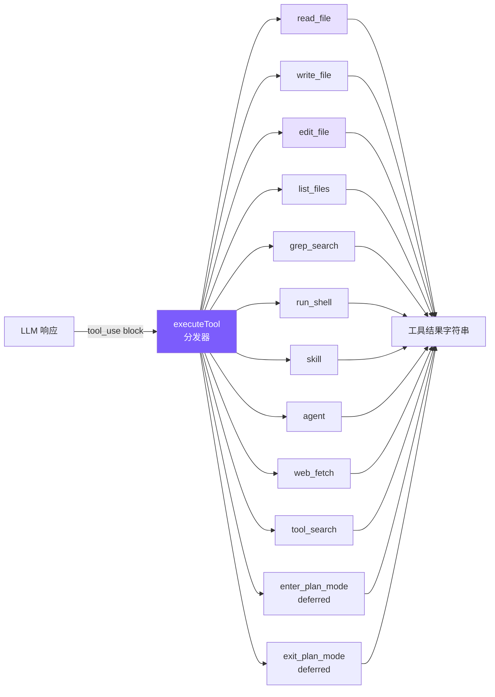
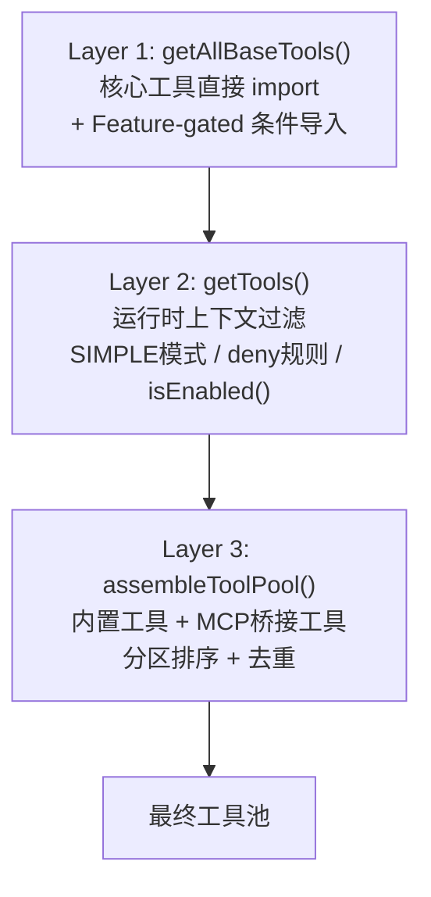
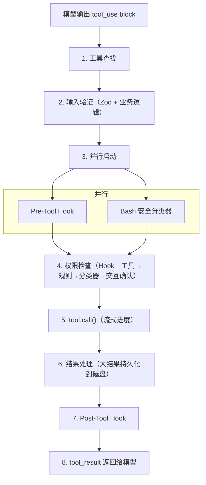

# 2. 工具系统

## 本章目标

定义 6 个核心工具（读文件、写文件、编辑文件、列文件、搜索、Shell）+ 5 个扩展工具（skill、agent、web_fetch、tool_search、plan mode），让 LLM 能真正操作你的代码库。实现编辑防护（read-before-edit + mtime 检查）和延迟加载（deferred tools）机制。



## Claude Code 怎么做的

### Tool 接口 — 每个工具的完整契约

Claude Code 的每个工具都遵循统一的 `Tool` 泛型接口，不是简单函数签名，而是完整的行为契约：

```python
from typing import Any, Callable, Protocol


class Tool(Protocol):
    name: str
    description: str
    input_schema: dict[str, Any]

    def is_concurrency_safe(self, input: dict[str, Any]) -> bool:
        """Whether this specific call can run alongside other safe tools."""
        ...

    async def call(self, input: dict[str, Any]) -> str:
        """Execute the tool and return text for the model."""
        ...

    def prompt(self) -> str:
        """Optional tool-specific usage guidance for the system prompt."""
        return ""
```

几个设计要点：

**`isConcurrencySafe(input)` 接收参数**——这意味着同一工具对不同输入可以有不同安全语义。BashTool 对 `ls` 返回 `isReadOnly: true`，对 `rm` 返回 `false`。比给整个工具打标签精确得多。

**`prompt()` 方法**——每个工具可以向 system prompt 注入自己的使用指南。FileEditTool 注入"精确匹配"规则，BashTool 注入安全执行提醒。工具行为指引和工具定义紧密关联，而非散落在全局 prompt 文件里。

**渲染方法**——每个工具自带渲染逻辑，新增工具不需要修改全局渲染代码。

### buildTool 工厂 — Fail-Closed 默认值

```python
from dataclasses import dataclass
from typing import Awaitable


@dataclass
class BuiltTool:
    name: str
    description: str
    input_schema: dict
    call: Callable[[dict], Awaitable[str]]
    concurrency_safe: Callable[[dict], bool] = lambda _input: False
    enabled: Callable[[], bool] = lambda: True


def build_tool(**kwargs) -> BuiltTool:
    # concurrency_safe 默认为 False：未知工具按有副作用处理。
    return BuiltTool(**kwargs)
```

这是 **fail-closed** 设计：错误标记"只读"工具为"非只读"后果是不必要的权限弹窗（烦人但安全）；反向错误——错误标记"写入"工具为"只读"——可能让它在没有权限检查的情况下并发执行（危险且隐蔽）。默认值只能选安全的方向。

### 工具注册 — 三层流水线



Layer 1 的 Feature-gated 工具通过条件 `require()` 加载：

```python
def get_all_base_tools() -> list[dict]:
    tools = [
        read_file_tool,
        write_file_tool,
        edit_file_tool,
        list_files_tool,
        grep_search_tool,
        run_shell_tool,
    ]

    if os.environ.get("MINI_CLAUDE_ENABLE_EXPERIMENTAL_TOOLS"):
        from .experimental_tools import experimental_tools
        tools.extend(experimental_tools)

    return tools
```

`feature()` 是 Bun 打包器的编译时宏。外部构建时求值为 `false`，整个 `require()` 被死代码消除——内部工具在外部二进制中物理上不存在。

Layer 3 的分区排序：内置工具按字母序在前，MCP 工具追加在后，不做全局排序。原因是 API 服务器在最后一个内置工具之后设置了缓存断点，分区确保添加 MCP 工具不影响内置工具的缓存命中。

### 工具执行生命周期 — 8 个阶段



几个值得关注的阶段：

**Stage 2 两阶段验证**：Phase 1 是 Zod Schema（字段类型），Phase 2 是业务逻辑（如 FileEditTool 检查 old_string 是否唯一）。分离确保低成本检查先执行，减少不必要的磁盘 I/O。

**Stage 3 并行启动**：Pre-Tool Hook 和 Bash 分类器同时启动，各需数十到数百毫秒，并行化降低权限检查总延迟。

**Stage 6 大结果处理**：结果超过 `maxResultSizeChars` 时，完整内容保存到 `~/claude-code/tool-results/`，模型收到文件路径 + 截断指示符，需要时通过 FileReadTool 主动拉取。

> **核心设计哲学：错误是数据，不是异常。** 任何阶段的错误都转换为带 `is_error: true` 的 `tool_result` 返回给模型，让模型自我纠正。

### 并发控制

```python
CONCURRENCY_SAFE_TOOLS = {"read_file", "list_files", "grep_search", "web_fetch"}


def split_into_batches(tool_calls: list[dict]) -> list[dict]:
    batches: list[dict] = []
    for call in tool_calls:
        safe = call["name"] in CONCURRENCY_SAFE_TOOLS
        if safe and batches and batches[-1]["concurrent"]:
            batches[-1]["items"].append(call)
        else:
            batches.append({"concurrent": safe, "items": [call]})
    return batches


async def execute_batches(batches: list[dict]) -> list[str]:
    results: list[str] = []
    for batch in batches:
        if batch["concurrent"]:
            results.extend(await asyncio.gather(*[
                execute_tool(c["name"], c["input"]) for c in batch["items"]
            ]))
        else:
            call = batch["items"][0]
            results.append(await execute_tool(call["name"], call["input"]))
    return results
```

规则很简单：非并发安全的工具必须独占执行；多个并发安全工具可以同时跑。`StreamingToolExecutor` 不等模型输出完所有 tool_use blocks，一旦检测到完整 block 就立即启动执行——工具执行延迟约 1 秒，模型流式输出持续 5-30 秒，大部分工具可以完全隐藏在流式窗口内。

并发上限 `MAX_TOOL_USE_CONCURRENCY = 10`。

### edit_file 的核心设计

FileEditTool 执行前有 14 步验证（按 I/O 成本排序：先检查内存状态，再访问磁盘），其中最关键的三个：

**读取前置检查**：代码层面的强制约束，不只是 prompt 建议。未先读取文件则拒绝执行，确保模型基于文件当前状态编辑而非过时记忆。

**外部修改检测**：通过 mtime 检测文件在读取后是否被外部修改（比如用户在 IDE 中编辑了同一个文件），解决真实竞争条件。

**配置文件保护**：对 `.claude/settings.json` 等，验证会模拟执行编辑后做 JSON Schema 校验，防止看似合理的编辑损坏配置格式。

### 为什么用 search-and-replace

在确定 search-and-replace 之前，有几种备选方案：

| 方案 | 致命缺陷 |
|------|---------|
| 行号编辑 | 位置相关：第一次插入 3 行后，后续所有行号偏移，多步编辑需要复杂重算 |
| AST 编辑 | 语法错误的文件恰恰最需要编辑，而 AST 解析器遇到语法错误会直接报错 |
| Unified diff | LLM 生成严格格式时表现很差：hunk header 行号、`+`/`-`/空格前缀任一出错则 patch 无法应用 |
| 全文件重写 | 大文件浪费 Token；模型可能遗漏未修改代码；用户无法快速 review |
| **字符串替换** | ✅ 无上述缺陷 |

search-and-replace 最被低估的优势是**幻觉安全**：模型提供了一个文件中不存在的字符串，工具直接失败，模型重新读取文件纠正记忆。全文件重写则可能静默地把错误的内容写入文件。

## 我们的简化决策

| Claude Code 的设计 | 我们的简化 | 简化理由 |
|-------------------|-----------|---------|
| 66+ 工具类，每个独立目录 | 1 个文件 + 6 个函数 | 教程不需要工业级模块化 |
| 8 阶段生命周期 | 直接 switch 分发 + 执行 | 省略 Hook、权限检查、分类器 |
| StreamingToolExecutor 并发 | 串行逐个执行 | 避免并发复杂度 |
| 14 步验证流水线 | 唯一性检查 + 引号容错 | 保留最关键的 2 个验证 |
| 三级大结果限制 | 单层 50K 截断 | 足够防止上下文爆炸 |
| MCP 7 种传输 + OAuth | 不支持 MCP | 教程聚焦核心概念 |

核心理念：**保留设计哲学，砍掉工程复杂度**。读代码时可以把工具系统分成两层：`agent.py` 负责“这个工具是否需要智能体状态”，`tools.py` 负责“普通工具如何真正执行”。

## 我们的实现

### 工具定义：静态数组

#### Python
```python
# tools.py — 工具定义（Anthropic Tool schema 格式）

tool_definitions: list[ToolDef] = [
    {
        "name": "read_file",
        "description": "Read the contents of a file. Returns the file content with line numbers.",
        "input_schema": {
            "type": "object",
            "properties": {
                "file_path": {"type": "string", "description": "The path to the file to read"},
            },
            "required": ["file_path"],
        },
    },
    # ... write_file, edit_file, list_files, grep_search, run_shell
]
```

这些定义直接传给 Anthropic API 的 `tools` 参数，格式完全一致，不需要任何转换。OpenAI 兼容后端会在 `agent.py` 的 `_to_openai_tools()` 中把同一份定义包一层 `{"type": "function", "function": ...}`，所以项目只维护一份工具 schema。

工具定义里的 `description` 和 `input_schema` 非常重要。模型不会读 Python 函数体，它只能看到 schema。也就是说，模型理解一个工具靠的是这几段描述：工具什么时候用、参数叫什么、哪些字段必填。如果 schema 写得模糊，模型就会传错参数；如果描述漏掉限制，模型就会在不合适的场景调用工具。

所以工具 schema 本质上是“给模型看的 API 文档”。普通程序员调用函数时可以看源码、看类型提示、看报错；模型调用工具时主要靠 schema 决策。后续如果你新增工具，先不要急着写复杂逻辑，应该先把工具名、描述和参数设计清楚。

**为什么用静态数组而非类？** Claude Code 用类体系是因为 66+ 工具需要继承、多态、独立测试。当前 Python 版工具数量不多，用一个数组表达“模型能看到什么”更直接。真正复杂的部分不是类继承，而是工具执行前后的权限、上下文和结果处理。

### 工具执行：两层分发

#### Python
```python
async def _execute_tool_call(self, name: str, inp: dict) -> str:
    if name in ("enter_plan_mode", "exit_plan_mode"):
        return await self._execute_plan_mode_tool(name)
    if name == "agent":
        return await self._execute_agent_tool(inp)
    if name == "skill":
        return await self._execute_skill_tool(inp)
    if self._mcp_manager.is_mcp_tool(name):
        return await self._mcp_manager.call_tool(name, inp)
    return await execute_tool(name, inp, self._read_file_state)


async def execute_tool(
    name: str,
    inp: dict,
    read_file_state: dict[str, float] | None = None,
) -> str:
    handlers = {
        "write_file": _write_file,
        "edit_file": _edit_file,
        "list_files": _list_files,
        "grep_search": _grep_search,
        "run_shell": _run_shell,
        "web_fetch": _web_fetch,
    }
    handler = handlers.get(name)
    if not handler:
        return f"Unknown tool: {name}"
    return _truncate_result(handler(inp))
```

第一层在 `agent.py`，处理必须访问当前智能体状态的工具：

- `enter_plan_mode` / `exit_plan_mode` 要改权限模式、生成 plan 文件、触发审批回调。
- `agent` 要创建子智能体，并把子智能体 token 计入父智能体。
- `skill` 的 `fork` 模式也要创建子智能体。
- `mcp__server__tool` 这类名字要转发给 MCP 管理器。

第二层在 `tools.py`，只处理无状态的普通工具。`read_file` 虽然没有出现在 `handlers` 里，但它在 `execute_tool()` 开头被单独处理，因为读取成功后要记录文件的修改时间，供后续 `write_file` / `edit_file` 做“先读后改”检查。

`Unknown tool` 返回字符串而不是抛异常，是“错误也是观察结果”的设计。模型看到这个结果后，可以换一个真实存在的工具重试；如果代码直接抛异常，整个智能体循环就被打断了。

### 工具调用前后发生了什么

一次普通工具调用并不是“模型说调用，代码马上执行”这么简单，中间有几道门：

1. 模型在响应里生成 `tool_use` 或 `tool_calls`。
2. `agent.py` 先调用 `check_permission()`，危险命令或写文件可能被拒绝或要求确认。
3. 通过权限后，`_execute_tool_call()` 判断是特殊工具、MCP 工具还是普通工具。
4. 普通工具进入 `tools.execute_tool()`，可能触发 read-before-edit 检查。
5. 工具返回字符串，过长结果会被 `_truncate_result()` 截断；在 `agent.py` 中更大的结果还可能被 `_persist_large_result()` 保存到磁盘。
6. 最终结果包装成 `tool_result` / `tool` 消息，回到模型上下文。

这条路径很重要：工具本身只知道“怎么做”，权限和消息协议由智能体循环负责。

这也是工具系统和权限系统的分工。`_edit_file()` 只关心怎么替换字符串；它不负责判断当前模式是否允许编辑。`check_permission()` 只关心能不能执行；它不负责真正写文件。`agent.py` 则负责把两者串起来，并把结果包装成模型能理解的 tool result。职责分开后，每层都更容易测试和替换。

### 逐个工具详解

#### read_file

#### Python
```python
def _read_file(inp: dict) -> str:
    try:
        content = Path(inp["file_path"]).read_text()
        lines = content.split("\n")
        numbered = "\n".join(f"{i+1:4d} | {line}" for i, line in enumerate(lines))
        return numbered
    except Exception as e:
        return f"Error reading file: {e}"
```

加行号是为了让 LLM 定位代码位置，但 `edit_file` 匹配时用的是实际内容字符串，不是行号。

#### edit_file — 最关键的工具

#### Python
```python
def _edit_file(inp: dict) -> str:
    try:
        path = Path(inp["file_path"])
        content = path.read_text()

        # 引号容错匹配
        actual = _find_actual_string(content, inp["old_string"])
        if not actual:
            return f"Error: old_string not found in {inp['file_path']}"

        count = content.count(actual)
        if count > 1:
            return f"Error: old_string found {count} times in {inp['file_path']}. Must be unique."

        new_content = content.replace(actual, inp["new_string"], 1)
        path.write_text(new_content)

        diff = _generate_diff(content, actual, inp["new_string"])
        quote_note = " (matched via quote normalization)" if actual != inp["old_string"] else ""
        return f"Successfully edited {inp['file_path']}{quote_note}\n\n{diff}"
    except Exception as e:
        return f"Error editing file: {e}"
```

唯一匹配检查是核心：出现 0 次说明模型对文件内容记忆有误（幻觉检测），出现 > 1 次则要求模型提供更多上下文来唯一标识修改点。"宁可失败也不猜测"——静默替换第一个匹配远比告知失败危险。

#### 引号容错 + Diff 输出

LLM 的 tokenization 可能将直引号映射为弯引号（`"` → `"`），没有容错机制这类编辑会 100% 失败。

#### Python
```python
def _normalize_quotes(s: str) -> str:
    s = re.sub("[\u2018\u2019\u2032]", "'", s)
    s = re.sub('[\u201c\u201d\u2033]', '"', s)
    return s

def _find_actual_string(file_content: str, search_string: str) -> str | None:
    if search_string in file_content:
        return search_string
    norm_search = _normalize_quotes(search_string)
    norm_file = _normalize_quotes(file_content)
    idx = norm_file.find(norm_search)
    if idx != -1:
        return file_content[idx:idx + len(search_string)]
    return None
```

关键细节：匹配成功后返回**文件中的原始字符串**而非标准化版本，替换时保持文件原始字符风格。

编辑成功后生成简易 diff，行号通过计算 `old_string` 前面有几个 `\n` 得出：

```
Successfully edited mini_claude/app.py (matched via quote normalization)

@@ -15,1 +15,1 @@
- const msg = "hello";
+ const msg = "world";
```

#### write_file

#### Python
```python
def _write_file(inp: dict) -> str:
    try:
        path = Path(inp["file_path"])
        path.parent.mkdir(parents=True, exist_ok=True)
        path.write_text(inp["content"])
        lines = inp["content"].split("\n")
        line_count = len(lines)
        preview = "\n".join(f"{i+1:4d} | {l}" for i, l in enumerate(lines[:30]))
        trunc = f"\n  ... ({line_count} lines total)" if line_count > 30 else ""
        return f"Successfully wrote to {inp['file_path']} ({line_count} lines)\n\n{preview}{trunc}"
    except Exception as e:
        return f"Error writing file: {e}"
```

自动创建父目录（`mkdir -p` 效果）避免模型还得额外调用 shell 命令。系统提示词里告诉模型优先用 `edit_file`，只对新文件用 `write_file`。

#### grep_search

#### Python
```python
def _grep_search(inp: dict) -> str:
    pattern = inp["pattern"]
    path = inp.get("path") or "."
    include = inp.get("include")

    try:
        args = ["grep", "--line-number", "--color=never", "-r"]
        if include:
            args.append(f"--include={include}")
        args.extend(["--", pattern, path])
        result = subprocess.run(args, capture_output=True, text=True, timeout=10)
        if result.returncode == 1:
            return "No matches found."
        if result.returncode != 0:
            return f"Error: {result.stderr}"
        lines = [l for l in result.stdout.split("\n") if l]
        output = "\n".join(lines[:100])
        if len(lines) > 100:
            output += f"\n... and {len(lines) - 100} more matches"
        return output
    except Exception as e:
        return f"Error: {e}"
```

`--color=never` 禁用 ANSI 颜色代码（输出给模型看的，不需要颜色）。Python 版本的 `--` 分隔符确保以 `-` 开头的 pattern 不被误解析为 grep 选项。

grep 退出码 1 表示"无匹配"不是错误，2+ 才是真正错误，需要分别处理。结果截断为前 100 条，附加 `... and N more matches` 提示。

Claude Code 用 ripgrep (`rg`)，我们用系统 `grep`——功能够用，少一个依赖。

#### run_shell

#### Python
```python
def _run_shell(inp: dict) -> str:
    try:
        timeout = inp.get("timeout", 30)
        result = subprocess.run(
            inp["command"],
            shell=True,
            capture_output=True,
            text=True,
            timeout=timeout,
        )
        if result.returncode != 0:
            stderr = f"\nStderr: {result.stderr}" if result.stderr else ""
            stdout = f"\nStdout: {result.stdout}" if result.stdout else ""
            return f"Command failed (exit code {result.returncode}){stdout}{stderr}"
        return result.stdout or "(no output)"
    except subprocess.TimeoutExpired:
        return f"Command timed out after {inp.get('timeout', 30)}s"
    except Exception as e:
        return f"Error: {e}"
```

失败时同时返回 stdout 和 stderr——很多编译器在 stderr 输出错误的同时，stdout 可能有有用的部分输出。`"(no output)"` 避免模型在命令成功但无输出时（`mkdir`、`touch`）产生困惑。

Claude Code 的 BashTool 分布在 18 个源文件中，有 AST 解析命令、沙箱执行、23 个安全检查。我们只做 timeout 保护（安全机制在第 6 章详述）。

### 工具结果截断

#### Python
```python
MAX_RESULT_CHARS = 50000

def _truncate_result(result: str) -> str:
    if len(result) <= MAX_RESULT_CHARS:
        return result
    keep_each = (MAX_RESULT_CHARS - 60) // 2
    return (
        result[:keep_each]
        + f"\n\n[... truncated {len(result) - keep_each * 2} chars ...]\n\n"
        + result[-keep_each:]
    )
```

保留头尾而非只保留头部，因为很多命令的关键输出在末尾（编译错误摘要、测试结果统计）。截断提示明确告知模型内容被截断，模型可据此决定是否用 `grep_search` 或 `read_file` 获取完整内容。

### WebFetch 工具

让 Agent 能访问 URL 获取内容——查文档、读 API 响应、抓取网页信息：

```python
def _web_fetch(inp: dict) -> str:
    import urllib.error
    import urllib.request

    url = inp.get("url", "")
    max_length = inp.get("max_length", 50000)
    req = urllib.request.Request(url, headers={"User-Agent": "mini-claude/1.0"})
    try:
        with urllib.request.urlopen(req, timeout=30) as resp:
            content_type = resp.headers.get("Content-Type", "")
            text = resp.read().decode("utf-8", errors="replace")
    except urllib.error.HTTPError as e:
        return f"HTTP error: {e.code} {e.reason}"
    except urllib.error.URLError as e:
        return f"Error fetching {url}: {e.reason}"

    if "html" in content_type:
        text = re.sub(r"<script[\s\S]*?</script>", "", text, flags=re.IGNORECASE)
        text = re.sub(r"<style[\s\S]*?</style>", "", text, flags=re.IGNORECASE)
        text = re.sub(r"<[^>]*>", " ", text)
        text = re.sub(r"\s{2,}", " ", text).strip()

    if len(text) > max_length:
        text = text[:max_length] + f"\n\n[... truncated at {max_length} characters]"
    return text or "(empty response)"
```

设计选择：
- **30 秒超时**：防止模型访问慢速或无响应的 URL 时阻塞整个循环
- **HTML 去标签**：LLM 不需要看 HTML 标签，纯文本更高效
- **50KB 上限**：避免网页内容挤占上下文窗口
- 标记为 `CONCURRENCY_SAFE_TOOLS`（只读、无副作用），可并行执行

### Read-before-edit + mtime 防护

Claude Code 的一个重要安全机制：**编辑文件前必须先读取**。这防止模型在不了解文件当前内容的情况下盲目修改，同时检测外部修改避免覆盖用户的手动编辑。

```python
async def execute_tool(
    name: str,
    inp: dict,
    read_file_state: dict[str, float] | None = None,
) -> str:
    if name == "read_file":
        result = _read_file(inp)
        if read_file_state is not None and not result.startswith("Error"):
            abs_path = str(Path(inp["file_path"]).resolve())
            read_file_state[abs_path] = os.path.getmtime(abs_path)
        return _truncate_result(result)

    if name in ("write_file", "edit_file") and read_file_state is not None:
        abs_path = str(Path(inp["file_path"]).resolve())
        if os.path.exists(abs_path):
            if abs_path not in read_file_state:
                verb = "writing" if name == "write_file" else "editing"
                return f"Error: You must read this file before {verb}. Use read_file first."
            if os.path.getmtime(abs_path) != read_file_state[abs_path]:
                verb = "writing" if name == "write_file" else "editing"
                return f"Warning: {inp['file_path']} was modified externally. Read it again before {verb}."
```

三个关键点：
- **`read_file_state` 字典** 在 `Agent` 实例中维护，key 是绝对路径，value 是上次读取时的修改时间
- **新文件跳过检查**：`existsSync(absPath)` 为 false 时不强制先读——创建新文件不需要先读
- **mtime 比较**：读取时记录 mtime，写入前比较。如果不一致，说明文件在 Agent 读取后被用户或其他进程修改了，返回警告而非静默覆盖

这与 Claude Code 的 `readFileTimestamps` 机制对齐——编辑必须基于已知状态，不能"盲写"。

### tool_search 延迟加载

当工具数量增多时（66+ 工具），把所有工具的 schema 都发给 API 会浪费大量 token。Claude Code 的做法是**延迟加载**：不常用的工具只发名称，模型需要时通过搜索工具按需激活。当前 Python 版保留这个机制，工具名叫 `tool_search`。

延迟加载可以理解成“工具说明书分级”。常用工具直接放在桌面上，模型每轮都能看到；不常用工具先放在目录里，只告诉模型它们存在。模型需要时先调用 `tool_search`，系统再把完整 schema 展开。这样做能减少每次 API 调用的固定成本，也能避免工具列表太长导致模型注意力分散。

```python
_activated_tools: set[str] = set()


def get_active_tool_definitions(all_tools: list[ToolDef] | None = None) -> list[ToolDef]:
    tools = all_tools if all_tools is not None else tool_definitions
    return [
        {k: v for k, v in t.items() if k != "deferred"}
        for t in tools
        if not t.get("deferred") or t["name"] in _activated_tools
    ]


async def execute_tool(name: str, inp: dict, read_file_state: dict[str, float] | None = None) -> str:
    if name == "tool_search":
        query = (inp.get("query") or "").lower()
        matches = [
            t for t in tool_definitions
            if t.get("deferred")
            and (query in t["name"].lower() or query in t.get("description", "").lower())
        ]
        for match in matches:
            _activated_tools.add(match["name"])
        return json.dumps([
            {
                "name": t["name"],
                "description": t.get("description", ""),
                "input_schema": t["input_schema"],
            }
            for t in matches
        ], indent=2)
```

工作流程：
1. API 调用时，`get_active_tool_definitions()` 过滤掉未激活的 deferred 工具（只发名称，不发 schema）
2. 系统提示词中通过 `get_deferred_tool_names()` 告知模型哪些工具可以通过 `tool_search` 激活
3. 模型需要时调用 `tool_search`，匹配的工具被加入 `_activated_tools` 集合
4. 下一次 API 调用自动包含已激活工具的完整 schema

我们只有 2 个 deferred 工具（plan mode），但这个机制对扩展到 20+ 工具时至关重要。

## 简化对比

| 维度 | Claude Code | mini-claude |
|------|------------|-------------|
| **工具数量** | 66+ | 13（6 核心 + web_fetch + tool_search + skill + agent + 2 plan mode） |
| **执行模式** | 并发执行 + streaming 早期启动 | 并行执行（concurrencySafe）+ streaming 早期启动 |
| **搜索引擎** | ripgrep（rg） | 系统 grep |
| **编辑验证** | 14 步流水线 + readFileTimestamps | 引号容错 + 唯一性 + diff + read-before-edit + mtime |
| **Shell 安全** | AST 解析 + 沙箱 | 正则匹配 + 确认 |
| **结果截断** | 选择性裁剪 + 磁盘持久化 | 保留头尾 50K + 30KB 磁盘持久化 |
| **延迟加载** | deferred tools + ToolSearch | deferred 标记 + tool_search |
| **网络访问** | WebFetch（去标签 + 超时） | web_fetch（去标签 + 30s 超时 + 50KB 上限） |

---

> **下一章**：工具定义了智能体的能力，但系统提示词定义了它的行为——怎么用这些工具、什么时候该小心。

## 本章小结：工具系统解决的真实问题

工具系统的核心价值，是把模型的“想做什么”变成代码里可执行、可检查、可记录的动作。模型不能直接访问你的文件系统，它只能输出结构化的工具调用；Python 代码收到调用后，再决定是否允许、如何执行、怎么把结果返回给模型。

实现上要分清三件事。第一是工具定义，也就是 `tool_definitions`，它告诉模型工具叫什么、参数是什么。第二是权限和路由，也就是 `Agent._execute_tool_call()` 之前的 `check_permission()` 和特殊工具分发。第三是真正执行，也就是 `tools.execute_tool()` 调用 `_read_file()`、`_edit_file()`、`_run_shell()` 等函数。

工具越多，越需要管理成本。`tool_search` 延迟加载就是为这个问题准备的：常用工具直接给模型，不常用工具先隐藏完整 schema，只告诉模型“需要时可以搜索激活”。这样既省 token，又不会牺牲扩展能力。
