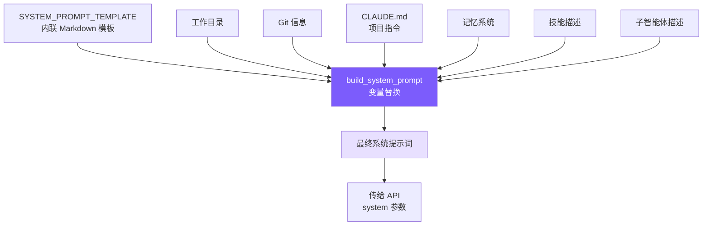

# 3. 系统提示词工程

## 本章目标

构造一个让模型成为合格编程智能体的系统提示词：告诉它身份、规则、工具使用策略和环境信息。



## Claude Code 怎么做的

Claude Code 的系统提示词不是随意堆砌的指令，而是经过大量 A/B 测试和模型行为观察迭代打磨的工程产物。

### 7 层递进结构

提示词从抽象到具体分为 7 层——**先建立身份和约束框架，再填充具体行为指导**。这个顺序很重要：模型先建立的概念会成为理解后续内容的框架。

```
1. Identity   → 我是谁？interactive agent
2. System     → 运行环境的基本事实
3. Doing Tasks → 怎么写代码？（反模式接种）
4. Actions    → 哪些操作需要确认？（爆炸半径框架）
5. Using Tools → 怎么用工具？（偏好映射表）
6. Tone & Style → 输出什么格式？
7. Output Efficiency → 怎么更简洁？
```

### 反模式接种

**明确告诉模型"不要做什么"，比只描述"要做什么"有效得多。**

正面指令（"be concise"）给模型留下了自我合理化的空间——它会认为"加注释是让代码更简洁易读的"，然后给每个函数加 docstring。而负面指令（"don't add docstrings to code you didn't change"）消除了解释余地。

Claude Code 的 Doing Tasks 部分有三条精确的"不要"：

- **不要扩大范围**：修 bug 不需要顺手重构周围代码
- **不要防御性编程**：不为不可能发生的场景加 try-catch 和校验
- **不要过早抽象**："Three similar lines of code is better than a premature abstraction"

这些规则的价值不在概念（谁都知道"不要过度工程"），而在**措辞的精确度**——给了模型具体的判断标准，而非模糊的原则。

### 爆炸半径框架

Actions 部分没有罗列"不能做 X、Y、Z"，而是教给模型一个**风险评估框架**：

```
Carefully consider the reversibility and blast radius of actions.
```

二维模型：**可逆性 × 影响范围**。高风险 = 不可逆 + 影响共享环境（force push、删除云资源）；低风险 = 可逆 + 只影响本地（编辑本地文件）。

这比穷举规则扩展性强得多——模型遇到规则列表之外的新场景（比如调用 API 删除云资源）能自行推理，而不是不知道怎么做。

还有一条关键规则：用户批准一次操作，不等于批准所有类似操作。每次授权只对当前范围有效。

在当前 Python 版里，这个框架分成软约束和硬约束两部分。软约束在 `SYSTEM_PROMPT_TEMPLATE` 的 `# Executing actions with care` 段落里：它要求模型思考动作是否可逆、是否影响共享环境、是否可能造成用户损失。硬约束在 `tools.py` 的 `check_permission()`：当模型调用 `run_shell` 且命令匹配危险正则，或者尝试创建/编辑特殊场景文件时，代码会返回 `confirm`，由用户决定是否允许。

这两层不能互相替代。只靠提示词，模型可能判断失误；只靠正则，代码只能识别已知危险模式，无法理解“发 Slack 消息”“关闭 GitHub issue”这类外部影响。提示词负责让模型主动谨慎，权限代码负责拦住常见高风险动作。两者合起来，才是一个可用的爆炸半径框架。

### 工具偏好映射表

Claude Code 在提示词中明确要求模型用专用工具而非 bash 命令：

```
Use Read instead of cat/head/tail
Use Edit instead of sed/awk
Use Glob instead of find/ls
Use Grep instead of grep/rg
```

专用工具和 bash 命令底层功能差不多，差异在用户体验：权限可以细粒度控制（读取 vs 写入分开授权）、输出结构化、原生支持并行调用。没有这张映射表，模型会默认用训练数据中出现最多的方式——即各种 bash 命令。

### CLAUDE.md 层级发现

CLAUDE.md 是项目级指令文件，类似 `.eslintrc` 但面向 AI。Claude Code 从 5 个位置加载：全局管理策略 → 用户主目录 → 项目目录（CWD 向上遍历）→ 本地文件 → 命令行指定目录。

靠近 CWD 的文件**后加载、优先级更高**——利用 LLM 的近因效应，子目录规则可以覆盖父目录规则。

## 我们的实现

### SYSTEM_PROMPT_TEMPLATE

模板内联在 `mini_claude/prompt.py` 中，用 `{{placeholder}}` 标记动态变量：

```python
SYSTEM_PROMPT_TEMPLATE = """\
You are Mini Claude Code, a lightweight coding assistant CLI.
You are an interactive agent that helps users with software engineering tasks.

# Doing tasks
- Read code before proposing changes.
- Prefer editing existing files over creating new files.
- Keep changes focused on the user's request.

# Using your tools
- Use read_file instead of cat/head/tail.
- Use edit_file instead of sed/awk.
- Use list_files instead of find/ls.
- Use grep_search instead of grep/rg.

# Environment
Working directory: {{cwd}}
Date: {{date}}
Platform: {{platform}}
Shell: {{shell}}
{{git_context}}
{{claude_md}}
{{memory}}
{{skills}}
{{agents}}
{{deferred_tools}}
"""
```

`{{memory}}`、`{{skills}}`、`{{agents}}` 放在末尾——近因效应，这些动态内容的权重更大（详见第 8、9 章）。

这些动态内容放在模板末尾，不只是排版习惯。大语言模型对靠近输入末尾的内容通常更敏感，这叫近因效应。项目规则、记忆、技能和子智能体描述都属于“当前会话特别相关”的信息，放在后面能提高模型使用它们的概率。不过这不是绝对规则；如果某段内容是最高优先级安全约束，通常仍然应该放在更靠前的位置。

### prompt.py 实现

#### Python
```python
import os
import platform
import subprocess
from pathlib import Path


def load_claude_md() -> str:
    parts: list[str] = []
    d = Path.cwd().resolve()
    while True:
        f = d / "CLAUDE.md"
        if f.is_file():
            try:
                content = f.read_text()
                content = _resolve_includes(content, d)  # @include 解析
                parts.insert(0, content)
            except Exception:
                pass
        parent = d.parent
        if parent == d:
            break
        d = parent
    rules = _load_rules_dir(Path.cwd())  # .claude/rules/*.md
    claude_md = "\n\n# Project Instructions (CLAUDE.md)\n" + "\n\n---\n\n".join(parts) if parts else ""
    return claude_md + rules


def get_git_context() -> str:
    try:
        opts = {"encoding": "utf-8", "timeout": 3, "capture_output": True}
        branch = subprocess.run(["git", "rev-parse", "--abbrev-ref", "HEAD"], **opts).stdout.strip()
        log = subprocess.run(["git", "log", "--oneline", "-5"], **opts).stdout.strip()
        status = subprocess.run(["git", "status", "--short"], **opts).stdout.strip()
        result = f"\nGit branch: {branch}"
        if log:
            result += f"\nRecent commits:\n{log}"
        if status:
            result += f"\nGit status:\n{status}"
        return result
    except Exception:
        return ""


def build_system_prompt() -> str:
    from .memory import build_memory_prompt_section
    from .skills import build_skill_descriptions
    from .subagent import build_agent_descriptions
    from datetime import date

    replacements = {
        "{{cwd}}": str(Path.cwd()),
        "{{date}}": date.today().isoformat(),
        "{{platform}}": f"{platform.system()} {platform.machine()}",
        "{{shell}}": os.environ.get("SHELL", "/bin/sh"),
        "{{git_context}}": get_git_context(),
        "{{claude_md}}": load_claude_md(),
        "{{memory}}": build_memory_prompt_section(),
        "{{skills}}": build_skill_descriptions(),
        "{{agents}}": build_agent_descriptions(),
        "{{deferred_tools}}": deferred_section,
    }
    result = SYSTEM_PROMPT_TEMPLATE
    for key, value in replacements.items():
        result = result.replace(key, value)
    return result
```

如果按真实代码读，`build_system_prompt()` 的顺序是：

1. 读取当前日期、平台、shell 和工作目录。
2. 调 `get_git_context()` 把分支、最近提交、工作区状态塞进去。
3. 调 `load_claude_md()`，从当前目录向上收集 `CLAUDE.md`，并解析 `@include`。
4. 调 `build_memory_prompt_section()` 放入记忆清单和保存规则。
5. 调 `build_skill_descriptions()` 告诉模型有哪些技能可以调用。
6. 调 `build_agent_descriptions()` 告诉模型有哪些子智能体类型。
7. 调 `get_deferred_tool_names()`，把未激活但可搜索的工具名写进提示词。

这解释了一个重要现象：同一个模型、同一句用户请求，在不同目录下表现会不同。因为工作目录、Git 状态、`CLAUDE.md`、规则文件和项目记忆都可能不同。

### 简化取舍

| Claude Code | mini-claude | 理由 |
|------------|-------------|------|
| Static/Dynamic 缓存边界 | 不实现 | 教程项目无需优化 API 成本 |
| CLAUDE.md 5 层发现 + .claude 子目录 | 从 CWD 向上遍历 + .claude/rules/ | 覆盖常见场景 |
| @include 指令 | 支持 @./path、@~/path、@/path | 完整实现 |
| 反模式接种（3 条规则） | 完整保留 | 对输出质量影响极大 |
| 爆炸半径框架 | 完整保留 | 安全性不能简化 |
| 工具偏好映射表 | 适配工具名保留 | 必须有，否则模型默认用 bash |
| Deferred 工具名注入 | `get_deferred_tool_names()` | 告知模型哪些工具可按需激活 |

### @include 语法与 Rules 自动加载

CLAUDE.md 文件支持 `@` 语法引用外部文件，实现项目配置的模块化。同时，`.claude/rules/*.md` 目录下的规则文件会自动加载。

这个机制解决的是项目规则越来越多的问题。如果所有规则都写进一个 `CLAUDE.md`，文件会变得很长，也不方便复用。`@include` 让你可以把编码风格、测试要求、安全约定拆成多个文件；`.claude/rules/*.md` 自动加载则让团队可以把规则按主题放在目录下，不需要在主文件里逐个复制内容。

实现上，`_resolve_includes()` 用正则查找单独一行的 `@./path`、`@~/path`、`@/path`。匹配到后，它根据路径类型解析出真实文件路径，读取文件内容，再递归解析被包含文件里的 include。为了防止 A 引用 B、B 又引用 A，它用 `visited` 集合记录已经读取过的文件；为了防止层级太深，它用 `_MAX_INCLUDE_DEPTH = 5` 截断递归。

```python
_INCLUDE_RE = re.compile(r"^@(\./[^\s]+|~/[^\s]+|/[^\s]+)$", re.MULTILINE)
_MAX_INCLUDE_DEPTH = 5


def _resolve_includes(
    content: str,
    base_path: Path,
    visited: set[str] | None = None,
    depth: int = 0,
) -> str:
    if depth >= _MAX_INCLUDE_DEPTH:
        return content
    visited = visited or set()

    def _replace(match: re.Match) -> str:
        raw = match.group(1)
        if raw.startswith("~/"):
            resolved = Path.home() / raw[2:]
        elif raw.startswith("/"):
            resolved = Path(raw)
        else:
            resolved = base_path / raw

        resolved = resolved.resolve()
        if str(resolved) in visited:
            return f"<!-- circular: {raw} -->"
        if not resolved.is_file():
            return f"<!-- not found: {raw} -->"

        visited.add(str(resolved))
        included = resolved.read_text()
        return _resolve_includes(included, resolved.parent, visited, depth + 1)

    return _INCLUDE_RE.sub(_replace, content)
```

三种路径格式：
- `@./relative/path` — 相对于当前 CLAUDE.md 所在目录
- `@~/path` — 相对于用户 home 目录
- `@/absolute/path` — 绝对路径

防护措施：
- **visited Set** 防止循环引用（A include B，B include A）
- **MAX_INCLUDE_DEPTH = 5** 防止嵌套过深
- 找不到文件时留下 HTML 注释标记，不报错中断

`.claude/rules/*.md` 自动加载：

```python
def _load_rules_dir(directory: Path) -> str:
    rules_dir = directory / ".claude" / "rules"
    if not rules_dir.is_dir():
        return ""

    parts: list[str] = []
    for file in sorted(rules_dir.iterdir()):
        if file.suffix == ".md" and file.is_file():
            content = file.read_text()
            content = _resolve_includes(content, rules_dir)
            parts.append(f"<!-- rule: {file.name} -->\n{content}")

    return "\n\n## Rules\n" + "\n\n".join(parts) if parts else ""
```

使用示例：

```markdown
# CLAUDE.md
@./.claude/rules/chinese-greeting.md
@./docs/coding-style.md

This project uses Python 3.11+ and keeps source code under mini_claude/.
```

加载后，引用会被替换为文件内容。这让团队可以把共享规则放在 `.claude/rules/` 目录下，CLAUDE.md 只需一行引用。

loadClaudeMd 整合了三者：向上遍历 CLAUDE.md + @include 解析 + rules 目录：

```python
def load_claude_md() -> str:
    parts: list[str] = []
    directory = Path.cwd().resolve()

    while True:
        file = directory / "CLAUDE.md"
        if file.is_file():
            content = file.read_text()
            content = _resolve_includes(content, directory)
            parts.insert(0, content)

        parent = directory.parent
        if parent == directory:
            break
        directory = parent

    claude_md = ""
    if parts:
        claude_md = "\n\n# Project Instructions (CLAUDE.md)\n"
        claude_md += "\n\n---\n\n".join(parts)

    return claude_md + _load_rules_dir(Path.cwd())
```

---

> **下一章**：有了工具和提示词，下一步是让 Agent 变得可交互——CLI 入口、REPL 循环和会话持久化。

## 本章小结：系统提示词不是普通说明书

系统提示词的作用，是给模型建立“工作方式”。它不只是告诉模型你是谁，还会告诉模型：优先读文件再修改、不要扩大任务范围、什么时候使用专用工具、当前目录在哪里、项目有哪些规则、有哪些记忆和技能可用。

代码实现集中在 `prompt.py` 的 `build_system_prompt()`。它先准备动态变量，比如工作目录、日期、平台和 Git 状态；再加载 `CLAUDE.md`、`.claude/rules/*.md`、记忆清单、技能描述和子智能体描述；最后把这些内容替换进 `SYSTEM_PROMPT_TEMPLATE`。所以系统提示词每次启动并不是固定不变的，它会随着项目目录、Git 状态和本地配置变化。

相关概念是“上下文工程”。模型本身不会知道项目规则，也不会天然知道你的偏好。凡是希望模型稳定遵守的内容，都需要通过系统提示词、项目规则、记忆或技能放进上下文。提示词工程不是写漂亮句子，而是设计模型能可靠执行的工作环境。
