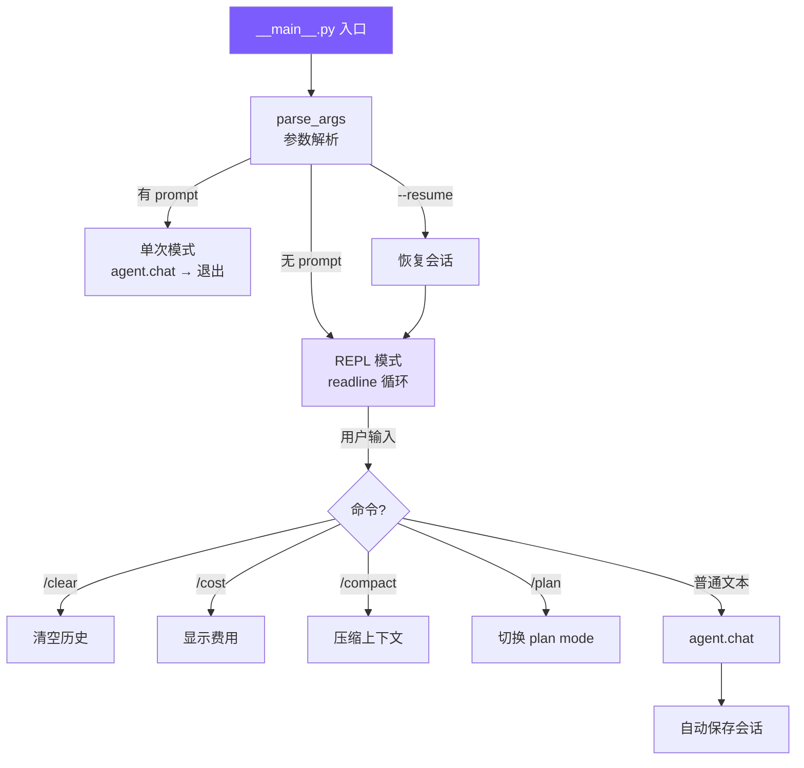

# 4. CLI 与会话

> Current status: `/plan` 和 `--plan` 已从当前源码删除。本文中 Plan Mode 相关内容属于历史设计记录；当前只保留 `plan` 子 agent 作为只读规划能力。

## 本章目标

构建用户接口层：命令行参数解析、交互式 REPL、Ctrl+C 中断处理、会话持久化和恢复。



## Claude Code 怎么做的

Claude Code 的入口使用 React/Ink 把组件模型搬进终端，支持流式 Markdown 渲染、Vim 模式、多 Tab、键盘自定义。会话用 JSONL 格式追加写入，崩溃安全。

### 终端原生 vs GUI

这是一个主动选择。开发者的工作流在终端里，打开浏览器意味着上下文切换。终端原生就是另一个命令行工具，跟 `git`、`grep` 一样嵌入到已有工作流。具体好处：SSH 环境可用、可接管道 (`echo "fix" | claude`)、支持 tmux 多实例并行、内存开销接近零。

React/Ink 的作用是弥补终端的交互限制——有了组件模型，流式输出、diff 视图这类复杂 UI 才变得可维护。

### 可观察的自主性

Claude Code UX 的核心理念：**Agent 自由行动，但让用户实时看到每一步**。

```
📖 read_file mini_claude/agent.py
  1 | import express from ...
  ... (1234 chars total)

✏️ edit_file mini_claude/agent.py
  - const port = 3000
  + const port = process.env.PORT
```

中断成本远低于撤销成本。用户在 Agent 走错方向前 3 秒就能按 Ctrl+C，而不是等 20 秒执行完再花更多时间撤销。每个工具有 4 种渲染方法（开始/完成/被拒/报错），长时间运行的工具实时流式输出 stdout，而不是等完成才展示。

### JSONL 会话存储

整体 JSON 覆盖写入有两个问题：写入中途崩溃会损坏整个文件；对话越长每次保存越慢。

JSONL 每轮追加一行，O(1) 写入，崩溃最多丢最后一行。文件系统的 append 操作通常是原子的。恢复时逐行解析，跳过末尾不完整的行即可。

## 我们的实现

### 参数解析

#### Python
```python
# __main__.py — parse_args

def parse_args() -> argparse.Namespace:
    parser = argparse.ArgumentParser(prog="mini-claude", add_help=False)
    parser.add_argument("prompt", nargs="*")
    parser.add_argument("--yolo", "-y", action="store_true")
    parser.add_argument("--plan", action="store_true")
    parser.add_argument("--accept-edits", action="store_true")
    parser.add_argument("--dont-ask", action="store_true")
    parser.add_argument("--thinking", action="store_true")
    parser.add_argument("--model", "-m", default=None)
    parser.add_argument("--api-base", default=None)
    parser.add_argument("--resume", action="store_true")
    parser.add_argument("--max-cost", type=float, default=None)
    parser.add_argument("--max-turns", type=int, default=None)
    parser.add_argument("--help", "-h", action="store_true")
    return parser.parse_args()


def _resolve_permission_mode(args: argparse.Namespace) -> str:
    if args.yolo: return "bypassPermissions"
    if args.plan: return "plan"
    if args.accept_edits: return "acceptEdits"
    if args.dont_ask: return "dontAsk"
    return "default"
```

Python 版直接用标准库 `argparse` 解析参数，因为参数数量不多，零额外依赖更轻。

参数解析的作用不是简单地“读命令行字符串”，而是把用户的启动意图转成内部状态。比如 `--plan` 最终会变成权限模式 `plan`，`--yolo` 会变成 `bypassPermissions`，`--accept-edits` 会变成 `acceptEdits`。后面的 `Agent` 和权限系统并不关心用户敲了哪个参数，它们只关心当前处于哪种权限模式。

这种映射让 CLI 层和核心逻辑解耦。以后如果你想增加 `--readonly` 作为 `--plan` 的别名，只需要改 `_resolve_permission_mode()`；如果你想新增一个模型参数，也只需要在 `main()` 创建 `Agent` 时传进去，不需要碰工具执行逻辑。

### 两种运行模式

#### Python
```python
# __main__.py — main

def main() -> None:
    args = parse_args()
    permission_mode = _resolve_permission_mode(args)
    model = args.model or os.environ.get("MINI_CLAUDE_MODEL", "claude-opus-4-6")

    resolved_api_key: str | None = None
    resolved_use_openai = bool(args.api_base)
    if os.environ.get("OPENAI_API_KEY") and os.environ.get("OPENAI_BASE_URL"):
        resolved_api_key = os.environ["OPENAI_API_KEY"]
        resolved_use_openai = True
    elif os.environ.get("ANTHROPIC_API_KEY"):
        resolved_api_key = os.environ["ANTHROPIC_API_KEY"]
    elif os.environ.get("OPENAI_API_KEY"):
        resolved_api_key = os.environ["OPENAI_API_KEY"]
        resolved_use_openai = True

    if not resolved_api_key:
        print_error("API key is required.")
        sys.exit(1)

    agent = Agent(permission_mode=permission_mode, model=model, thinking=args.thinking,
                  max_cost_usd=args.max_cost, max_turns=args.max_turns, api_key=resolved_api_key)

    if args.resume:
        session_id = get_latest_session_id()
        if session_id:
            session = load_session(session_id)
            if session: agent.restore_session(session)

    prompt = " ".join(args.prompt) if args.prompt else None
    if prompt:
        asyncio.run(agent.chat(prompt))
    else:
        asyncio.run(run_repl(agent))
```

这段代码把启动方式分成两类。第一类是 one-shot 模式：命令行后面直接带 prompt，程序执行一次 `agent.chat(prompt)` 后退出。它适合脚本化使用，比如在 CI 或 shell 里临时问一个问题。第二类是 REPL 模式：没有 prompt 时进入交互式循环，用户可以连续追问，所有对话共享同一个 `Agent` 实例。

共享同一个 `Agent` 实例很重要。它意味着消息历史、token 统计、确认过的路径、当前 Plan Mode 状态都会保留下来。如果每次输入都创建一个新 `Agent`，模型就会忘记前面读过什么文件，也无法基于上一轮工具结果继续推理。

### REPL 实现

#### Python
```python
# __main__.py — run_repl

async def run_repl(agent: Agent) -> None:
    sigint_count = 0

    def handle_sigint(sig, frame):
        nonlocal sigint_count
        if agent._aborted is False and agent._output_buffer is not None:
            agent.abort()
            print("\n  (interrupted)")
            sigint_count = 0
            print_user_prompt()
        else:
            sigint_count += 1
            if sigint_count >= 2: print("\nBye!\n"); sys.exit(0)
            print("\n  Press Ctrl+C again to exit.")
            print_user_prompt()

    signal.signal(signal.SIGINT, handle_sigint)
    print_welcome()

    while True:
        print_user_prompt()
        try:
            line = input()
        except (EOFError, KeyboardInterrupt):
            print("\nBye!\n"); break

        inp = line.strip()
        sigint_count = 0
        if not inp: continue
        if inp in ("exit", "quit"): print("\nBye!\n"); break

        if inp == "/clear": agent.clear_history(); continue
        if inp == "/cost": agent.show_cost(); continue
        if inp == "/compact": await agent.compact(); continue
        if inp == "/plan": agent.toggle_plan_mode(); continue

        try:
            await agent.chat(inp)
        except Exception as e:
            if "abort" not in str(e).lower(): print_error(str(e))
```

**Ctrl+C 的双重语义**：处理中按下 → 中断当前操作，回到输入提示；空闲时按下 → 第一次提醒，第二次退出。这避免了两种意外：手滑 Ctrl+C 导致整个会话丢失，以及 Agent 跑偏时只能眼睁睁等它跑完。

REPL 还承担了“本地命令分流”的职责。`/clear`、`/cost`、`/compact`、`/memory`、`/skills`、`/plan` 都不需要模型参与，它们直接操作本地状态。这样既省 token，也避免模型对本地控制命令产生误解。只有普通自然语言输入才会进入 `agent.chat()`。

**`rl.once` vs `rl.on`**：`rl.on` 注册的 handler 不会等 `await agent.chat()` 完成就响应下一行输入，导致多个 chat 并发修改消息历史。`rl.once` 每次只监听一行，处理完再递归注册，天然串行。Python 的 `while + input() + await` 没有这个问题。

### 会话持久化

#### Python
```python
# session.py

SESSION_DIR = Path.home() / ".mini-claude" / "sessions"

def save_session(session_id: str, data: dict[str, Any]) -> None:
    SESSION_DIR.mkdir(parents=True, exist_ok=True)
    (SESSION_DIR / f"{session_id}.json").write_text(json.dumps(data, indent=2, default=str))

def get_latest_session_id() -> str | None:
    sessions = list_sessions()
    if not sessions: return None
    sessions.sort(key=lambda s: s.get("startTime", ""), reverse=True)
    return sessions[0].get("id")
```

每次 `agent.chat()` 完成后自动保存，保存失败静默忽略（不能因为磁盘满让整个对话崩溃）。恢复时直接把消息数组加载回 Agent：

会话保存的重点不是保存屏幕输出，而是保存下一次 API 调用需要的上下文。真正关键的是 `_anthropic_messages` 或 `_openai_messages`，以及模型、工作目录、消息数量等元数据。终端颜色、spinner 状态、当前输入行这些 UI 状态都不值得保存。

当前实现用 JSON 文件覆盖写入，比 Claude Code 的 JSONL 追加写入简单。JSON 的好处是恢复时直接 `json.loads()`，结构清楚；缺点是会话很长时每次保存都要重写完整文件。教程项目选择这种实现，是为了让读者先理解“会话恢复就是恢复消息历史”这个核心概念。

#### Python
```python
# agent.py
def _auto_save(self) -> None:
    try:
        save_session(self.session_id, {
            "metadata": { "id": self.session_id, "model": self.model,
                          "cwd": str(Path.cwd()), "startTime": self.session_start_time,
                          "messageCount": self._get_message_count() },
            "anthropicMessages": self._anthropic_messages if not self.use_openai else None,
            "openaiMessages": self._openai_messages if self.use_openai else None,
        })
    except Exception:
        pass

def restore_session(self, data: dict) -> None:
    if data.get("anthropicMessages"): self._anthropic_messages = data["anthropicMessages"]
    if data.get("openaiMessages"): self._openai_messages = data["openaiMessages"]
    print_info(f"Session restored ({self._get_message_count()} messages).")
```

### 终端 UI — ui.py

所有输出通过 `mini_claude/ui.py` 统一格式化：

#### Python
```python
# ui.py（使用 rich）

def print_tool_call(name: str, inp: dict) -> None:
    icon = _get_tool_icon(name)
    summary = _get_tool_summary(name, inp)
    console.print(f"\n  [yellow]{icon} {name}[/yellow][dim] {summary}[/dim]")

def print_tool_result(name: str, result: str) -> None:
    max_len = 500
    truncated = result[:max_len] + f"\n  ... ({len(result)} chars total)" if len(result) > max_len else result
    lines = "\n".join("  " + l for l in truncated.split("\n"))
    console.print(f"[dim]{lines}[/dim]")
```

工具结果在 UI 层截断到 500 字符——这是给人看的显示，完整结果已在消息历史中。

> **下一章**：让 Agent 的输出实时显示——流式输出与双后端支持。

## 本章小结：CLI 层在项目里负责什么

CLI 层负责把“人和终端的交互”转换成“对 Agent 的方法调用”。它不应该理解工具细节，也不应该直接拼 API 请求。它要做的是解析参数、创建 `Agent`、处理 REPL 命令、响应 Ctrl+C、保存和恢复会话。

实现上，`__main__.py` 里的 `parse_args()` 把命令行选项转成配置；`main()` 根据 API key、模型、权限模式创建 `Agent`；`run_repl()` 循环读取用户输入。如果输入是 `/clear`、`/cost`、`/compact`、`/memory`、`/skills` 这类本地命令，就直接操作本地状态；如果是普通文本，才调用 `agent.chat()`。

会话持久化对应 `session.py`。它保存的重点不是终端显示内容，而是下一次模型调用需要的消息历史和 token 统计。这样 `--resume` 恢复后，模型仍然能看到之前对话做过什么。终端 UI 则在 `ui.py`，只负责把工具调用、结果、费用和计划审批展示得更清楚。
