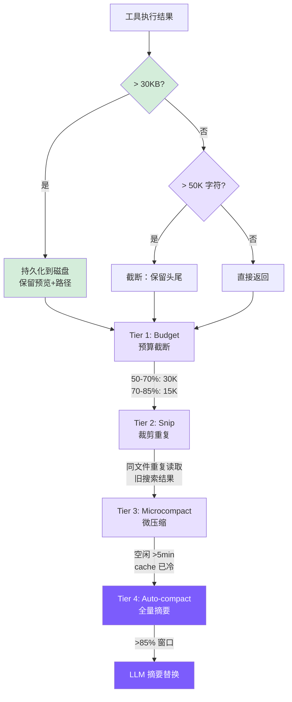

# 7. 上下文管理

## 本章目标

防止对话历史超出 LLM 的上下文窗口：4 层分级压缩管道，从轻量级截断到全量摘要逐级递进。



## Claude Code 怎么做的

### 上下文构建

每次 API 调用前，Claude Code 把三类信息组装进请求：

**系统提示词**是最稳定的部分，由归属头、工具 schema、安全规则等拼接而成。其中有一个 `SYSTEM_PROMPT_DYNAMIC_BOUNDARY` 哨兵将其分为静态半区和动态半区——静态半区对所有用户完全相同，标记 `scope: 'global'` 全球共享缓存；动态半区（MCP 工具、语言偏好等）因用户而异，不共享。这让全球数百万用户共享同一份核心系统提示词的缓存，是主要的成本优化手段之一。

**系统/用户上下文**每会话计算一次并 memoize：git 状态（5 个命令并行执行）、CLAUDE.md 文件（从 CWD 向上遍历目录树）、当前日期等。注入顺序是刻意安排的——系统上下文后置于系统提示词，用户上下文前置于消息数组，确保最稳定的内容在最前面，最大化缓存命中。

**消息历史**记录对话中的一切，是压缩管道的主要操作对象。发送给 API 前会经过 `normalizeMessagesForAPI()` 修复格式问题：附件重排序、处理 thinking 块、合并分裂消息、验证 `tool_use`/`tool_result` 配对等。

### 5 级压缩流水线

设计哲学是**渐进式压缩**：先用成本最低的手段，只在必要时才动更重的武器。

**Level 1: Tool Result 预算裁剪** — 工具声明 `maxResultSizeChars`（默认 50K 字符），超限时**持久化到磁盘**，上下文中只保留紧凑引用和 2KB 预览。选择持久化而非截断的原因：数据没有丢失，模型可以随时用 Read 工具读取完整文件。

**Level 2: History Snip** — Feature-gated 功能，裁剪历史中的冗余部分。释放的量会传递给后续 autocompact 的阈值计算，因为 snip 移除消息后最后一条 assistant 消息的 `usage` 仍反映 snip 前的大小，不修正会导致 autocompact 过早触发。

**Level 3: Microcompact** — 清理不再需要的旧工具结果，有两条路径：
- **缓存已冷**（空闲超过 N 分钟）：直接修改消息内容，将旧工具结果替换为占位符。缓存过期了，修改不会造成额外失效。
- **缓存仍热**：使用 API 级的 `cache_edits` 机制在服务端就地删除，完全不修改本地消息，避免缓存前缀失效。

**Level 4: Context Collapse** — 投影式折叠，关键特性是**不修改原始消息**，只创建一个折叠视图。类比数据库 View：底层表不变，查询时看到过滤后的结果。启用时会抑制 Autocompact，避免两者竞争。

**Level 5: Autocompact** — 最后手段，fork 子 Agent 调用 API 生成摘要。触发阈值约 85.5% 上下文利用率。压缩提示词用"分析-摘要"两阶段：先让模型在 `<analysis>` 块推理，再生成标准化的 `<summary>`（9 个部分），最后剥离推理过程只保留摘要——典型的链式思考草稿技术。

### Token 预算与缓存

**Token 估算**从不调用额外 API：用最近一次 API 返回的 `usage` 作为锚点，新增消息用字符数 / 4 粗估。误差从纯估算的 30%+ 降到 <5%。

**Prompt 缓存**脆弱性在于前缀中任何字节变化都会导致失效。Claude Code 在多个层面维护稳定性：静态/动态边界标记、beta header 粘性锁存（一旦发送就持续出现，不随 feature flag 变化）、工具数组末尾打缓存断点、以及断裂检测（`cache_read_input_tokens` 下降 >5% 时自动归因）。

**熔断器**：曾有会话连续 autocompact 失败 3,272 次，浪费大量 API 调用。现在连续 3 次失败后直接停止重试。

## 我们的实现

4 层管道：执行时截断 + Budget + Snip + Microcompact + Auto-compact。

### 第 0 层：执行时截断（`_truncate_result`）

#### Python
```python
# tools.py
MAX_RESULT_CHARS = 50000

def _truncate_result(result: str) -> str:
    if len(result) <= MAX_RESULT_CHARS:
        return result
    keep_each = (MAX_RESULT_CHARS - 60) // 2
    return (
        result[:keep_each]
        + f"\n\n[... truncated {len(result) - keep_each * 2} chars ...]\n\n"
        + result[-keep_each:]
    )
```

保留头尾而非只保留头部：文件开头有 imports、类定义等结构信息，命令输出的错误摘要通常在最后。

截断发生在工具结果返回之后、进入模型上下文之前。它的作用是防止一次工具调用把上下文窗口塞爆。比如 `grep_search` 搜到几千行、`run_shell` 输出大量日志，如果原样放进消息历史，后续模型调用会变贵，也可能直接超过上下文限制。

与 Claude Code 的区别：Claude Code 持久化到磁盘，模型后续可用读文件工具取回完整内容。我们现在也实现了持久化，见下方 `_persist_large_result`。两层配合：`_persist_large_result` 先拦截 >30KB 的结果保存到磁盘，`_truncate_result` 再处理通过第一层但仍超过 50K 的内容。

### 第 0.5 层：大结果持久化（`_persist_large_result`）

当工具返回结果超过 30KB 时，将完整内容写入磁盘，上下文中只保留预览和文件路径。模型后续可以用 `read_file` 按需取回完整输出。

```python
def _persist_large_result(self, tool_name: str, result: str) -> str:
    threshold = 30 * 1024
    if len(result.encode()) <= threshold:
        return result

    directory = Path.home() / ".mini-claude" / "tool-results"
    directory.mkdir(parents=True, exist_ok=True)

    filename = f"{int(time.time() * 1000)}-{tool_name}.txt"
    filepath = directory / filename
    filepath.write_text(result, encoding="utf-8")

    lines = result.split("\n")
    preview = "\n".join(lines[:200])
    size_kb = len(result.encode()) / 1024

    return (
        f"[Result too large ({size_kb:.1f} KB, {len(lines)} lines). "
        f"Full output saved to {filepath}. "
        f"You can use read_file to see the full result.]\n\n"
        f"Preview (first 200 lines):\n{preview}"
    )
```

这一层的设计要点：

- **30KB 阈值低于 `_truncate_result` 的 50K 限制**：在截断发生之前先拦截大结果，避免不可逆的信息丢失。如果一个结果有 80KB，`_persist_large_result` 会先将完整内容保存到磁盘，返回预览；而不是等 `_truncate_result` 把中间部分永久丢弃。
- **200 行预览**：给模型足够的上下文来判断是否需要读取完整输出。大多数情况下，前 200 行已经包含了关键信息（文件列表的开头、搜索结果的前几个匹配、命令输出的主要内容）。
- **可恢复 vs 不可恢复**：这是与 `_truncate_result` 的根本区别。`_truncate_result` 是不可逆的——被截掉的内容永远消失了。`_persist_large_result` 把数据保存到 `~/.mini-claude/tool-results/{timestamp}-{tool_name}.txt`，模型随时可以用 `read_file` 取回。
- **调用时机**：在主循环中每次工具执行完成后、结果添加到消息之前调用。这意味着它在 `_truncate_result` 之前生效——先尝试保存，保存后返回的预览文本通常远小于 50K，不会再触发截断。
- **与 Claude Code 的对齐**：这一设计直接对应 Claude Code 的 Level 1 策略（持久化到磁盘，上下文中只保留引用）。区别在于 Claude Code 用 2KB 预览，我们用 200 行——思路相同，实现简化。

### 第 1 层：Budget — 动态缩减工具结果

随上下文压力动态收紧历史中工具结果的大小：

#### Python
```python
# agent.py
def _budget_tool_results_anthropic(self) -> None:
    utilization = self.last_input_token_count / self.effective_window if self.effective_window else 0
    if utilization < 0.5:
        return
    budget = 15000 if utilization > 0.70 else 30000
    for msg in self._anthropic_messages:
        if msg.get("role") != "user" or not isinstance(msg.get("content"), list):
            continue
        for block in msg["content"]:
            if (isinstance(block, dict) and block.get("type") == "tool_result"
                    and isinstance(block.get("content"), str) and len(block["content"]) > budget):
                keep = (budget - 80) // 2
                block["content"] = (
                    block["content"][:keep]
                    + f"\n\n[... budgeted: {len(block['content']) - keep * 2} chars truncated ...]\n\n"
                    + block["content"][-keep:]
                )
```

第 0 层是一次性的 50K 硬限制；Budget 是每次 API 调用前重算，预算随利用率自动收紧。用双阈值（50%/70%）而非单阈值，是为了在上下文还宽裕时多保留细节。

Budget 和 `_truncate_result()` 的区别在于时机。`_truncate_result()` 只处理刚刚返回的单个工具结果；Budget 会回头检查历史消息里的旧工具结果。当上下文压力变大时，原本可以保留的 30K 结果也可能变得太贵，这时 Budget 会进一步缩小它们。

### 第 2 层：Snip — 替换过时的工具结果

#### Python
```python
# agent.py
SNIPPABLE_TOOLS = {"read_file", "grep_search", "list_files", "run_shell"}
SNIP_PLACEHOLDER = "[Content snipped - re-read if needed]"
KEEP_RECENT_RESULTS = 3
```

Snip 策略（利用率 > 60% 时触发）：
- 同一文件被 `read_file` 多次读取 → 只保留最新一次，旧的 snip
- 同类搜索结果超过 3 个 → snip 最旧的
- 最近 3 个 `tool_result` 永远保留

关键点：**只清 `tool_result` 的 content，保留 `tool_use` block 不变**。模型仍能看到"我之前读了 mini_claude/agent.py"，只是看不到内容了——如果需要，可以重新调用 `read_file`。保留元数据比保留数据更重要。

Snip 的价值是保留“发生过什么”，删除“当时的全部细节”。这和人类记笔记类似：你不需要永远保存每次搜索的完整输出，但需要知道自己搜过哪里、读过哪个文件。如果后续确实需要细节，模型可以重新调用工具获取最新内容。

### 第 3 层：Microcompact — 缓存冷启动时激进清理

#### Python
```python
# agent.py
MICROCOMPACT_IDLE_S = 5 * 60

def _microcompact_anthropic(self) -> None:
    if not self.last_api_call_time or (time.time() - self.last_api_call_time) < MICROCOMPACT_IDLE_S:
        return
    # 除最近 3 个外，所有旧 tool_result → "[Old result cleared]"
```

用时间触发的原因：prompt cache 有 TTL，空闲超过 5 分钟后缓存大概率已过期，继续保留旧消息内容没有成本优势，不如激进清理。

Snip 是选择性的（只替换"过时"结果），Microcompact 是无差别的（除最新 3 个外全清）——更激进，但触发条件更严格。

我们只实现了基于时间的路径。Claude Code 的缓存编辑路径依赖 `cache_edits` API 机制，对教学实现过于复杂。

### 第 4 层：Auto-compact — 全量摘要压缩

#### 触发条件

#### Python
```python
# agent.py
async def _check_and_compact(self) -> None:
    if self.last_input_token_count > self.effective_window * 0.85:
        print_info("Context window filling up, compacting conversation...")
        await self._compact_conversation()
```

`effectiveWindow = 模型上下文窗口 - 20000`，预留给新一轮输入/输出。对 Claude（200K 窗口），触发点约在 76.5% 总利用率。

Auto-compact 是最激进的一层，因为它会调用模型总结整段旧对话，并用摘要替换大量历史。它的好处是能一次性释放很多上下文；代价是摘要可能丢失细节。因此前面几层会先尝试截断、持久化、budget 和 snip，只有上下文真的接近上限时才做全量摘要。

> ⚠️ **调用方契约**：`_check_and_compact()` 只能在回合边界调用（用户输入加入消息数组之后、API 调用之前）。下面的 `_compact_anthropic()` / `_compact_openai()` 会把消息数组的最后一条当成“已被处理的纯文本用户消息”——它会先切掉最后一条去生成摘要，再在最后把这条消息接回来。一旦在工具循环中段调用，最后一条会是 `tool_result`（Anthropic）或 `tool` role（OpenAI），切掉后前面 `assistant` 的 `tool_use` / `tool_calls` 失去配对，API 会直接报错。

#### Anthropic 后端压缩

#### Python
```python
# agent.py
async def _compact_anthropic(self) -> None:
    if len(self._anthropic_messages) < 4:
        return

    last_user_msg = self._anthropic_messages[-1]

    summary_resp = await self._anthropic_client.messages.create(
        model=self.model,
        max_tokens=2048,
        system="You are a conversation summarizer. Be concise but preserve important details.",
        messages=[
            *self._anthropic_messages[:-1],
            {"role": "user", "content": "Summarize the conversation so far in a concise paragraph, "
             "preserving key decisions, file paths, and context needed to continue the work."},
        ],
    )
    summary_text = (summary_resp.content[0].text
                    if summary_resp.content and summary_resp.content[0].type == "text"
                    else "No summary available.")

    self._anthropic_messages = [
        {"role": "user", "content": f"[Previous conversation summary]\n{summary_text}"},
        {"role": "assistant", "content": "Understood. I have the context from our previous conversation. How can I continue helping?"},
    ]

    if last_user_msg.get("role") == "user":
        self._anthropic_messages.append(last_user_msg)
    self.last_input_token_count = 0
```

与 Claude Code 的主要差异：Claude Code 用"分析-摘要"两阶段提示词生成更高质量的摘要，压缩后恢复最近 5 个文件和活跃技能，有熔断器防无限循环。我们是简化版——单段摘要、无恢复机制、无熔断。

#### OpenAI 后端压缩

OpenAI 的 system prompt 在消息数组中（`role: "system"`），压缩时需要额外保留：

#### Python
```python
# agent.py
async def _compact_openai(self) -> None:
    if len(self._openai_messages) < 5:
        return

    system_msg = self._openai_messages[0]
    last_user_msg = self._openai_messages[-1]

    summary_resp = await self._openai_client.chat.completions.create(
        model=self.model,
        max_tokens=2048,
        messages=[
            {"role": "system", "content": "You are a conversation summarizer. Be concise but preserve important details."},
            *self._openai_messages[1:-1],
            {"role": "user", "content": "Summarize the conversation so far..."},
        ],
    )
    summary_text = summary_resp.choices[0].message.content or "No summary available."

    self._openai_messages = [
        system_msg,
        {"role": "user", "content": f"[Previous conversation summary]\n{summary_text}"},
        {"role": "assistant", "content": "Understood. I have the context..."},
    ]

    if last_user_msg.get("role") == "user":
        self._openai_messages.append(last_user_msg)
    self.last_input_token_count = 0
```

守卫条件是 `< 5` 而非 `< 4`，因为 OpenAI 消息数组最少包含 system + 2 轮对话 + 最新用户消息 = 5 条。

### 手动压缩

```
> /compact
  ℹ Conversation compacted.
```

调用链：`mini_claude/__main__.py` → `agent.compact()` → `_compact_conversation()` → `_compact_anthropic()` / `_compact_openai()`

### Token 统计与管道编排

每次 API 调用后更新：

#### Python
```python
self.total_input_tokens += response.usage.input_tokens
self.total_output_tokens += response.usage.output_tokens
self.last_input_token_count = response.usage.input_tokens
```

`lastInputTokenCount` 用于判断是否接近窗口上限；`totalInputTokens` 累计所有调用用于费用估算。我们直接用 API 返回值，比 Claude Code 的锚点+估算方案简单，够用。

4 层在每次 API 调用前顺序执行：

#### Python
```python
def _run_compression_pipeline(self) -> None:
    if self.use_openai:
        self._budget_tool_results_openai()
        self._snip_stale_results_openai()
        self._microcompact_openai()
    else:
        self._budget_tool_results_anthropic()
        self._snip_stale_results_anthropic()
        self._microcompact_anthropic()
```

Tier 1-3 在每次 API 调用**前**运行（零 API 成本），Tier 4 在**回合边界**触发——即每次用户输入加入消息数组后、`while` 主循环开始前。**不要**把 Tier 4 放在工具循环末尾：那时最后一条消息是 `{role: "user", content: [tool_result, ...]}`，`_compact_anthropic()` 内部切掉最后一条会破坏它与前一条 `assistant` 消息里 `tool_use` 的配对，Anthropic API 会拒绝那次摘要请求。`last_input_token_count` 在新位置仍然有效——它反映上一轮最后一次 API 调用的状态，足以判断是否触发。顺序也有意义：Budget 先压缩大结果，让 Snip 的去重判断更准确，Microcompact 最后在时间条件满足时无差别清理。

## 简化对比

| 维度 | Claude Code | mini-claude |
|------|------------|-------------|
| **压缩层级** | 5 级流水线 | 4 层（budget + snip + microcompact + 摘要） |
| **Token 计数** | 锚点+粗估，不额外调 API | 直接用 API 返回的 input_tokens |
| **Budget 触发** | 基于剩余预算 | 50%/70% 双阈值 |
| **Snip 策略** | 选择性裁剪 + cache 感知 | 同文件去重 + 保留最近 3 个 |
| **Microcompact** | 时间路径 + 缓存编辑路径 | 只有 5 分钟空闲触发 |
| **Auto-compact** | 两阶段摘要 + 压缩后恢复 + 熔断器 | 单段摘要，无恢复 |
| **溢出存储** | 磁盘持久化，可按需读取 | 磁盘持久化（>30KB），可按需读取 |

## 补充：容易混淆的几个点

### mini-claude 的“4 层”到底是哪几层

本章说的 4 层压缩，指的是上下文进入 API 前后的主压缩管道：

1. **Budget**：按上下文利用率缩短历史工具结果。
2. **Snip**：把陈旧工具结果替换成占位符。
3. **Microcompact**：空闲一段时间后，更激进地清理旧工具结果。
4. **Auto-compact**：调用模型生成摘要，用摘要替换旧历史。

在这之前还有一层“第 0 层”保护：`_persist_large_result()` 和 `_truncate_result()`。它们处理的是**刚刚产生的单个工具结果**，防止一次 `grep_search`、`run_shell` 或大文件读取把上下文撑爆。主压缩管道处理的是**已经进入消息历史的旧工具结果**。所以更精确地说，mini-claude 是“第 0 层预处理 + 4 层压缩管道”。

### Budget 不是只修改预算

Budget 的名字容易让人误解。它不是只计算一个预算值，也不是调用 Snip 策略，而是会**直接修改消息历史里的工具结果内容**。

当 `last_input_token_count / effective_window` 小于 50% 时，Budget 不动作。超过 50% 后，它会把过长工具结果裁到约 30K 字符；超过 70% 后，裁到约 15K 字符。裁剪方式是保留头尾：

```text
前半部分

[... budgeted: N chars truncated ...]

后半部分
```

Budget 和 Snip 的区别在于：

- **Budget 是缩短**：仍保留工具结果的头部和尾部。
- **Snip 是替换**：直接把内容变成 `[Content snipped - re-read if needed]`。

两者是独立步骤，只是在 `_run_compression_pipeline()` 中按顺序执行：Budget 先尽量保留信息地缩短内容，Snip 再处理重复、陈旧、低价值的旧结果。

### Microcompact 的缓存冷热路径

Claude Code 的 Microcompact 有两条路径，背后的矛盾是：既想删除旧工具结果来节省上下文，又不想破坏 prompt cache。

**缓存已冷**时，服务端缓存大概率已经过期，继续保持本地消息字节不变也没有多少收益。这时可以直接修改本地消息，把旧工具结果替换为占位符：

```text
[Old result cleared]
```

mini-claude 实现的就是这条路径。它用 `MICROCOMPACT_IDLE_S = 5 * 60` 判断：如果距离上次 API 调用超过 5 分钟，就认为缓存大概率已经冷掉，于是保留最近 3 个工具结果，清理更旧的结果。

**缓存仍热**时，直接改本地消息会破坏缓存前缀。因为 prompt cache 通常要求请求前缀字节完全一致，一旦历史中间某个工具结果从长文本变成占位符，从这个位置开始后面的缓存都可能失效。Claude Code 的完整实现会使用 API 级的 `cache_edits` 机制：本地消息不变，服务端在缓存内部就地删除或忽略旧内容。这样既保住缓存命中，又减少模型实际看到的旧结果。

mini-claude 没有实现热缓存路径，因为它依赖更复杂的服务端缓存编辑能力。教学实现只保留了“缓存已冷后直接清理本地消息”的版本。

### Token 预算为什么不用额外 API 计算

Claude Code 的 token 估算不会为了数 token 再调用一次 API。它用最近一次 API 返回的 `usage` 作为锚点，再对新增消息做粗估：

```text
当前估算 token ≈ 上次 input_tokens + 新增字符数 / 4
```

这样比“把整段历史全部按字符数 / 4 粗估”更准，因为历史大头已经由上次 API 精确统计过，只有新增部分是估算。误差主要集中在最近新增的一小段内容里。

mini-claude 更简单：它直接使用 API 返回的 `input_tokens` 更新 `last_input_token_count`，再用这个值判断是否触发 Budget、Snip 和 Auto-compact。这个实现没有做“锚点 + 新增消息估算”的复杂逻辑，但足够支撑教程项目。

### Prompt cache 为什么这么脆弱

Prompt cache 缓存的是请求前缀，例如 system prompt、工具定义、项目规则和较早的消息历史。它能降低重复上下文的成本和延迟，但前提是前缀稳定。

如果请求从这里开始发生字节变化：

```text
system prompt
tools
message 1  <- 这里变了
message 2
message 3
```

那么即使 `message 2` 和 `message 3` 内容没变，后续缓存也可能无法复用。Claude Code 因此会尽量维护前缀稳定：

- 静态/动态边界：把长期不变的 system prompt 放前面，把日期、git 状态、用户偏好这类动态内容放后面。
- beta header 粘性锁存：某个 beta header 一旦在会话里启用，后续请求持续携带，避免请求形态来回变化。
- 工具数组末尾打缓存断点：让稳定的工具定义尽量成为可复用前缀。
- 断裂检测：观察 `cache_read_input_tokens` 是否明显下降，下降超过阈值时尝试归因。

mini-claude 没有实现这些完整的 prompt cache 维护策略，但理解它们有助于解释为什么压缩不能随便改历史：改得太早可能省了一点上下文，却损失了大量缓存收益。

### 熔断器防止 Auto-compact 失控

Auto-compact 自己也要调用模型。如果上下文已经太大、摘要请求失败、摘要格式不合法，或者压缩后仍然超限，就可能进入反复重试：

```text
发现上下文快满
→ 尝试 compact
→ 失败
→ 下一轮仍然快满
→ 再尝试 compact
→ 再失败
```

真实系统需要熔断器：连续失败几次后停止自动重试，避免无限消耗 API 调用。Claude Code 的完整实现会在连续失败后停止 autocompact。mini-claude 当前的 `_compact_conversation()` 是教学版，没有实现失败计数和熔断；如果要增强健壮性，可以加一个 `compact_failure_count`，连续 3 次失败后禁用自动 compact，并提示用户手动 `/clear`、`/compact` 或开启新会话。

---

> **下一章**：让 Agent 跨会话记住信息——记忆系统。

## 本章小结：上下文管理是在保护模型的注意力

模型每次调用都只能看到有限上下文。编程任务跑得越久，消息历史里就会堆积越多文件内容、搜索结果、测试输出和工具结果。如果不管理，上下文会越来越贵，甚至超过模型窗口。上下文管理就是在不破坏任务连续性的前提下，把低价值内容压缩或移出。

当前实现分两类。第一类是不调用模型的轻量处理：`_truncate_result()` 截断超长工具结果，`_persist_large_result()` 把大结果保存到磁盘，`_run_compression_pipeline()` 里做 budget、snip、microcompact。第二类是调用模型的 auto-compact：`_check_and_compact()` 判断上下文接近上限时，调用 `_compact_anthropic()` 或 `_compact_openai()` 把旧对话总结成摘要。

最重要的相关概念是“回合边界”。工具调用和工具结果必须成对出现，不能随便删其中一半。所以全量摘要只能在用户消息刚进入历史、下一次 API 调用之前做。这个位置看起来细微，但它决定了压缩后消息协议是否仍然合法。
