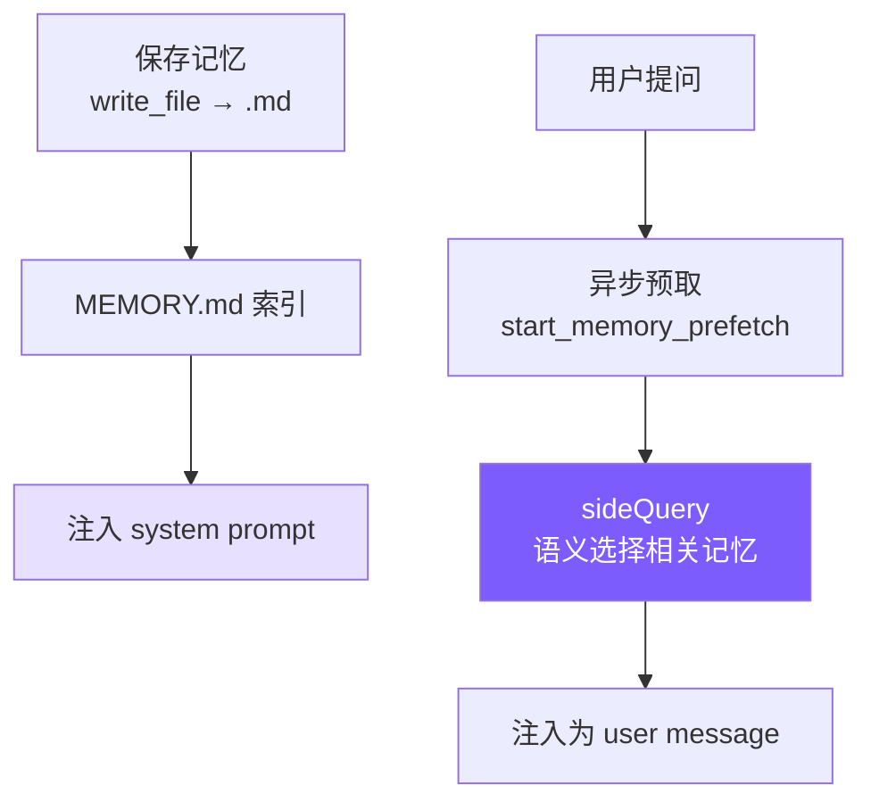

# 8. 记忆系统

## 本章目标

实现跨会话记忆：让 Agent 在多次对话间保持对用户和项目的认知，不依赖对话历史。



---

## Claude Code 怎么做的

Claude Code 记忆系统的核心约束只有一条：**只记忆不可从当前项目状态推导的信息**。代码模式、架构、文件路径、git 历史、正在进行的调试——这些读代码和 `git log` 就能获得，记忆中的版本只会制造漂移。连用户明确要求保存的信息也不例外——如果用户说"记住这个 PR 列表"，Agent 应该追问：列表中有什么是不可推导的？某个截止日期？某个意外发现？

记忆分四种类型：

| 类型 | 记什么 | 触发时机 |
|------|--------|---------|
| **user** | 用户身份、偏好、知识背景 | 了解到用户角色/偏好时 |
| **feedback** | 对 Agent 行为的纠正**和肯定** | 用户纠正或肯定某个行为时 |
| **project** | 项目进展、决策、截止日期 | 了解到项目动态时 |
| **reference** | 外部系统的定位信息 | 了解到外部系统位置时 |

封闭分类法而非自由标签——防止标签膨胀导致召回时的模糊匹配。

`feedback` 类型有个细节：不只记录纠正，也记录用户的肯定。原因很实际：只记录"错误"会让模型避免重蹈覆辙，但也可能无意间放弃用户已经验证过的好做法。这两种类型还要求正文包含 `Why` 和 `How to apply`——因为知道"为什么"才能判断边界情况，盲目执行规则往往适得其反。

`project` 类型有个具体要求：相对日期必须转为绝对日期。"周四之后合并冻结"→"2026-03-05 后合并冻结"。记忆可能在几周后被读取，"周四"到时已毫无意义。

**MEMORY.md 是索引不是容器。** 它每次会话都完整加载到 system prompt，所以必须紧凑——每条一行链接，实际内容按需读取。设有 200 行/25KB 双重截断，超出时追加提示"keep index entries to one line under ~200 chars"。错误消息包含修复指引，这是贯穿整个系统的设计习惯。

**召回机制**用 `sideQuery` 调模型做语义匹配，而非关键词搜索。用户问"部署流程"时，语义匹配能找到标题为"CI/CD 注意事项"的记忆，关键词匹配则不行。召回在模型开始生成响应的同时异步执行（`pendingMemoryPrefetch`），对用户而言延迟近乎为零。每次最多返回 5 条，上下文成本可控。

每条记忆还附带 **freshness warning**——超过 1 天的记忆会标注过期天数，提醒模型记忆是时间切片而非实时状态。"下周截止"的记忆在两周后读到时，模型需要知道它可能已经过时。

---

## 我们的实现

### 存储结构

```
~/.mini-claude/projects/{sha256-hash}/memory/
├── MEMORY.md                          # 索引文件
├── user_prefers_concise_output.md
├── feedback_no_summary_at_end.md
├── project_auth_migration_q2.md
└── reference_ci_dashboard_url.md
```

路径中的哈希是 `process.cwd()` 的 sha256 前 16 位——同一项目目录始终映射到同一记忆空间。

这样设计是为了把“项目记忆”和“全局用户记忆”区分开。不同项目可能有完全不同的技术栈、测试命令和团队约定，如果都混在同一个目录里，模型很容易把 A 项目的规则带到 B 项目。用当前工作目录生成 hash，可以保证同一项目稳定命中同一份记忆，同时避免路径里出现过长或包含特殊字符的目录名。

### 记忆文件格式

```markdown
---
name: 不要在回复末尾总结
description: 用户明确要求省略总结段落
type: feedback
---
用户说"不要在响应末尾总结"，因为他们能自己看 diff 和代码变更。

**Why:** 用户觉得总结浪费时间，更喜欢直接给出结果。
**How to apply:** 完成任务后直接结束，不要加 "总结" 或 "以上是..." 段落。
```

### Frontmatter 解析（共享模块）

记忆和技能都要解析 YAML frontmatter，抽出 `mini_claude/frontmatter.py`：

#### Python
```python
# frontmatter.py

@dataclass
class FrontmatterResult:
    meta: dict[str, str] = field(default_factory=dict)
    body: str = ""


def parse_frontmatter(content: str) -> FrontmatterResult:
    lines = content.split("\n")
    if not lines or lines[0].strip() != "---":
        return FrontmatterResult(body=content)

    end_idx = -1
    for i in range(1, len(lines)):
        if lines[i].strip() == "---":
            end_idx = i
            break
    if end_idx == -1:
        return FrontmatterResult(body=content)

    meta: dict[str, str] = {}
    for i in range(1, end_idx):
        colon_idx = lines[i].find(":")
        if colon_idx == -1:
            continue
        key = lines[i][:colon_idx].strip()
        value = lines[i][colon_idx + 1:].strip()
        if key:
            meta[key] = value

    body = "\n".join(lines[end_idx + 1:]).strip()
    return FrontmatterResult(meta=meta, body=body)
```

没有用 `js-yaml` 之类的库——我们的 frontmatter 只是简单的 `key: value`，20 行手写解析器够用且零依赖。

frontmatter 的作用是把“给程序看的元数据”和“给模型看的正文”分开。`name`、`description`、`type` 方便代码索引和筛选；正文则保存真正需要注入给模型的内容。这样扫描记忆时不必读取和理解整篇正文，只需要看前面的元数据就能先判断大概用途。

### 保存与索引

#### Python
```python
# memory.py — save_memory

def save_memory(name: str, description: str, type: str, content: str) -> str:
    d = get_memory_dir()
    filename = f"{type}_{_slugify(name)}.md"
    text = format_frontmatter(
        {"name": name, "description": description, "type": type}, content
    )
    (d / filename).write_text(text)
    _update_memory_index()
    return filename

def _update_memory_index() -> None:
    memories = list_memories()
    lines = ["# Memory Index", ""]
    for m in memories:
        lines.append(f"- **[{m.name}]({m.filename})** ({m.type}) — {m.description}")
    _get_index_path().write_text("\n".join(lines))
```

文件名格式 `{type}_{slugified_name}.md` 让文件系统排序时自动按类型分组，人眼扫描也一目了然。每次写入后立即重建索引，保持 MEMORY.md 与文件系统同步。

索引文件 `MEMORY.md` 不是给程序唯一依赖的数据库，而是给模型和人类快速浏览的目录。程序仍然可以扫描具体记忆文件；索引的好处是把“当前有哪些记忆”压缩成较短列表，适合放进系统提示词。如果没有索引，每次都把所有记忆正文塞给模型，很快就会浪费上下文。

### 索引截断

#### Python
```python
# memory.py — load_memory_index

MAX_INDEX_LINES = 200
MAX_INDEX_BYTES = 25000

def load_memory_index() -> str:
    index_path = _get_index_path()
    if not index_path.exists():
        return ""
    content = index_path.read_text()
    lines = content.split("\n")
    if len(lines) > MAX_INDEX_LINES:
        content = "\n".join(lines[:MAX_INDEX_LINES]) + "\n\n[... truncated, too many memory entries ...]"
    if len(content.encode()) > MAX_INDEX_BYTES:
        content = content[:MAX_INDEX_BYTES] + "\n\n[... truncated, index too large ...]"
    return content
```

两层截断各有用途：行截断（200 行）是正常防护，按完整条目截断；字节截断（25KB）是异常防御，捕捉行数不多但单行极长的情况——Claude Code 团队在生产中见过 197KB 塞在 200 行内的案例。

### 系统提示词注入

`buildMemoryPromptSection()` 生成注入到 system prompt 的文本，告诉模型记忆系统的存在和用法：

#### Python
```python
# memory.py — build_memory_prompt_section（简化展示）

def build_memory_prompt_section() -> str:
    index = load_memory_index()
    memory_dir = str(get_memory_dir())

    return f"""# Memory System

You have a persistent, file-based memory system at `{memory_dir}`.

## Memory Types
- **user**: User's role, preferences, knowledge level
- **feedback**: Corrections and guidance from the user
- **project**: Ongoing work, goals, deadlines, decisions
- **reference**: Pointers to external resources

## How to Save Memories
Use the write_file tool to create a memory file with YAML frontmatter:
...
Save to: `{memory_dir}/`
Filename format: `{{type}}_{{slugified_name}}.md`

## What NOT to Save
- Code patterns or architecture (read the code instead)
- Git history (use git log)
- Anything already in CLAUDE.md
- Ephemeral task details

{"## Current Memory Index" + chr(10) + index if index else "(No memories saved yet.)"}"""
```

这段 prompt 做了三件事：教模型分类（四种类型）、教模型操作（用 `write_file`、存到哪里、什么格式）、教模型克制（"What NOT to Save"）。"让模型使用记忆"不只是给它一个工具，还要在 prompt 中描述完整的类型体系和边界，模型才能做出好的决策。

最后在 `mini_claude/prompt.py` 中通过占位符注入：

#### Python
```python
result = result.replace("{{memory}}", build_memory_prompt_section())
```

### CLI 交互

用户在 REPL 中输入 `/memory` 可以列出所有记忆：

#### Python
```python
if inp == "/memory":
    memories = list_memories()
    if not memories:
        print_info("No memories saved yet.")
    else:
        print_info(f"{len(memories)} memories:")
        for m in memories:
            print(f"    [{m.type}] {m.name} — {m.description}")
    continue
```

---

### 语义召回（sideQuery）

早期版本用关键词匹配做记忆召回——把查询拆成词，统计每条记忆的命中数排序。这很简单但能力有限：用户问"部署流程"时，标题为"CI/CD 注意事项"的记忆完全匹配不上，因为没有共同关键词。

新版本用 `sideQuery` 做语义召回：把所有记忆的文件名和描述发给模型，让模型判断哪些与当前查询相关。

```python
SELECT_MEMORIES_PROMPT = """You are selecting memories that will be useful to an AI coding assistant as it processes a user's query.

Return a JSON object with a "selected_memories" array of filenames for the memories that will clearly be useful (up to 5).
- If you are unsure if a memory will be useful, do not include it.
- If no memories would clearly be useful, return an empty array."""


async def select_relevant_memories(
    query: str,
    side_query: SideQueryFn,
    already_surfaced: set[str],
) -> list[RelevantMemory]:
    headers = scan_memory_headers()
    candidates = [h for h in headers if h.file_path not in already_surfaced]
    if not candidates:
        return []

    manifest = format_memory_manifest(candidates)
    text = await side_query(
        SELECT_MEMORIES_PROMPT,
        f"Query: {query}\n\nAvailable memories:\n{manifest}",
    )

    match = re.search(r"\{[\s\S]*\}", text)
    if not match:
        return []

    parsed = json.loads(match.group(0))
    selected_filenames = set(parsed.get("selected_memories", []))
    selected = [h for h in candidates if h.filename in selected_filenames][:5]
```

几个关键设计点：

**sideQuery 用的是同一个模型，不是单独的小模型。** Claude Code 用 Sonnet 做 sideQuery，我们简化为直接复用用户配置的模型。sideQuery 只发送记忆清单（文件名 + 描述），不发送完整内容，所以输入 token 很少。

这里的 sideQuery 可以理解成“旁路小任务”。主模型正在处理用户请求，同时系统额外问模型一个更窄的问题：这些记忆里哪些和当前请求有关？它不需要完整工具列表，也不需要完整对话，只需要用户问题和记忆清单。这样可以用很少的上下文换来更准确的记忆召回。

**模型做语义选择，比关键词匹配强得多。** "部署流程"能匹配到"CI/CD 注意事项"，"数据库性能"能匹配到"PostgreSQL 索引优化经验"——因为模型理解语义关联，不只是字面重叠。

**`alreadySurfaced` Set 防止重复召回。** 同一会话中已经展示过的记忆不会再次出现，避免用户每次提问都看到相同的记忆。这个 Set 在整个会话生命周期内持续增长。

**单文件 4KB 截断 + 会话总预算 60KB。** 防止单条巨大记忆或累积过多召回挤占上下文。预算是字节级控制，不是 token 级——字节计算更快，且对多语言文本更公平。

> **对比旧版关键词匹配（已替换）：** 旧实现把查询拆词后逐条匹配，零 API 调用但准确度低。新版每次召回消耗 1 次 API 调用，但语义理解能力质的飞跃。对于教程项目记忆量少的场景，这个 API 成本完全可以接受。

### 异步预取（`start_memory_prefetch`）

语义召回需要一次 API 调用，如果同步执行会增加用户等待时间。解决方案：**在用户提交输入的瞬间就启动召回，与第一次模型 API 调用并行执行。**

异步预取的意义是把记忆召回的耗时藏起来。用户提交问题后，主循环很快就要调用模型生成第一轮响应；与此同时，记忆系统可以在后台判断哪些长期记忆相关。等主模型需要继续下一轮时，相关记忆通常已经准备好，可以作为 `<system-reminder>` 注入，而不需要让用户额外等待。

```python
class MemoryPrefetch:
    def __init__(self, task: asyncio.Task):
        self.task = task
        self.consumed = False

    @property
    def settled(self) -> bool:
        return self.task.done()


def start_memory_prefetch(
    query: str,
    side_query: SideQueryFn,
    already_surfaced: set[str],
    session_memory_bytes: int,
) -> MemoryPrefetch | None:
    if not re.search(r"\s", query.strip()):
        return None
    if session_memory_bytes >= MAX_SESSION_MEMORY_BYTES:
        return None
    if not any(f.suffix == ".md" and f.name != "MEMORY.md" for f in get_memory_dir().iterdir()):
        return None

    task = asyncio.create_task(
        select_relevant_memories(query, side_query, already_surfaced)
    )
    return MemoryPrefetch(task)
```

在 `mini_claude/agent.py` 中的使用：

```python
memory_prefetch: MemoryPrefetch | None = None
if not self.is_sub_agent:
    side_query = self._build_side_query()
    if side_query:
        memory_prefetch = start_memory_prefetch(
            user_message,
            side_query,
            self._already_surfaced_memories,
            self._session_memory_bytes,
        )

while True:
    if memory_prefetch and memory_prefetch.settled and not memory_prefetch.consumed:
        memory_prefetch.consumed = True
        memories = memory_prefetch.task.result()
        if memories:
            injection_text = format_memories_for_injection(memories)
            last = self._anthropic_messages[-1]
            last["content"] = last["content"] + "\n\n" + injection_text
```

这个设计的关键在于**非阻塞轮询**：

1. **预取在用户输入时启动**——与第一次模型 API 调用并行，用户感知不到额外延迟
2. **每次循环迭代都检查**——如果预取还没完成，不等待，直接跳过；下一次迭代再检查
3. **`settled` 标志用 `.then()` 设置**——不用 `await`，只在确认完成后才读取结果
4. **消费后标记 `consumed = true`**——确保同一次预取只注入一次

三个门控条件避免浪费 API 调用：
- **多词查询**：单个词（如 "hi"）太短，语义匹配无意义
- **会话预算**：累积超过 60KB 后停止召回，防止上下文过载
- **记忆存在性**：没有记忆文件时跳过，省一次 API 调用

`formatMemoriesForInjection` 把每条记忆包裹在 `<system-reminder>` 标签中注入为 user message：

```python
def format_memories_for_injection(memories: list[RelevantMemory]) -> str:
    parts = []
    for memory in memories:
        parts.append(
            f"<system-reminder>\n"
            f"{memory.header}\n\n"
            f"{memory.content}\n"
            f"</system-reminder>"
        )
    return "\n\n".join(parts)
```

### Freshness Warning

记忆是时间切片，不是实时状态。一条"项目下周截止"的记忆在两周后读到时已经过时，模型如果不知道这一点就会给出错误建议。

```python
def memory_age(mtime_ms: float) -> str:
    days = max(0, int((time.time() * 1000 - mtime_ms) / 86_400_000))
    if days == 0:
        return "today"
    if days == 1:
        return "yesterday"
    return f"{days} days ago"


def memory_freshness_warning(mtime_ms: float) -> str:
    days = max(0, int((time.time() * 1000 - mtime_ms) / 86_400_000))
    if days <= 1:
        return ""
    return (
        f"This memory is {days} days old. Memories are point-in-time observations, "
        "not live state — claims about code behavior may be outdated. "
        "Verify against current code before asserting as fact."
    )
```

规则很简单：1 天以内不提示（信息基本新鲜），超过 1 天就附带警告。警告文本明确告诉模型两件事："这是过去某个时刻的观察"和"需要对照当前代码验证"。这比简单标注"X 天前"更有效——它给出了行动指引，而非只是信息。

---

## 关键设计决策

**为什么记忆用文件系统而非数据库？** 三个好处：用户可以直接用编辑器读写记忆文件；模型用已有的 `write_file`/`read_file` 工具就能操作，不需要专门的记忆 API；如有需要可以纳入 git 版本控制。记忆系统"寄生"在工具系统上，减少了需要暴露的接口数量。

**为什么用语义召回而非关键词匹配？** 关键词匹配只能找到字面重叠的记忆，语义召回能理解"部署流程"和"CI/CD 注意事项"的关联。代价是每次召回消耗 1 次 API 调用，但 sideQuery 只发送记忆清单（文件名 + 描述），输入 token 极少，成本很低。对于记忆量有限的场景，这个 trade-off 完全值得。

**为什么异步预取而非同步召回？** 同步召回意味着用户每次提问都要多等一个 API 往返。预取与第一次模型调用并行，如果预取先完成，记忆在第一轮响应中就可见；如果没完成，第二轮也能赶上。最差情况下记忆晚到一轮，但用户永远不需要等。

**为什么需要会话级预算？** 无限召回会让上下文充满记忆，挤掉真正的对话内容。60KB 预算大约相当于 20-30 条中等长度的记忆，足够覆盖一次会话的上下文需求。`alreadySurfaced` 集合配合预算上限，让越到会话后期记忆召回越精准——已经展示过的不重复，预算内只留真正需要的。

### 对比总览

| 维度 | Claude Code | mini-claude |
|------|------------|-------------|
| **召回方式** | Sonnet sideQuery 语义匹配 | sideQuery 语义匹配（同模型） |
| **异步预取** | `memory_prefetch` | `start_memory_prefetch` |
| **会话预算** | 60KB | 60KB |
| **Freshness** | 过期警告 | 过期警告 |
| **API 调用** | 每次召回 1 次 | 每次召回 1 次 |

---

## 补充理解：这些概念到底在解决什么问题

本章容易混淆的点在于：记忆系统不是“把所有历史对话保存起来再全部喂给模型”，而是一个小型检索系统。它先把长期信息保存下来，再在用户提问时挑出少量相关内容注入上下文。

### 封闭分类法 vs 自由标签

“封闭分类法”指记忆只能属于固定的几类：`user`、`feedback`、`project`、`reference`。这四类是系统提前定义好的，不允许模型随手创造新类型。

“自由标签”则是给每条记忆随便打 tag，比如 `deploy`、`deployment`、`ci`、`cicd`、`release`、`上线`、`部署`。一开始看起来很灵活，但时间长了会出现标签膨胀：同一个意思被写成很多相近标签，召回时反而更模糊。

举个例子，用户问“部署流程”，相关记忆可能叫“CI/CD 注意事项”。如果系统依赖关键词或标签，而这条记忆只打了 `ci`、`release`，就可能漏掉。mini-claude 的设计是：类型只负责粗分类，真正的相关性由 `name`、`description` 和 sideQuery 的语义判断完成。

所以封闭分类法的目的不是让分类更细，而是让分类更稳定。它避免模型在长期运行中造出越来越多相似但不统一的标签。

### 保存与索引

“保存”是把一条长期记忆写成独立 Markdown 文件。例如：

```markdown
---
name: staging 部署前跑 smoke test
description: 项目部署到 staging 前需要先执行 smoke test
type: project
---
这个项目部署到 staging 前需要先跑 smoke test。
```

“索引”是自动生成 `MEMORY.md`，把所有记忆压缩成一份目录：

```markdown
# Memory Index

- **[staging 部署前跑 smoke test](project_staging_deploy_smoke_test.md)** (project) — 项目部署到 staging 前需要先执行 smoke test
- **[用户喜欢简洁回复](user_prefers_concise_output.md)** (user) — 用户偏好直接、少总结
```

`MEMORY.md` 的作用类似书的目录。模型启动时先看到“有哪些记忆”，但不会一开始就读取所有正文。这样既能让模型知道记忆系统里有什么，又不会把上下文塞满。

这也是为什么文档强调 `MEMORY.md` 是索引，不是容器。真正的内容在单独记忆文件里；索引只保留名称、类型、描述和链接。

### 索引截断

索引截断是为了防止 `MEMORY.md` 自己变成上下文负担。

`MEMORY.md` 会被注入 system prompt。如果记忆越来越多，索引可能增长到几百行甚至几千行。此时每次对话都带着巨大目录，会带来几个问题：

- token 成本变高
- system prompt 变长，挤占真正对话内容
- 模型注意力被大量无关记忆分散
- 极端情况下超过上下文限制

所以实现中设置了两层保护：最多 200 行，最多 25KB。行数限制负责正常截断，字节限制负责防御“行数不多但单行极长”的异常情况。

换句话说，索引截断是在维护一个边界：`MEMORY.md` 只能是轻量目录，不能膨胀成数据库。

### 召回、sideQuery 和异步预取

“召回”就是从长期记忆库里找出当前问题需要的几条。记忆少时可以全部注入，但记忆多了以后，全部注入会浪费上下文，还会让无关信息干扰模型。

mini-claude 用 sideQuery 做语义召回。sideQuery 可以理解为旁路小任务：主模型处理用户问题的同时，系统额外问模型一个更窄的问题：

> 用户现在问了这个问题。下面是可用记忆的文件名和描述。请选出最多 5 条明确有用的记忆。

sideQuery 不需要完整工具列表，也不需要完整记忆正文。它只看记忆清单：

```text
- [project] project_ci_cd_notes.md: 记录项目发布流水线、staging 环境和生产部署约定
- [user] user_prefers_concise_output.md: 用户喜欢简洁回复
```

然后返回类似：

```json
{"selected_memories": ["project_ci_cd_notes.md"]}
```

这样用户问“这个项目怎么部署？”时，模型能理解“部署”和“CI/CD”之间的语义关系，而不是只找字面相同的关键词。

“异步预取”解决的是延迟问题。语义召回需要一次 API 调用，如果同步执行，用户每次提问都要多等一次模型请求。mini-claude 在用户输入进入主循环时就启动预取任务，同时继续主模型调用。后续循环只做非阻塞检查：如果预取完成，就把记忆注入；如果没完成，就先跳过。

因此“延迟近乎为零”的意思不是召回不耗时，而是召回耗时被主回答流程掩盖了。最坏情况下相关记忆晚一轮进入上下文，但用户不会因为召回额外等待。

### Freshness Warning

Freshness Warning 解决的是“过期记忆误导模型”的问题。

记忆是时间切片，不是实时状态。比如某天保存了一条：

```text
项目下周五上线。
```

两周后模型再次读到这条，如果不知道它已经过期，就可能继续把“下周五上线”当成当前事实，给出错误建议。

所以实现会根据记忆文件的修改时间计算年龄。1 天以内不提示；超过 1 天，就在注入记忆时附带警告：

```text
This memory is 14 days old. Memories are point-in-time observations,
not live state. Verify against current code before asserting as fact.
```

这段警告主要是给模型看的。它不只是标注“14 天前”，还明确给出行动指引：这只是过去某个时刻的观察，不是实时事实；如果涉及代码行为、项目状态、截止日期，需要对照当前代码或当前资料验证。

所以 Freshness Warning 的作用可以概括为：降低模型把旧记忆当成新事实使用的风险。

### 总体流程再串一次

mini-claude 的记忆模块可以按下面这条链路理解：

```text
用户要求记住某件事
→ 模型用 write_file 写入 memory 目录下的 Markdown 文件
→ 写入后自动更新 MEMORY.md 索引
→ system prompt 每次加载轻量索引和记忆使用规则
→ 用户提出新问题
→ start_memory_prefetch 启动异步 sideQuery
→ sideQuery 根据问题和记忆清单选出最多 5 条
→ 读取选中的记忆正文
→ 如有需要附加 Freshness Warning
→ 用 <system-reminder> 注入当前上下文
→ 主模型基于当前问题、代码状态和召回记忆作答
```

这一套设计的核心取舍是：不用复杂数据库，也不把所有记忆无脑塞进上下文，而是用文件系统保存长期信息，用索引控制成本，用语义召回提升相关性，用异步预取降低体感延迟，用新鲜度警告避免旧信息误导。

---

> **下一章**：可复用的 Prompt 模块——技能系统。

## 本章小结：记忆和会话历史有什么区别

会话历史记录的是“这次对话发生过什么”，记忆记录的是“以后也值得保留的信息”。比如用户偏好、项目约定、某个长期存在的部署事实，都适合做记忆；某次临时调试的中间输出就不适合长期保存。

实现上，`memory.py` 把记忆保存成带元数据头的 Markdown 文件。`save_memory()` 写入文件后会更新 `MEMORY.md` 索引；`build_memory_prompt_section()` 会把记忆规则和清单注入系统提示词；`select_relevant_memories()` 会通过旁路查询判断哪些记忆和当前问题有关；`start_memory_prefetch()` 则把这个判断异步化，避免阻塞主响应。

相关概念是“召回”。如果记忆少，可以全部塞进提示词；但记忆一多，全部注入会浪费上下文，还可能让无关信息干扰模型。语义召回的意义就是：先给模型一个记忆目录，需要时再挑出相关内容。这样记忆系统才不会从帮助变成噪音。
