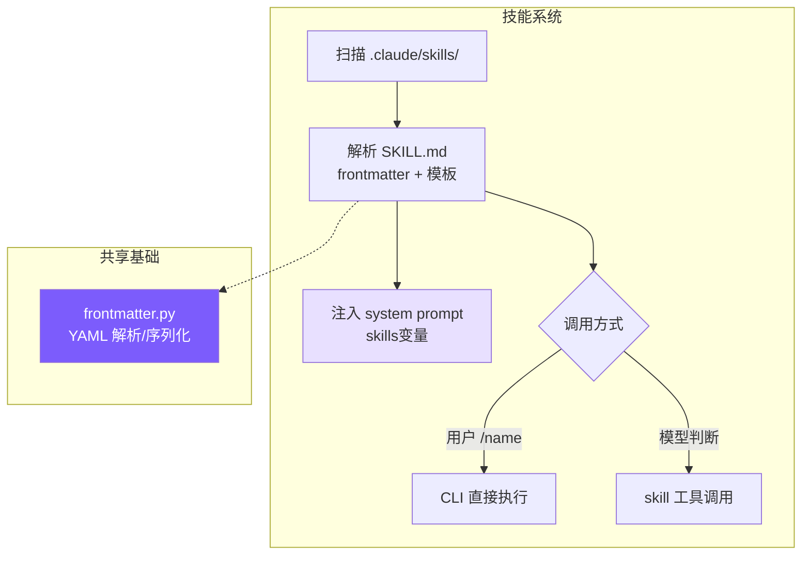
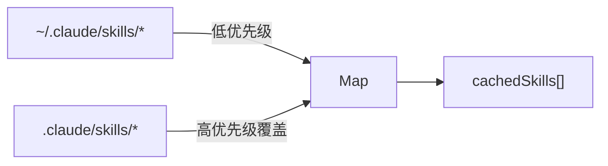
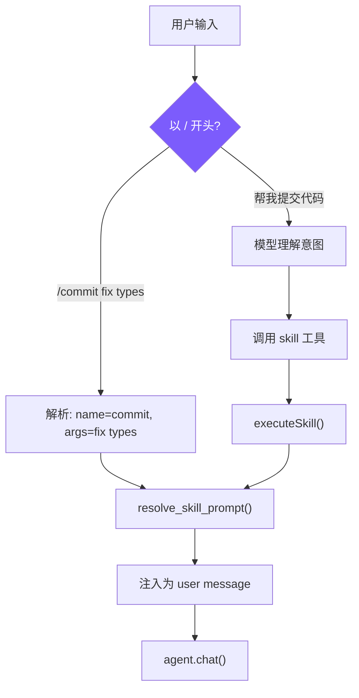

# 9. 技能系统

## 本章目标

让 Agent 拥有可复用的 Prompt 模块：用户定义一次，反复调用。像 Shell 脚本一样即装即用。



---

## Claude Code 怎么做的

技能是 Claude Code 的"AI Shell 脚本"——把 AI 工作流模板化，一次定义，反复复用。一个 `/commit` 技能封装了"读 diff → 分析变更 → 撰写 commit message → 提交"的完整 prompt。

技能从 6 个来源加载，优先级从高到低：企业策略（managed）> 项目级 > 用户级 > 插件 > 内置（bundled）> MCP。规律很简单：越接近用户控制的来源优先级越高，MCP 来自远程不受信任的服务端所以垫底。每个技能必须是目录格式 `skill-name/SKILL.md`，允许技能附带资源文件并通过 `${CLAUDE_SKILL_DIR}` 引用。

启动时只预加载 frontmatter（name/description/whenToUse），完整 prompt 在调用时才读取。几十个技能全量加载会挤占大量上下文，懒加载把成本推迟到真正需要的时刻。即使只是 frontmatter，技能列表也需要 token 空间——`formatCommandsWithinBudget()` 用三阶段算法控制：预算充足时全量展示；超出时内置技能（`/commit`、`/review`）始终保留完整描述，其余按剩余预算均分；每个技能不足 20 字符时降级为仅显示名称。

技能 prompt 执行前经过多层替换：`$ARGUMENTS` 替换用户参数，`${CLAUDE_SKILL_DIR}` 替换技能目录路径，`` !`command` `` 内联 Shell 执行（MCP 技能禁用此特性，防止远程提示词注入执行任意命令）。

执行模式有两种：**inline**（默认）直接注入当前对话，**fork** 创建独立子 Agent 执行后返回结果。fork 适合需要大量工具调用的技能——比如代码审查要读多个文件，这些调用会污染主对话上下文，fork 后只有最终结果回到主线。

---

## 我们的实现

### SKILL.md 格式

```markdown
---
name: commit
description: Create a git commit with a descriptive message
when_to_use: When the user asks to commit changes or says "commit"
allowed-tools: run_shell, read_file
user-invocable: true
---
Look at the current git diff and staged changes. Write a clear, concise
commit message following conventional commits format.

The user's request: $ARGUMENTS

Project skill directory: ${CLAUDE_SKILL_DIR}
```

- `when_to_use`：给模型看的触发条件，模型根据此判断是否自动调用
- `allowed-tools`：安全边界，限制技能可使用的工具
- `user-invocable`：`false` 的技能只能被模型自动触发

技能文件的本质是“带元数据的提示词模板”。元数据告诉系统这个技能叫什么、什么时候用、能用哪些工具；正文告诉模型具体怎么做。和普通工具不同，技能本身不直接访问文件系统，它通常会指导模型使用已有工具完成一套流程。比如 commit 技能不会自己执行 git，而是提示模型先看 diff、再组织提交信息、再按需要调用 `run_shell`。

可以把一个技能理解成“可复用的工作方法”。工具负责做具体动作，技能负责规定动作顺序。`read_file`、`grep_search`、`run_shell` 这些工具返回的是文件内容、搜索结果或命令输出；技能返回的是一段新的指令，让模型按固定流程组织这些工具调用。

### 发现与加载



#### Python
```python
# skills.py — discover_skills

_cached_skills: list[SkillDefinition] | None = None


def discover_skills() -> list[SkillDefinition]:
    global _cached_skills
    if _cached_skills is not None:
        return _cached_skills

    skills: dict[str, SkillDefinition] = {}

    _load_skills_from_dir(Path.home() / ".claude" / "skills", "user", skills)
    _load_skills_from_dir(Path.cwd() / ".claude" / "skills", "project", skills)

    _cached_skills = list(skills.values())
    return _cached_skills
```

用 Map 去重自然实现"项目级覆盖用户级"——先加载 user，再加载 project，同名 key 被后者覆盖。Claude Code 有 6 个来源是因为要支持企业和 MCP 场景，project + user 覆盖了个人开发者的核心需求。

项目级覆盖用户级很符合实际使用：用户可以有一个全局 `review` 技能，但某个项目可能有特殊代码审查规范，这时项目内 `.claude/skills/review/SKILL.md` 应该优先。这样技能既能复用，又能被项目定制。

### 技能解析

#### Python
```python
# skills.py — _parse_skill_file

def _parse_skill_file(
    file_path: Path, source: str, skill_dir: str
) -> SkillDefinition | None:
    try:
        # 读取整个 SKILL.md。文件由两部分组成：
        # 1. 顶部 frontmatter 元数据
        # 2. 后面的 prompt 正文模板
        raw = file_path.read_text()

        # parse_frontmatter() 会把文件拆成 meta 和 body：
        # meta: {"name": "...", "description": "..."}
        # body: 真正要给模型看的技能 prompt 模板
        result = parse_frontmatter(raw)
        meta = result.meta

        # 技能名优先取 frontmatter 里的 name。
        # 如果没有写 name，就用目录名作为兜底。
        name = meta.get("name") or file_path.parent.name or "unknown"

        # 是否允许用户通过 /<skill-name> 手动调用。
        # 默认允许；只有 user-invocable: false 才禁用。
        user_invocable = meta.get("user-invocable", "true") != "false"

        # 执行模式：
        # context: fork  表示创建子 Agent 隔离执行
        # 其他情况默认 inline，直接在当前对话里执行
        context = "fork" if meta.get("context") == "fork" else "inline"

        # allowed-tools 是工具白名单。
        # None 表示没有显式限制；fork 模式下会使用默认工具集合。
        allowed_tools: list[str] | None = None
        if "allowed-tools" in meta:
            raw_tools = meta["allowed-tools"]

            # 支持 JSON 数组写法：
            # allowed-tools: ["read_file", "grep_search"]
            if raw_tools.startswith("["):
                try:
                    allowed_tools = json.loads(raw_tools)
                except Exception:
                    # 如果 JSON 解析失败，就退回到逗号拆分。
                    # 例如 allowed-tools: [read_file, grep_search]
                    allowed_tools = [s.strip() for s in raw_tools.strip("[]").split(",")]
            else:
                # 支持最常见的逗号分隔写法：
                # allowed-tools: read_file, grep_search
                allowed_tools = [s.strip() for s in raw_tools.split(",")]

        # 把 Markdown 文件转换成结构化对象。
        # 后续系统不再直接操作 SKILL.md，而是使用 SkillDefinition。
        return SkillDefinition(
            name=name, description=meta.get("description", ""),
            when_to_use=meta.get("when_to_use") or meta.get("when-to-use"),
            allowed_tools=allowed_tools, user_invocable=user_invocable,
            context=context, prompt_template=result.body,
            source=source, skill_dir=skill_dir,
        )
    except Exception:
        # 单个技能解析失败时直接忽略，避免一个坏技能拖垮整个 CLI。
        return None
```

这段代码的职责是把 `SKILL.md` 从“文本文件”转换成“程序对象”。例如下面这个技能：

```markdown
---
name: commit
description: Create a git commit
when_to_use: When the user asks to commit code
allowed-tools: run_shell, read_file
user-invocable: true
context: inline
---

Please inspect the staged diff and create a commit.

Extra request: $ARGUMENTS
```

解析后会得到类似这样的对象：

```python
SkillDefinition(
    name="commit",
    description="Create a git commit",
    when_to_use="When the user asks to commit code",
    allowed_tools=["run_shell", "read_file"],
    user_invocable=True,
    context="inline",
    prompt_template="Please inspect the staged diff and create a commit.\n\nExtra request: $ARGUMENTS",
    source="project",
    skill_dir="/path/to/.claude/skills/commit",
)
```

`allowed-tools` 同时支持逗号分隔和 JSON 数组两种写法，先尝试 `json.loads()`，失败就按逗号拆——用户写 YAML 时两种格式都很自然，容错解析避免因格式问题导致技能加载失败。`when_to_use` 同时兼容下划线和连字符两种 key 名，同理。

注意这里的 frontmatter 解析器不是完整 YAML 解析器，它只处理简单的 `key: value`。这正好符合教程目标：让技能格式足够直观，同时避免引入额外依赖。

### Prompt 模板替换

#### Python
```python
# skills.py — resolve_skill_prompt

def resolve_skill_prompt(skill: SkillDefinition, args: str) -> str:
    # 取出技能正文，也就是 SKILL.md 中 frontmatter 后面的部分。
    prompt = skill.prompt_template

    # 替换用户参数，支持两种写法：
    # $ARGUMENTS 和 ${ARGUMENTS}
    # 例如用户输入 /commit use conventional commit format，
    # args 就是 "use conventional commit format"。
    prompt = re.sub(r"\$ARGUMENTS|\$\{ARGUMENTS\}", args, prompt)

    # 替换技能所在目录。
    # 技能可以在自己的目录里放模板、示例或辅助说明文件，
    # 然后在 prompt 中引用 ${CLAUDE_SKILL_DIR}/xxx.md。
    prompt = prompt.replace("${CLAUDE_SKILL_DIR}", skill.skill_dir)

    # 返回本次调用真正要交给模型执行的 prompt。
    return prompt
```

`$ARGUMENTS` 替换用户传入的参数，`${CLAUDE_SKILL_DIR}` 替换技能目录路径（技能可以在目录里放模板文件，在 prompt 中用 `read_file` 引用）。模板替换发生在技能真正执行前，所以同一个技能可以用不同参数重复运行。

例如模板是：

```markdown
Please create a commit.

User extra request: $ARGUMENTS
Skill files are in: ${CLAUDE_SKILL_DIR}
```

用户输入：

```text
/commit use conventional commit format
```

假设技能目录是 `/root/EvoCode/.claude/skills/commit`，展开后就是：

```markdown
Please create a commit.

User extra request: use conventional commit format
Skill files are in: /root/EvoCode/.claude/skills/commit
```

Claude Code 还支持 `` !`shell_command` `` 内联执行，我们没有实现——它增加了安全风险，教程场景不需要。尤其是远程或第三方技能如果能在模板展开阶段执行 shell，容易把“读取提示词”变成“执行任意命令”。

### 双重调用路径



**路径 1：用户手动调用**（`mini_claude/__main__.py`）

#### Python
```python
if inp.startswith("/"):
    # 找到第一个空格，用来区分命令名和参数。
    # /commit fix types -> 命令名 commit，参数 fix types
    # /commit           -> 命令名 commit，参数为空
    space_idx = inp.find(" ")

    # 去掉开头的 /，得到技能名。
    cmd_name = inp[1:space_idx] if space_idx > 0 else inp[1:]

    # 空格后面的所有内容都作为参数原样传给技能。
    cmd_args = inp[space_idx + 1:] if space_idx > 0 else ""

    # 从已经发现的技能列表里按名称查找。
    skill = get_skill_by_name(cmd_name)

    # 只有存在且 user_invocable 为 true 的技能才能手动调用。
    if skill and skill.user_invocable:
        # 展开技能 prompt，替换 $ARGUMENTS 和 ${CLAUDE_SKILL_DIR}。
        resolved = resolve_skill_prompt(skill, cmd_args)
        print_info(f"Invoking skill: {skill.name}")

        # 把展开后的技能 prompt 当作一条用户消息交给主 Agent。
        await agent.chat(resolved)
        continue
```

这条路径适合用户明确知道技能名的情况。比如 `/commit fix type annotations` 会被解析成：

```python
cmd_name = "commit"
cmd_args = "fix type annotations"
```

然后系统找到 `commit` 技能，展开模板，并把展开后的 prompt 直接送进 `agent.chat()`。这里不需要模型先判断“要不要用 commit 技能”，用户已经通过 slash command 做出了选择。

**路径 2：模型程序化调用**（`mini_claude/tools.py`）

#### Python
```python
# tools.py — skill 工具定义与执行

{
    # 工具名。模型要自动调用技能时，调用的就是这个 tool。
    "name": "skill",

    # 工具说明。它告诉模型：这个工具不是读文件或执行命令，
    # 而是按名称加载一个已经注册的技能。
    "description": "Invoke a registered skill by name...",

    # 工具参数结构。
    "input_schema": {
        "type": "object",
        "properties": {
            # 要调用的技能名，例如 "commit" 或 "review"。
            "skill_name": {"type": "string"},

            # 传给技能模板的可选参数，会进入 $ARGUMENTS。
            "args": {"type": "string"},
        },
        "required": ["skill_name"],
    },
}

async def _execute_skill_tool(self, inp: dict) -> str:
    # inp 来自模型的工具调用，例如：
    # {"skill_name": "commit", "args": "use conventional commit format"}
    result = execute_skill(inp.get("skill_name", ""), inp.get("args", ""))

    # 找不到技能时，返回普通文本错误，让模型知道调用失败。
    if not result:
        return f"Unknown skill: {inp.get('skill_name', '')}"

    # inline 技能的工具结果不是外部数据，而是一段新的 prompt。
    # 模型在下一步会按照这段 prompt 继续执行任务。
    return f'[Skill "{inp.get("skill_name", "")}" activated]\n\n{result["prompt"]}'
```

模型调用 `skill` 工具后得到的是展开后的 prompt 文本，在接下来的回合中按这个 prompt 执行任务。本质上是**元工具**——工具的返回值不是数据，而是指令。

这也是技能和普通工具最大的区别。普通工具返回外部世界的数据，比如文件内容、搜索结果、命令输出；技能返回的是“接下来应该怎么做”的指导。它更像把一段经验流程封装起来，让模型在需要时加载这段流程。

模型是否调用技能，不靠硬编码关键词匹配。mini-claude 没有写 `if "commit" in user_input: call_skill("commit")` 这类规则。真正的判断来自系统提示词里的技能列表：模型看到 `description` 和 `when_to_use`，再结合用户当前请求，决定是否调用 `skill` 工具。

例如用户说“帮我提交这次改动”，系统提示词里又有：

```markdown
- **/commit**: Create a git commit with a summary of changes
  When to use: When the user asks to commit changes
```

模型就可以判断当前任务适合调用：

```json
{
  "skill_name": "commit",
  "args": "用户想提交这次改动"
}
```

### 执行模式：inline vs fork

#### Python
```python
# agent.py — _execute_skill_tool

async def _execute_skill_tool(self, inp: dict) -> str:
    # 先展开技能，得到 prompt、allowed_tools、context 等执行信息。
    result = execute_skill(inp.get("skill_name", ""), inp.get("args", ""))
    if not result:
        return f"Unknown skill: {inp.get('skill_name', '')}"

    # fork 表示这个技能要在子 Agent 中独立执行。
    if result["context"] == "fork":
        # 如果技能声明了 allowed-tools，就只把这些工具交给子 Agent。
        # 这相当于技能级别的工具白名单。
        if result.get("allowed_tools"):
            tools = [t for t in self.tools if t["name"] in result["allowed_tools"]]
        else:
            # 如果没声明 allowed-tools，就给默认工具集合，
            # 但排除 agent 工具，避免子 Agent 继续创建 Agent 形成递归。
            tools = [t for t in self.tools if t["name"] != "agent"]

        # 创建子 Agent。关键是 custom_system_prompt=result["prompt"]：
        # 技能 prompt 会成为子 Agent 的系统提示词。
        sub_agent = Agent(
            model=self.model,
            custom_system_prompt=result["prompt"],
            custom_tools=tools,
            is_sub_agent=True,
            permission_mode="bypassPermissions",
        )

        # 让子 Agent 独立执行一次。
        # 子 Agent 可能读很多文件、做很多搜索，但主 Agent 只拿最终文本。
        sub_result = await sub_agent.run_once(inp.get("args") or "Execute this skill task.")
        return sub_result["text"] or "(Skill produced no output)"

    # inline 是默认模式：不创建子 Agent。
    # 直接把技能 prompt 作为工具结果返回给当前主 Agent。
    return f'[Skill "{inp.get("skill_name", "")}" activated]\n\n{result["prompt"]}'
```

fork 时子 Agent 工具受 `allowed_tools` 白名单约束，没指定则排除 `agent` 工具防止递归。技能需要多轮工具调用（如代码审查读多个文件）时选 fork，保持主对话干净。

选择 inline 还是 fork，核心看中间过程是否值得留在主上下文里。简单技能，比如“按固定格式写提交信息”，inline 就够了；复杂技能，比如“审查整个模块并给出风险”，可能需要读取很多文件、运行多个搜索，fork 更合适。fork 后主智能体只收到最终报告，不会被大量中间工具结果拖慢。

两种模式的差异可以这样看：

| 模式 | 执行者 | 技能 prompt 放在哪里 | 中间工具结果是否进入主上下文 | 适合场景 |
|------|--------|----------------------|------------------------------|----------|
| `inline` | 主 Agent | 作为工具结果返回给主 Agent | 会进入 | 简短流程、提交信息、格式化回复 |
| `fork` | 子 Agent | 作为子 Agent 的 system prompt | 不会，只返回最终结果 | 代码审查、大范围搜索、复杂分析 |

更简单的判断标准是：如果中间过程本身有价值，选 `inline`；如果中间过程只是为了得到最终报告，选 `fork`。

### 系统提示词描述

#### Python
```python
# skills.py — build_skill_descriptions

def build_skill_descriptions() -> str:
    # 先发现当前可用的所有技能。
    skills = discover_skills()

    # 没有技能时，不向系统提示词注入任何内容。
    if not skills:
        return ""

    # 用 Markdown 组织技能清单，方便模型阅读。
    lines = ["# Available Skills", ""]

    # 用户可以通过 /<name> 手动调用的技能。
    invocable = [s for s in skills if s.user_invocable]

    # 用户不能手动调用，只能模型根据时机自动调用的技能。
    auto_only = [s for s in skills if not s.user_invocable]

    if invocable:
        lines.append("User-invocable skills (user types /<name> to invoke):")
        for s in invocable:
            # 用户可调用技能显示成 /name，提醒用户可以直接输入命令。
            lines.append(f"- **/{s.name}**: {s.description}")
            if s.when_to_use:
                # when_to_use 是给模型看的触发条件。
                lines.append(f"  When to use: {s.when_to_use}")
        lines.append("")

    if auto_only:
        lines.append("Auto-invocable skills (use the skill tool when appropriate):")
        for s in auto_only:
            # 自动技能不加 / 前缀，因为用户不能直接 slash 调用。
            lines.append(f"- **{s.name}**: {s.description}")
            if s.when_to_use:
                lines.append(f"  When to use: {s.when_to_use}")
        lines.append("")

    # 明确告诉模型：如果要程序化调用技能，应该使用 skill 工具。
    lines.append("To invoke a skill programmatically, use the `skill` tool.")
    return "\n".join(lines)
```

技能分两组展示：用户可调用的加 `/` 前缀，仅模型可调用的不加。`when_to_use` 是给模型看的判断条件，决定是否主动触发。Claude Code 还做了 token 预算控制（`formatCommandsWithinBudget()`），我们跳过——教程场景技能数量有限。

生成后的片段会被插入系统提示词的 `{{skills}}` 位置。它的作用不是执行技能，而是让模型“知道技能存在”。如果没有这段描述，模型即使拥有 `skill` 工具，也不知道应该传哪个 `skill_name`，更不知道每个技能适合什么场景。

例如两个技能：

```yaml
name: commit
description: Create a git commit
user-invocable: true
when_to_use: When the user asks to commit code
```

```yaml
name: deep-review
description: Perform a deep code review
user-invocable: false
when_to_use: When the user asks for a thorough review of multiple files
```

会被整理成：

```markdown
# Available Skills

User-invocable skills (user types /<name> to invoke):
- **/commit**: Create a git commit
  When to use: When the user asks to commit code

Auto-invocable skills (use the skill tool when appropriate):
- **deep-review**: Perform a deep code review
  When to use: When the user asks for a thorough review of multiple files

To invoke a skill programmatically, use the `skill` tool.
```

所以 `build_skill_descriptions()` 是技能系统的“广告牌”，`_execute_skill_tool()` 才是技能系统的“执行器”。

---

## 关键设计决策

**为什么技能用 Markdown 而非 JSON/YAML？** 技能的本体是大段自然语言 prompt。Markdown 的 body 直接就是 prompt 本身，frontmatter 提供结构化元数据。JSON 存储的话 prompt 需要转义换行符和引号，可读性很差。

**为什么需要双重调用路径？** 只支持 `/commit` 手动调用不够——用户可能说"帮我提交代码"而不知道有这个技能；只支持模型自动调用也不够——用户有时想精确控制触发时机。两条路径最终汇合到同一个 `resolve_skill_prompt()`，逻辑不重复。

**模型什么时候会主动调用技能？** 当用户请求与技能的 `description` 或 `when_to_use` 匹配时，模型会倾向于调用 `skill` 工具。这个判断是 LLM 的语义判断，不是程序里的关键词路由。因此 `when_to_use` 要写具体：例如“当用户要求审查代码、检查 diff、寻找 bug 或评估实现风险时使用”，比“Useful for code”更容易触发正确。

**为什么 fork 要限制工具？** fork 技能通常会执行更多步骤，工具权限如果不收敛，成本和风险都会放大。`allowed-tools` 让技能作者声明这个工作流需要哪些能力；未声明时排除 `agent`，是为了避免子 Agent 继续创建更多 Agent，导致执行链失控。

### 简化对比总览

| 维度 | Claude Code | mini-claude |
|------|------------|-------------|
| **技能来源** | 6 个（managed/project/user/plugin/bundled/MCP） | 2 个（project + user） |
| **技能加载** | 懒加载 + token 预算控制 | 启动时全量加载 + 缓存 |
| **Prompt 替换** | `$ARGUMENTS` + `${CLAUDE_SKILL_DIR}` + `` !`shell` `` | `$ARGUMENTS` + `${CLAUDE_SKILL_DIR}` |

---

> **下一章**：让 Agent 先想清楚再动手——Plan Mode，只读规划模式。

## 本章小结：技能是“可复用的工作方法”

技能和工具不一样。工具是代码函数，比如读文件、搜索、编辑；技能是一段可复用的提示词，告诉模型按某种方法做事。比如代码审查、生成变更说明、排查测试失败，都可以写成技能。它不一定增加新能力，但能让模型以更稳定的流程使用已有工具。

实现上，`skills.py` 会扫描项目级 `.claude/skills/*/SKILL.md` 和用户级 `~/.claude/skills/*/SKILL.md`。每个技能文件前面的元数据头定义名称、描述、允许工具、执行上下文等；正文是提示词模板。`resolve_skill_prompt()` 会替换 `$ARGUMENTS` 和 `${CLAUDE_SKILL_DIR}`，让同一个技能可以带不同参数运行。

执行方式分 `inline` 和 `fork`。`inline` 会把技能提示词注入当前对话，让主智能体继续执行；`fork` 会创建子智能体单独跑技能，只把最终结果带回主对话。相关概念是上下文隔离：如果技能需要读很多文件，fork 能避免主对话被大量工具结果污染。
