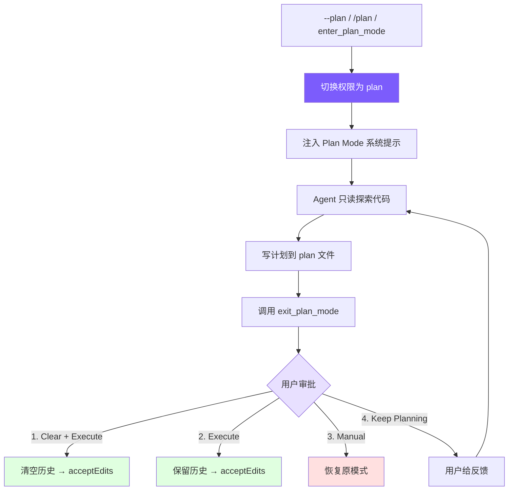

# 10. Plan Mode：只读规划模式

## 本章目标

实现 Plan Mode：让 Agent 先制定计划再执行，避免盲目修改代码。包含模式切换、plan 文件持久化、权限联动和 4 选项审批工作流。

本章的阅读重点可以先记成一句话：**Plan Mode 把 Agent 的工作拆成“只读规划”和“审批后执行”两个阶段，并用权限系统保证规划阶段不能改项目代码。**

它适合用在重构、多文件修改、架构调整、迁移这类高风险任务中。普通模式下，Agent 可能边读代码边直接编辑；Plan Mode 下，它只能读代码、搜索代码、写计划文件。用户先看到方案，再决定是否让 Agent 执行。



## Claude Code 怎么做的

Claude Code 的 Plan Mode 是完整的 EnterPlanMode / ExitPlanMode 工具对：

1. **进入**：切换到 read-only 模式，生成 plan 文件（`~/.claude/plans/` 目录），注入 plan 系统提示约束 Agent 行为
2. **规划**：Agent 用只读工具探索代码，将实现计划写入 plan 文件
3. **退出**：Agent 调用 ExitPlanMode，用户看到计划后选择执行方式
4. **审批**：用户选择清空上下文执行、保留上下文执行、手动审批执行、或继续修改

关键设计：**Plan Mode 不是"不让 Agent 做事"，而是让 Agent 先想清楚再做**。plan 文件持久化到磁盘意味着即使清空上下文，计划也不会丢失——Agent 可以从零开始执行一个经过审批的方案。

换成更直观的流程，普通模式像这样：

```text
读代码 -> 想方案 -> 可能直接改代码
```

Plan Mode 则变成：

```text
进入 Plan Mode
-> 只读探索
-> 写 plan 文件
-> 调用 exit_plan_mode
-> 用户审批
-> 执行 / 继续规划 / 手动处理
```

所以 Plan Mode 的价值不是让 Agent 少做事，而是让它在动手前把方案写清楚，并把执行权交回用户。

## 我们的实现

### 工具定义

Plan Mode 需要两个工具，标记为 `deferred`（延迟加载，详见[第 2 章](02-tools.md)）：

#### Python
```python
# tools.py — Plan Mode 工具定义

{
    # 进入 Plan Mode：把当前会话切到“只读规划阶段”
    "name": "enter_plan_mode",
    "description": "Enter plan mode to switch to a read-only planning phase. ...",
    # 没有参数，因为具体状态都保存在 Agent 实例里
    "input_schema": {"type": "object", "properties": {}},
    # 延迟加载：普通会话不需要时，不占用模型上下文
    "deferred": True,
},
{
    # 退出 Plan Mode：计划写完后触发用户审批流程
    "name": "exit_plan_mode",
    "description": "Exit plan mode after you have finished writing your plan to the plan file. ...",
    "input_schema": {"type": "object", "properties": {}},
    "deferred": True,
},
```

两个工具都没有参数——进入和退出是纯状态切换，所有数据（plan 文件路径、审批结果）都在 Agent 内部管理。标记为 `deferred` 是因为大多数会话不需要 Plan Mode，延迟加载避免占用提示词空间。

Plan Mode 工具没有参数，是因为它们表达的是“切换工作阶段”，不是执行某个外部动作。进入时需要生成 plan 文件、保存原权限模式、追加系统提示词；退出时需要读取计划、触发审批、恢复或切换权限。这些都依赖当前 `Agent` 的会话状态，所以实现放在 `agent.py`，而不是普通的 `tools.execute_tool()`。

### 模式切换

Plan Mode 涉及 4 个状态变量：

#### Python
```python
# agent.py — Plan Mode 状态

self._pre_plan_mode: str | None = None      # 进入前的模式
self._plan_file_path: str | None = None     # plan 文件路径
self._base_system_prompt: str = ""           # 基础提示词
self._context_cleared: bool = False          # 是否清空了上下文
```

`_pre_plan_mode` 是关键——它记住进入 Plan Mode 之前的权限模式，这样退出时可以精确恢复。如果用户之前是 `acceptEdits` 模式，退出 Plan Mode 后应该回到 `acceptEdits`，而不是变成 `default`。

Plan Mode 本质上是临时覆盖权限模式。如果不记录进入前状态，就会出现“用户原本允许自动编辑，进入规划后退出却回到默认模式”的体验问题。`_pre_plan_mode` 让 Plan Mode 像一个可逆的状态栈：进入时压住旧状态，退出时恢复旧状态。

切换逻辑是对称的进入/退出：

#### Python
```python
# agent.py — toggle_plan_mode()

def toggle_plan_mode(self) -> str:
    # 当前已经在 plan 模式：再次调用就是退出
    if self.permission_mode == "plan":
        # 恢复进入 Plan Mode 前的权限模式；没有记录时回到 default
        self.permission_mode = self._pre_plan_mode or "default"
        # 清理 Plan Mode 临时状态，避免影响后续普通会话
        self._pre_plan_mode = None
        self._plan_file_path = None
        # 移除 Plan Mode 追加的系统提示词
        self._system_prompt = self._base_system_prompt
        # OpenAI 消息格式里，第一条通常是 system message，需要同步更新
        if self.use_openai and self._openai_messages:
            self._openai_messages[0]["content"] = self._system_prompt
        print_info(f"Exited plan mode → {self.permission_mode} mode")
        return self.permission_mode
    else:
        # 进入 plan 模式前先保存当前权限，方便退出时精确恢复
        self._pre_plan_mode = self.permission_mode
        self.permission_mode = "plan"
        # 每个会话生成一个独立 plan 文件
        self._plan_file_path = self._generate_plan_file_path()
        # 在基础系统提示词后追加 Plan Mode 专属约束
        self._system_prompt = self._base_system_prompt + self._build_plan_mode_prompt()
        if self.use_openai and self._openai_messages:
            self._openai_messages[0]["content"] = self._system_prompt
        print_info(f"Entered plan mode. Plan file: {self._plan_file_path}")
        return "plan"
```

注意系统提示词的更新方式：进入时在 `baseSystemPrompt` 后追加 plan 提示，退出时恢复为 `baseSystemPrompt`。对于 OpenAI 格式，需要直接修改消息数组的第一条（系统消息）。

从总体设计看，进入 Plan Mode 实际发生了三件事：

1. **状态切换**：把 `permission_mode` 改成 `"plan"`，同时用 `_pre_plan_mode` 记住原权限模式。
2. **文件准备**：生成本次会话专属的 plan 文件路径。
3. **提示词注入**：在原 system prompt 后追加 Plan Mode 规则，让模型知道当前工作阶段已经变成“只读规划”。

这里的 `_pre_plan_mode` 是状态恢复的关键。Plan Mode 只是临时覆盖权限，不应该永久改变用户原本的设置。如果用户原来在 `acceptEdits`，退出后应该回到 `acceptEdits`；如果用户原来在 `default`，退出后应该回到 `default`。

### Plan 文件与系统提示

Plan 文件路径按会话 ID 生成，确保每个会话有独立的 plan 文件：

#### Python
```python
# agent.py — Plan 文件生成

def _generate_plan_file_path(self) -> str:
    # 使用 Claude Code 风格的全局 plans 目录保存计划
    d = Path.home() / ".claude" / "plans"
    # 确保目录存在；parents=True 会同时创建缺失的父目录
    d.mkdir(parents=True, exist_ok=True)
    # session_id 保证不同会话不会写到同一个计划文件
    return str(d / f"plan-{self.session_id}.md")
```

Plan 系统提示注入了严格的 read-only 约束和工作流指引：

#### Python
```python
# agent.py — _build_plan_mode_prompt()

def _build_plan_mode_prompt(self) -> str:
    # 返回一段追加到 system prompt 的规则，让模型知道当前只能规划
    return f"""

# Plan Mode Active

Plan mode is active. You MUST NOT make any edits (except the plan file below),
run non-readonly tools, or make any changes to the system.

## Plan File: {self._plan_file_path}
Write your plan incrementally to this file using write_file or edit_file.
This is the ONLY file you are allowed to edit.

## Workflow
1. **Explore**: Read code to understand the task. Use read_file, list_files, grep_search.
2. **Design**: Design your implementation approach.
3. **Write Plan**: Write a structured plan to the plan file including:
   - **Context**: Why this change is needed
   - **Steps**: Implementation steps with critical file paths
   - **Verification**: How to test the changes
4. **Exit**: Call exit_plan_mode when your plan is ready for user review.

IMPORTANT: When your plan is complete, you MUST call exit_plan_mode.
Do NOT ask the user to approve — exit_plan_mode handles that."""
```

这个提示词做了三件事：
1. **约束行为**：明确禁止编辑和 shell（配合权限检查双重保障）
2. **声明 plan 文件**：告诉模型唯一可写的文件路径
3. **规定工作流**：Explore → Design → Write → Exit，确保模型不会跳步

最后一句"Do NOT ask the user to approve"很重要——没有这句，模型经常会在写完计划后问"这个计划可以吗？"而不是调用 `exit_plan_mode`，导致审批流程无法触发。

### 权限集成

Plan Mode 的只读约束通过 `check_permission()` 强制执行（详见[第 6 章](06-permissions.md)）：

#### Python
```python
# tools.py — check_permission() 中的 Plan Mode 处理

if mode == "plan":
    # Plan Mode 下只有 plan 文件允许写，其他编辑都会被拒绝
    if tool_name in EDIT_TOOLS:
        file_path = inp.get("file_path") or inp.get("path")
        # 只有目标路径和当前 plan 文件完全一致时才放行
        if plan_file_path and file_path == plan_file_path:
            return {"action": "allow"}
        return {"action": "deny", "message": f"Blocked in plan mode: {tool_name}"}
    # 规划阶段禁止 shell，避免执行测试、安装依赖或修改系统状态
    if tool_name == "run_shell":
        return {"action": "deny", "message": "Shell commands blocked in plan mode"}

# 进入/退出 Plan Mode 的元工具本身必须允许调用
if tool_name in ("enter_plan_mode", "exit_plan_mode"):
    return {"action": "allow"}
```

这里有一个精巧的设计：**plan 文件路径作为参数传入 `check_permission()`**。当智能体试图写文件时，权限检查会比对目标路径和 plan 文件路径——只有完全匹配才放行。这意味着系统提示词说“只能写 plan 文件”不只是建议，而是代码强制执行的约束。

双重保障：
- **系统提示词**：引导模型不要尝试写其他文件（减少无效 API 调用）
- **权限检查**：即使模型无视提示词，写操作也会被拦截并返回错误

这就是 Plan Mode 的核心安全点。提示词负责让模型少犯错，权限代码负责让错误不会真的落到文件系统上。尤其是“只能写 plan 文件”这条规则，如果只写在提示词里，模型偶尔还是可能直接编辑源码；现在 `check_permission()` 会比较目标路径和 `_plan_file_path`，不匹配就拒绝。

### 工具执行逻辑

`executePlanModeTool()` 处理 `enter_plan_mode` 和 `exit_plan_mode` 的执行：

#### Python
```python
# agent.py — _execute_plan_mode_tool()

async def _execute_plan_mode_tool(self, name: str) -> str:
    # 处理进入 Plan Mode 的工具调用
    if name == "enter_plan_mode":
        # 幂等保护：重复进入时不改变状态
        if self.permission_mode == "plan":
            return "Already in plan mode."
        # 保存原权限模式，退出时要用它恢复
        self._pre_plan_mode = self.permission_mode
        self.permission_mode = "plan"
        # 创建本轮规划要写入的 plan 文件路径
        self._plan_file_path = self._generate_plan_file_path()
        # 注入 Plan Mode 系统提示，约束模型只能只读探索和写计划
        self._system_prompt = self._base_system_prompt + self._build_plan_mode_prompt()
        if self.use_openai and self._openai_messages:
            self._openai_messages[0]["content"] = self._system_prompt
        print_info("Entered plan mode (read-only). Plan file: " + self._plan_file_path)
        return (
            f"Entered plan mode. You are now in read-only mode.\n\n"
            f"Your plan file: {self._plan_file_path}\n"
            f"Write your plan to this file. This is the only file you can edit.\n\n"
            f"When your plan is complete, call exit_plan_mode."
        )

    # 处理退出 Plan Mode 的工具调用
    if name == "exit_plan_mode":
        # 防御性检查：不在 plan 模式时不能退出
        if self.permission_mode != "plan":
            return "Not in plan mode."
        plan_content = "(No plan file found)"
        # 优先从磁盘读取计划，确保清空上下文后计划仍然可用
        if self._plan_file_path and Path(self._plan_file_path).exists():
            plan_content = Path(self._plan_file_path).read_text()

        # 如果主程序注入了审批回调，就进入用户审批流程
        if self._plan_approval_fn:
            result = await self._plan_approval_fn(plan_content)
            choice = result.get("choice", "manual-execute")

            # 用户选择继续规划：保持 plan 模式，把反馈返回给模型
            if choice == "keep-planning":
                feedback = result.get("feedback") or "Please revise the plan."
                return (
                    f"User rejected the plan and wants to keep planning.\n\n"
                    f"User feedback: {feedback}\n\n"
                    f"Please revise your plan based on this feedback. "
                    f"When done, call exit_plan_mode again."
                )

            # 用户选择自动执行时切到 acceptEdits；否则恢复原权限模式
            if choice in ("clear-and-execute", "execute"):
                target_mode = "acceptEdits"
            else:
                target_mode = self._pre_plan_mode or "default"

            # 审批完成后退出 Plan Mode，清理临时状态
            self.permission_mode = target_mode
            self._pre_plan_mode = None
            saved_plan_path = self._plan_file_path
            self._plan_file_path = None
            self._system_prompt = self._base_system_prompt

            # 选项 1：清空历史，只保留系统提示，再按批准的计划执行
            if choice == "clear-and-execute":
                self._clear_history_keep_system()
                self._context_cleared = True
                print_info(f"Plan approved. Context cleared, executing in {target_mode} mode.")
                return (
                    f"User approved the plan. Context was cleared. "
                    f"Permission mode: {target_mode}\n\n"
                    f"Plan file: {saved_plan_path}\n\n"
                    f"## Approved Plan:\n{plan_content}\n\n"
                    f"Proceed with implementation."
                )

            # 选项 2 或 3：保留当前上下文，把计划内容作为工具结果返回
            print_info(f"Plan approved. Executing in {target_mode} mode.")
            return (
                f"User approved the plan. Permission mode: {target_mode}\n\n"
                f"## Approved Plan:\n{plan_content}\n\n"
                f"Proceed with implementation."
            )

        # Fallback: no approval function
        # 没有审批回调时直接恢复原模式，常用于子 Agent 或测试场景
        self.permission_mode = self._pre_plan_mode or "default"
        self._pre_plan_mode = None
        self._plan_file_path = None
        self._system_prompt = self._base_system_prompt
        print_info("Exited plan mode. Restored to " + self.permission_mode + " mode.")
        return (
            f"Exited plan mode. Permission mode restored to: {self.permission_mode}\n\n"
            f"## Your Plan:\n{plan_content}"
        )

    return f"Unknown plan mode tool: {name}"
```

核心逻辑分三层：

1. **enter_plan_mode**：状态切换 + plan 文件创建 + 提示词注入。幂等设计——已在 plan 模式时返回提示而不是报错。

2. **exit_plan_mode（有审批函数）**：读取 plan 文件 → 调用审批回调 → 根据用户选择处理：
   - `keep-planning`：不退出 plan 模式，把用户反馈作为工具结果返回给模型
   - `clear-and-execute`：清空消息历史（释放上下文）→ 切换到 `acceptEdits`
   - `execute`：保留历史 → 切换到 `acceptEdits`
   - `manual-execute`：恢复进入前的模式（用户手动审批每次编辑）

3. **exit_plan_mode（无审批函数）**：直接退出恢复原模式。这个分支用于子 Agent 场景——子 Agent 不需要用户交互式审批。

#### 有审批函数和无审批函数的区别

这里的“审批函数”指的是 `self._plan_approval_fn`。它通常由 CLI 层通过 `agent.set_plan_approval_fn(plan_approval)` 注入。Agent 自己不负责“怎么问用户”，它只负责在退出 Plan Mode 时调用这个回调，并根据回调返回的 `choice` 决定下一步。

**有审批函数**是主 Agent 的正常交互场景：

```text
Agent 写完 plan
-> 调用 exit_plan_mode
-> 读取 plan 文件
-> 调用 _plan_approval_fn(plan_content)
-> 用户看到计划和 4 个选项
-> 根据用户选择决定下一步
```

这种情况下，用户可以选择清空上下文执行、保留上下文执行、手动执行或继续规划。

**无审批函数**是 fallback 分支，常用于子 Agent、测试或非交互场景：

```text
Agent 写完 plan
-> 调用 exit_plan_mode
-> 读取 plan 文件
-> 不弹审批
-> 直接恢复进入 Plan Mode 前的权限模式
-> 返回 plan 内容
```

子 Agent 不应该在内部再弹出用户审批。它的职责通常只是完成一次规划并把结果交回主 Agent；真正是否执行，应由主 Agent 所在的主会话决定。

### 审批工作流

审批通过回调函数注入，解耦了 Agent 和 UI 层：

#### Python
```python
# __main__.py — 设置审批回调

async def plan_approval(plan_content: str) -> dict:
    # 先把 Agent 写好的计划渲染给用户看
    print_plan_for_approval(plan_content)
    # 再展示 4 个审批选项
    print_plan_approval_options()
    while True:
        choice = input("  Enter choice (1-4): ").strip()
        if choice == "1":
            # 清空上下文后执行，适合计划已明确但历史太长的情况
            return {"choice": "clear-and-execute"}
        elif choice == "2":
            # 保留当前上下文直接执行
            return {"choice": "execute"}
        elif choice == "3":
            # 只把计划作为参考，恢复原权限模式
            return {"choice": "manual-execute"}
        elif choice == "4":
            # 给模型反馈，让它继续修改 plan 文件
            feedback = input("  Feedback (what to change): ").strip()
            return {"choice": "keep-planning", "feedback": feedback or None}
        else:
            print("  Invalid choice. Enter 1, 2, 3, or 4.")

# 把 UI 层的审批函数注入 Agent，Agent 自身不依赖具体终端实现
agent.set_plan_approval_fn(plan_approval)
```

UI 部分显示计划内容和 4 个选项：

```python
def print_plan_approval_options() -> None:
    console.print()
    # 展示用户可选的执行策略
    console.print("  [bold]Choose how to proceed:[/bold]")
    console.print("  [cyan]1[/cyan]. Clear context and execute")
    console.print("  [cyan]2[/cyan]. Execute with current context")
    console.print("  [cyan]3[/cyan]. Keep plan as guidance")
    console.print("  [cyan]4[/cyan]. Keep planning")


def print_plan_for_approval(plan_content: str) -> None:
    # 用 Rich Panel + Markdown 把计划渲染成更容易审阅的格式
    console.print(Panel(
        Markdown(plan_content or "(empty plan)"),
        title="Plan",
        border_style="cyan",
    ))
```

四个选项的设计背后是不同的使用场景：

| 选项 | 权限切换 | 上下文 | 适用场景 |
|------|---------|--------|---------|
| 1. Clear + Execute | → acceptEdits | 清空 | 计划完善，上下文已很长，从零执行最高效 |
| 2. Execute | → acceptEdits | 保留 | 计划完善，Agent 已有足够上下文直接执行 |
| 3. Manual | → 恢复原模式 | 保留 | 计划大致可以，但想逐步审批每个修改 |
| 4. Keep Planning | 不变 | 保留 | 计划需要修改，给反馈让 Agent 继续调整 |

这块代码的核心是职责拆分：

| 层 | 职责 |
|----|------|
| Agent 层 | 保存 plan 文件、调用审批回调、根据 `choice` 切换权限模式、清空或保留上下文、决定是否继续规划 |
| UI 层 | 展示计划、展示选项、读取用户输入、返回结构化的审批结果 |

`plan_approval()` 的返回值是 Agent 和 UI 之间的协议。比如 `{"choice": "execute"}` 表示保留当前上下文并进入自动编辑模式；`{"choice": "keep-planning", "feedback": "补充测试计划"}` 表示不退出 Plan Mode，而是把用户反馈交给模型继续修改计划。

四个选项可以这样理解：

- **Clear + Execute**：计划已经完善，但上下文很长。清空历史后执行，减少 token 压力。
- **Execute**：计划已经完善，并且当前上下文还有价值。保留上下文直接执行。
- **Manual**：计划可以作为指导，但用户仍想逐步审批每次修改。
- **Keep Planning**：计划还不够好，用户给反馈，让 Agent 继续修改 plan 文件。

这也是为什么审批逻辑用回调而不是写死在 `Agent` 里。CLI 可以用 `input()`，IDE 可以弹窗，测试可以直接返回固定字典；Agent 的核心逻辑不用跟具体 UI 绑定。

### CLI 入口

Plan Mode 有三个入口：

#### Python
```python
# __main__.py — CLI 参数

# 1. 命令行参数 --plan
elif arg == "--plan":
    # 启动时直接进入 Plan Mode
    permission_mode = "plan"

# 2. REPL 命令 /plan
if user_input == "/plan":
    # 会话中手动切换：普通模式 <-> Plan Mode
    agent.toggle_plan_mode()
    continue

# 3. Agent 自主调用 enter_plan_mode 工具
```

三个入口的区别：
- `--plan`：启动时就进入 Plan Mode，整个会话从规划开始
- `/plan`：会话中途切换，适合"先聊后规划"的工作流
- `enter_plan_mode` 工具：智能体自己判断需要先规划再执行（需要通过 `tool_search` 激活）

## 设计决策

### 为什么 Plan 文件写磁盘？

Plan 文件持久化到 `~/.claude/plans/` 有两个原因：

1. **Clear-and-execute 选项需要**：清空上下文后，对话历史中的 plan 内容会丢失。但 plan 文件在磁盘上，Agent 可以重新读取。
2. **跨会话可用**：用户可以 `--resume` 恢复会话时看到之前的 plan，或者手动查看历史 plan 文件。

### 为什么审批是回调而不是直接实现？

`_plan_approval_fn` 是外部注入的回调，而不是 `Agent` 内部直接实现。这让 `Agent` 类不依赖具体的 UI 实现——CLI 用终端输入，IDE 集成可以用图形对话框，测试时可以注入模拟函数。子智能体没有审批函数时直接退出，不需要特殊处理。

### 为什么 clear-and-execute 切换到 acceptEdits？

用户既然审批了计划并选择了自动执行，说明他们信任 Agent 的修改方向。切换到 `acceptEdits` 让 Agent 无需反复确认每次文件编辑，大幅提升执行效率。如果用户想逐步审批，有专门的选项 3。

## 简化对比

| 维度 | Claude Code | mini-claude | 差异 |
|------|------------|-------------|------|
| Plan 文件 | 全局 plans 目录 + 语义文件名 | `~/.claude/plans/plan-{sessionId}.md` | 简化命名 |
| 审批选项 | 多种执行模式 + 权限提示 | 4 种选项（clear/execute/manual/revise） | 核心对齐 |
| 权限联动 | 深度集成（7 层权限体系） | `check_permission()` 特殊分支 + plan 文件白名单 | 简化但等效 |
| 工具加载 | 始终可用 | deferred 延迟加载 | 节省提示词空间 |
| 子 Agent | Plan Agent 类型 | Fallback 直接退出 | 简化分支 |

---

> **下一章**：当单个 Agent 的上下文不够用时——多 Agent 架构，分而治之。

## 本章小结：Plan Mode 解决的是“先想清楚再动手”

Plan Mode 的作用，是把“分析方案”和“实际修改”分成两个阶段。普通模式下，模型可能边看代码边直接编辑；Plan Mode 下，它只能读文件、搜索、写计划文件，不能随便改项目代码。这样用户可以先审阅方案，再决定是否让它执行。

代码实现分三块。第一块是工具定义：`enter_plan_mode` 和 `exit_plan_mode` 在 `tools.py` 中标记为 deferred，默认不占用完整工具 schema。第二块是状态管理：`agent.py` 通过 `permission_mode == "plan"` 判断是否处于 Plan Mode，并记录 `_pre_plan_mode`、`_plan_file_path` 和 `_plan_approval_fn`。第三块是权限联动：`check_permission()` 在 plan 模式下只允许读工具，以及写入当前 plan 文件。

相关概念是“代码强制约束”。系统提示词会告诉模型“现在只能规划”，但真正可靠的是权限检查：即使模型试图调用 `edit_file` 修改源码，代码也会拒绝。Plan Mode 的价值就在这里，它不是礼貌建议，而是一套受代码保护的工作流。

## 知识卡片：本章重点

本章最重要的是理解 Plan Mode 的边界：它不是一个“思考提示词”，而是一套由状态、文件、提示词、权限和审批共同组成的工作流。

1. **目标**：让 Agent 先只读探索并写计划，再由用户审批是否执行。
2. **核心工具**：`enter_plan_mode` 负责进入规划阶段，`exit_plan_mode` 负责读取计划并触发退出或审批。
3. **状态恢复**：`_pre_plan_mode` 记住进入前的权限模式，避免退出后丢失用户原本设置。
4. **计划持久化**：plan 写到 `~/.claude/plans/plan-{session_id}.md`，清空上下文后仍然可用。
5. **提示词约束**：Plan Mode prompt 告诉模型只能读、只能写 plan 文件、写完必须调用 `exit_plan_mode`。
6. **权限兜底**：`check_permission()` 强制只允许写当前 plan 文件，禁止修改源码和运行 shell。
7. **审批解耦**：`_plan_approval_fn` 把 Agent 核心逻辑和 CLI / IDE / 测试 UI 分开。
8. **四种审批结果**：清空执行、保留执行、手动执行、继续规划，分别对应不同风险和上下文长度。

可以把完整流程记成：

```text
入口（--plan / /plan / enter_plan_mode）
-> 保存原权限模式
-> 切到 plan 权限
-> 生成 plan 文件
-> 注入 Plan Mode prompt
-> 只读探索并写计划
-> exit_plan_mode
-> 有审批函数：用户选择 1-4
-> 无审批函数：直接恢复原模式并返回计划
```

最终设计目标是让高风险代码修改先形成可审阅方案，再进入执行阶段，从而降低误改、漏改和上下文污染的风险。
