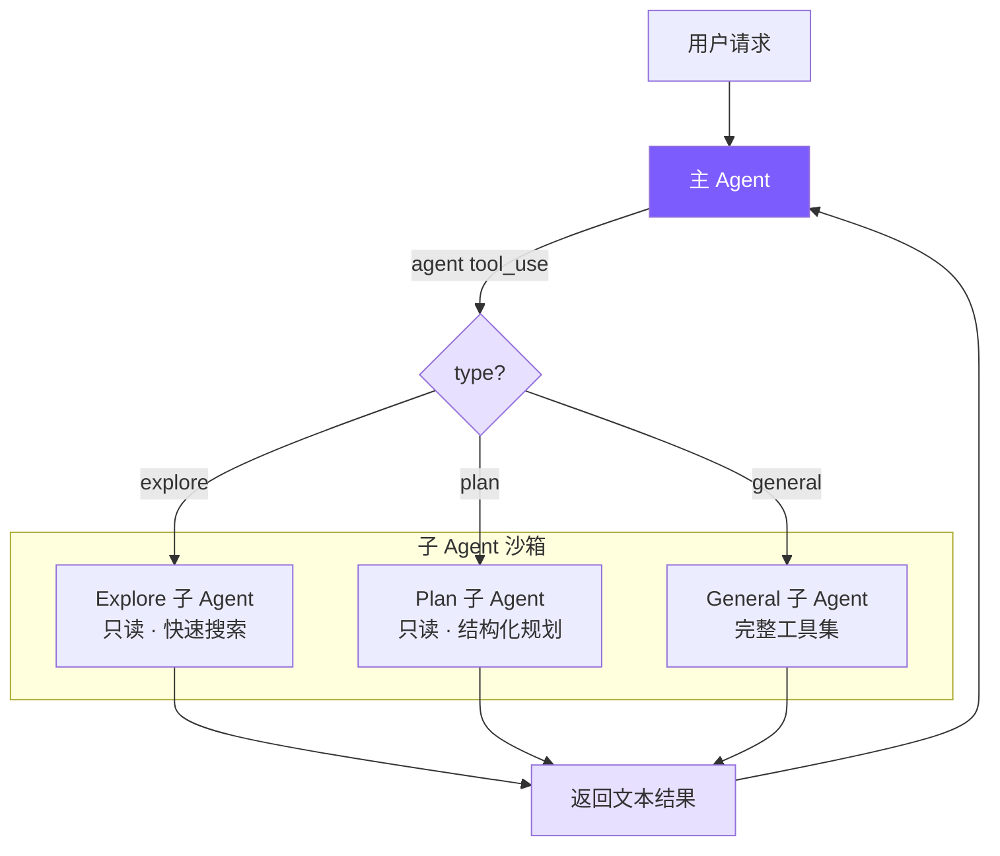

# 11. 多 Agent 架构

> Current status: 当前源码保留 `plan` 子 agent，但已删除全局 Plan Mode。本文中“Plan Mode 继承权限”的段落属于历史设计记录；现在只读约束由子 agent 工具白名单强制。

## 本章目标

实现 Sub-Agent（子代理）系统：让主 Agent 能派生出独立的子 Agent 执行探索、规划、通用任务，完成后将结果返回主 Agent。这是 Claude Code 处理复杂任务时最重要的"分而治之"机制。



## Claude Code 怎么做的

Claude Code 的多 Agent 体系在 `src/tools/AgentTool/` 中实现，支持三种协作模式：

| 模式 | 特点 |
|------|------|
| **Sub-Agent**（fork-return） | 分叉独立执行，完成后返回结果 |
| **Coordinator** | 一个协调者分配任务给多个 Worker |
| **Swarm Team** | 多 Agent 对等协作，通过信箱通信 |

我们实现的是 Sub-Agent 模式，也是最常用的。

### 内置 Agent 类型

- **Explore**：用 Haiku 模型（更便宜），只读工具集，专门用于代码搜索
- **Plan**：只读 + 结构化输出，设计实现方案
- **General**：完整工具集（除了不能递归创建子 Agent）
- **Custom**：通过 `.claude/agents/*.md` 文件定义

### Coordinator 模式的关键设计

Coordinator 将主 Agent 变为**纯编排者**——工具集被硬限制为只有 `Agent`（派生 Worker）和 `SendMessage`（续传 Worker），完全无法执行文件操作。这个硬约束防止协调器"懒得委托、自己动手"而退化成普通单 Agent。

标准工作流分四阶段：**研究（并行只读）→ 综合（协调器串行理解）→ 实施（按文件集串行）→ 验证**。

其中综合阶段有个反直觉的约束：提示词里明确禁止写 "based on your findings"。这强制协调器真正理解并具体化研究结果（包含文件路径、行号），而不是把理解工作转包给下一个 Worker。

每个 Worker 都是从零开始的独立 Agent，看不到协调器与用户的对话，所以协调器写给 Worker 的 prompt 必须自包含——这是 Coordinator 模式中最容易踩坑的地方。

### 工具过滤：4 层管道

子 Agent 的工具访问经过 4 层过滤，实现纵深防御：

1. 移除元工具（`TaskOutput`、`EnterPlanMode`、`AskUserQuestion` 等）——子 Agent 不应控制 Agent 执行流程
2. 对自定义 Agent 额外限制——用户定义的类型不与内建类型同级信任
3. 异步 Agent 用白名单模式——后台运行无法展示交互 UI，必须严格限制
4. Agent 类型级 `disallowedTools`——如 Explore 显式排除写入工具

前三层是全局策略，第四层是类型策略。即使自定义 Agent 设置了 `disallowedTools: []`，前三层仍然有效。

### 上下文隔离

子 Agent 采用 deny-by-default：消息历史完全独立，`abortController` 单向传播（父中断→子中断，反之不行），子 Agent 的状态变更默认不传播到父级 UI。只有一个例外：Bash 启动的后台进程必须注册到根 store，否则成为僵尸进程。

### Worktree 隔离

多 Agent 并行写文件时，Claude Code 给每个写操作 Agent 分配独立的 Git Worktree——共享 `.git` 目录但有独立工作目录，完全无冲突，开销比 `git clone` 小得多。

## 我们的实现

用 **~199 行** 的 `mini_claude/subagent.py` + Agent 类的少量改动，实现 Sub-Agent 模式的核心。

| Claude Code | 我们的实现 | 简化原因 |
|-------------|-----------|---------|
| 5 阶段执行流程 | 直接 new Agent + runOnce | 不需要 fork 进程、缓存共享 |
| 4 层工具过滤管道 | 1 个 Set + filter | 只有 3 种固定类型 |
| Haiku 模型给 Explore | 统一用主模型 | 减少配置复杂度 |
| deny-by-default 上下文隔离 | 天然隔离（独立 Agent 实例） | new Agent 自带独立消息历史 |

多智能体不是为了显得复杂，而是为了解决主上下文被污染的问题。探索代码时会产生大量中间信息：哪些文件看过、哪些搜索没命中、哪些假设被排除。主智能体通常只需要最终结论，不需要完整探索过程。子智能体单独跑完后返回摘要，可以把主对话保持得更干净。

## 关键代码

### 1. Agent 类型配置 — `mini_claude/subagent.py`

#### Python
```python
# Explore / Plan 只允许这三个只读工具。
# 这是工具 schema 级别的限制：模型看不到写文件、编辑文件或 shell 工具。
READ_ONLY_TOOLS = {"read_file", "list_files", "grep_search"}

def _get_read_only_tools() -> list[ToolDef]:
    # 从全量工具定义中筛出只读工具，作为 Explore / Plan 的工具列表。
    return [t for t in tool_definitions if t["name"] in READ_ONLY_TOOLS]
```

这里的"只读"是工具 schema 级别的硬限制：Explore / Plan 只会把 `read_file`、`list_files`、`grep_search` 暴露给模型。模型即使想写文件或跑 shell，也看不到对应工具定义，因此不能产生合法工具调用。代价是不能直接用 `git log`、`find`、`wc` 这类 shell 命令做探索；好处是安全边界更清晰，不依赖 prompt 自律。

#### Python
```python
# Explore Agent 的系统提示词：强调“快速搜索”和“只读”。
# 真正的只读边界由 READ_ONLY_TOOLS 保证，prompt 负责进一步约束模型行为。
EXPLORE_PROMPT = """You are an Explore agent — a fast, READ-ONLY sub-agent specialized for codebase exploration.

IMPORTANT CONSTRAINTS:
- You are READ-ONLY. You only have access to read_file, list_files, and grep_search.
- Do NOT attempt to modify any files.

Be fast and thorough. Use multiple tool calls when possible. Return a concise summary of your findings."""
```

Plan Agent 同样只读，但 prompt 引导它输出结构化方案：

#### Python
```python
# Plan Agent 的系统提示词：同样只读，但输出目标从“搜索结论”变成“实施计划”。
PLAN_PROMPT = """You are a Plan agent — a READ-ONLY sub-agent specialized for designing implementation plans.

Return a structured plan with:
1. Summary of current state
2. Step-by-step implementation steps
3. Critical files for implementation
4. Potential risks or considerations"""
```

General Agent 拿到除 `agent` 外的全部工具：

#### Python
```python
# General Agent 用于独立完成较完整的任务，工具权限比 explore/plan 更宽。
GENERAL_PROMPT = "You are a General sub-agent handling an independent task. Complete the assigned task and return a concise result. You have access to all tools."

def get_sub_agent_config(agent_type: str) -> dict:
    # 先查自定义 Agent：用户可以通过 .claude/agents/*.md 覆盖或扩展类型。
    custom = _discover_custom_agents().get(agent_type)
    if custom:
        if custom["allowed_tools"]:
            # 自定义 Agent 声明 allowed-tools 时，严格按白名单过滤工具。
            tools = [t for t in tool_definitions if t["name"] in custom["allowed_tools"]]
        else:
            # 未声明白名单时给它普通工具，但排除 agent，防止递归创建子 Agent。
            tools = [t for t in tool_definitions if t["name"] != "agent"]
        return {"system_prompt": custom["system_prompt"], "tools": tools}

    # 内置只读工具集，供 explore 和 plan 共用。
    read_only = [t for t in tool_definitions if t["name"] in READ_ONLY_TOOLS]
    if agent_type == "explore":
        # 代码探索：只读工具 + 探索提示词。
        return {"system_prompt": EXPLORE_PROMPT, "tools": read_only}
    elif agent_type == "plan":
        # 实施规划：只读工具 + 结构化规划提示词。
        return {"system_prompt": PLAN_PROMPT, "tools": read_only}
    else:
        # 默认回退到 general。仍排除 agent，避免子 Agent 再派生子 Agent。
        return {"system_prompt": GENERAL_PROMPT, "tools": [t for t in tool_definitions if t["name"] != "agent"]}
```

### 2. Agent 工具定义 — `mini_claude/tools.py`

`agent` 作为一个普通工具注册，`type` 不是 required——LLM 不确定时可以省略，默认回退到 `general`：

#### Python
```python
{
    # agent 是模型可见的“派生子 Agent”入口。
    # 真正执行逻辑在 Agent._execute_agent_tool()，因为需要当前 Agent 实例状态。
    "name": "agent",
    "description": "Launch a sub-agent to handle a task autonomously. Types: 'explore' (read-only), 'plan' (read-only, structured planning), 'general' (full tools).",
    "input_schema": {
        "type": "object",
        "properties": {
            # 简短描述用于 UI 展示，例如 “find auth code”。
            "description": {"type": "string", "description": "Short (3-5 word) description of the sub-agent's task"},
            # 详细任务说明必须自包含，因为子 Agent 看不到父 Agent 的对话历史。
            "prompt": {"type": "string", "description": "Detailed task instructions for the sub-agent"},
            # type 不是必填；省略时运行时默认使用 general。
            "type": {"type": "string", "enum": ["explore", "plan", "general"], "description": "Agent type. Default: general"},
        },
        # 只要求 description 和 prompt，降低模型调用门槛。
        "required": ["description", "prompt"],
    },
}
```

### 3. Agent 类改造 — `mini_claude/agent.py`

只需 4 处改动，让同一个 Agent 类同时服务于主 Agent 和子 Agent。

#### 3a. 构造函数：接受自定义配置

#### Python
```python
class Agent:
    def __init__(
        self,
        *,
        # ...
        # 子 Agent 可传入专属系统提示词；主 Agent 不传则使用完整默认提示词。
        custom_system_prompt: str | None = None,
        # 子 Agent 可传入裁剪后的工具列表；主 Agent 不传则使用全量工具。
        custom_tools: list[ToolDef] | None = None,
        # 标记当前实例是否是子 Agent，用于控制 UI、会话保存、记忆/MCP 等行为。
        is_sub_agent: bool = False,
    ):
        # 主 Agent 为 False，子 Agent 为 True。
        self.is_sub_agent = is_sub_agent
        # custom_tools 为 None 时回退到全量工具，对主 Agent 零侵入。
        self.tools = custom_tools or tool_definitions
        # custom_system_prompt 为 None 时构建默认系统提示词。
        self._base_system_prompt = custom_system_prompt or build_system_prompt()
```

`custom_tools` 为 `None` 时回退到全量工具列表，对主智能体零侵入。

这个构造函数改造让同一个 `Agent` 类可以扮演不同角色。主智能体使用默认系统提示词和完整工具集；探索子智能体传入只读工具和探索提示词；技能 fork 子智能体传入技能提示词和技能允许的工具。这样避免为每种智能体重新写一套循环。

#### 3b. 输出捕获：`_emit_text` + `_output_buffer`

子 Agent 的文本输出不能直接打印，需要收集后返回给主 Agent：

#### Python
```python
# None 表示主 Agent 模式：输出直接打印。
# list 表示子 Agent 模式：输出先进入 buffer，最后作为工具结果返回父 Agent。
self._output_buffer: list[str] | None = None

def _emit_text(self, text: str) -> None:
    if self._output_buffer is not None:
        # 子 Agent：捕获流式文本，避免直接打乱主终端输出。
        self._output_buffer.append(text)
    else:
        # 主 Agent：正常显示给用户。
        print_assistant_text(text)
```

`_output_buffer` 的三态：`None` = 主智能体模式（直接打印），`[]` = 子智能体模式（开始收集），`[...]` = 正在积累。流式回调只需调 `_emit_text()`，完全不感知自己在哪个模式下运行。

输出捕获解决的是 UI 边界问题。子智能体运行时不应该把每个中间字都直接打印到用户终端，否则用户会看到主智能体和子智能体输出混在一起。通过 `_output_buffer`，子智能体可以正常使用流式输出逻辑，但最终只把收集到的文本作为工具结果返回给父智能体。

#### 3c. runOnce：一次性执行入口

#### Python
```python
async def run_once(self, prompt: str) -> dict:
    # 开启输出捕获，进入“子 Agent 一次性执行”模式。
    self._output_buffer = []
    # 记录执行前的累计 token，用于最后计算本次增量。
    prev_in = self.total_input_tokens
    prev_out = self.total_output_tokens
    # 复用完整 chat 循环：模型调用、工具执行、压缩等逻辑都不重写。
    await self.chat(prompt)
    # 子 Agent 的最终文本由流式输出拼接而来。
    text = "".join(self._output_buffer)
    # 关闭捕获，恢复普通输出状态。
    self._output_buffer = None
    return {
        "text": text,
        "tokens": {
            # 返回本次子 Agent 消耗的增量 token，供父 Agent 汇总成本。
            "input": self.total_input_tokens - prev_in,
            "output": self.total_output_tokens - prev_out,
        },
    }
```

Token 用增量计算（运行后 - 运行前），因为 Agent 实例的计数器是累积的。`chat()` 完全复用，它不关心自己在主 Agent 还是子 Agent 中——工具集和输出去向已经在构造函数里配置好了。

#### 3d. executeAgentTool：执行子 Agent

#### Python
```python
async def _execute_agent_tool(self, inp: dict) -> str:
    # type 省略时默认 general，提升模型调用容错性。
    agent_type = inp.get("type", "general")
    # description 只用于终端展示，不参与任务执行。
    description = inp.get("description", "sub-agent task")
    # prompt 是真正交给子 Agent 的任务说明，必须尽量自包含。
    prompt = inp.get("prompt", "")

    # 在终端显示子 Agent 边界，内部正文会被 run_once 捕获。
    print_sub_agent_start(agent_type, description)

    # 根据类型选择系统提示词和工具集。
    config = get_sub_agent_config(agent_type)
    # fork：创建一个全新的 Agent 实例，天然拥有独立消息历史。
    sub_agent = Agent(
        # 子 Agent 继承父 Agent 的模型。
        model=self.model,
        # 子 Agent 使用该类型专属的系统提示词。
        custom_system_prompt=config["system_prompt"],
        # 子 Agent 使用该类型专属的工具列表。
        custom_tools=config["tools"],
        # 标记为子 Agent：不保存会话、不直接打印正文、不初始化主会话功能。
        is_sub_agent=True,
        # 普通模式下不重复询问权限；Plan Mode 必须继承，防止绕过只读限制。
        permission_mode="plan" if self.permission_mode == "plan" else "bypassPermissions",
    )

    try:
        # return：等待子 Agent 完成，并拿到文本结果与 token 增量。
        result = await sub_agent.run_once(prompt)
        # 子 Agent 的成本汇总到父 Agent，/cost 才能反映真实消耗。
        self.total_input_tokens += result["tokens"]["input"]
        self.total_output_tokens += result["tokens"]["output"]
        print_sub_agent_end(agent_type, description)
        # 工具结果必须是字符串，空输出时给父 Agent 一个明确占位。
        return result["text"] or "(Sub-agent produced no output)"
    except Exception as e:
        # 子 Agent 失败不让父 Agent 崩溃，而是作为工具结果返回给模型决策。
        print_sub_agent_end(agent_type, description)
        return f"Sub-agent error: {e}"
```

子 Agent 出错时返回错误字符串，不会让父 Agent 崩溃——父 Agent 的 LLM 看到错误信息后可以自行决定重试或换策略。

权限继承：子 Agent 默认 `bypassPermissions`（主 Agent 已授权，子 Agent 不必再询问用户），但 Plan Mode 必须继承——否则子 Agent 可以绕过只读限制，是个安全漏洞。

`agent` 工具需要特殊分发，因为它需要访问当前 Agent 实例状态（model、permissionMode、token 计数器），无法走无状态的通用分发函数：

#### Python
```python
async def _execute_tool_call(self, name: str, inp: dict) -> str:
    if name == "agent":
        # agent 工具需要当前 Agent 的模型、权限模式、token 计数等状态，
        # 所以在 Agent 类中专门处理，不能走无状态的 execute_tool()。
        return await self._execute_agent_tool(inp)
    if name == "skill":
        # skill 也可能 fork 子 Agent，因此同样需要当前实例状态。
        return await self._execute_skill_tool(inp)
    # 普通工具才交给 tools.py 的无状态执行函数。
    return await execute_tool(name, inp)
```

### 4. `is_sub_agent` 标志

子 Agent 跳过三个只对主 Agent 有意义的操作：

#### Python
```python
if not self.is_sub_agent:
    # 主 Agent 回合结束后打印分隔线。
    # 子 Agent 的输出会作为工具结果返回，不需要单独分隔。
    print_divider()
    # 只保存主会话；子 Agent 是一次性任务，保存它的历史没有意义。
    self._auto_save()

if not self.is_sub_agent:
    # 只由主 Agent 打印总成本；子 Agent token 已累加回父 Agent。
    print_cost(self.total_input_tokens, self.total_output_tokens)
```

- 分隔线：子 Agent 输出已被 buffer 捕获，不会显示在终端
- 会话保存：子 Agent 是一次性任务，保存其会话无意义，且可能覆盖主 Agent 的文件
- 费用打印：token 已汇总到父 Agent，子 Agent 自己打印会造成重复计费的错觉

### 5. 终端 UI — `mini_claude/ui.py`

#### Python
```python
def print_sub_agent_start(agent_type: str, description: str) -> None:
    # 显示子 Agent 开始执行，方便用户知道主 Agent 正在等待哪个任务。
    console.print(f"\n  [magenta]┌─ Sub-agent [{agent_type}]: {description}[/magenta]")

def print_sub_agent_end(agent_type: str, _description: str) -> None:
    # 显示子 Agent 结束；具体结果会作为 agent 工具结果回到父 Agent。
    console.print(f"  [magenta]└─ Sub-agent [{agent_type}] completed[/magenta]")
```

### 6. 自定义 Agent 类型：`.claude/agents/*.md`

与 Claude Code 的 `.claude/agents/` 完全一致的扩展方式：

```markdown
<!-- .claude/agents/reviewer.md -->
---
# 自定义 Agent 名称，调用 agent 工具时 type="reviewer"。
name: reviewer
# 描述会被注入主系统提示词，帮助主 Agent 判断何时使用它。
description: Reviews code for bugs and style issues
# 工具白名单；未声明时会给普通工具但排除 agent，防止递归。
allowed-tools: read_file, list_files, grep_search, run_shell
---
# 下面正文会成为 reviewer 子 Agent 的 system prompt。
You are a code reviewer. Analyze the code thoroughly and report:
1. Bugs and potential issues
2. Style inconsistencies
3. Performance concerns
```

发现机制：项目级（`.claude/agents/`）优先级高于用户级（`~/.claude/agents/`），同名覆盖。frontmatter 复用 `parseFrontmatter()`，与 Memory 和 Skills 共享同一套解析器。

## 知识文档：Mini Claude Multi-Agent 实现方案

这一节把本章的讨论按内容重新整理，适合作为读代码时的索引。先抓住一句话：**Mini Claude 的 multi-agent 不是一套新框架，而是用同一个 `Agent` 类创建不同配置的子实例**。

### 1. 总体设计：Sub-Agent / fork-return

当前实现采用 **Sub-Agent / fork-return** 模式：

```text
用户请求
  ↓
主 Agent 推理
  ↓
模型调用 agent 工具
  ↓
父 Agent 创建新的 Agent 实例
  ↓
子 Agent 独立执行 prompt
  ↓
子 Agent 返回 text + token 用量
  ↓
父 Agent 把 text 当作工具结果继续推理
```

这里的 `fork` 表示创建一个独立上下文，`return` 表示只把最终结果带回父 Agent。子 Agent 不持续在线，也不和父 Agent 实时共享消息历史。

这个设计解决的是 **主上下文污染** 问题。代码探索通常会产生大量中间信息：读过哪些文件、哪些搜索无结果、哪些猜测被排除。主 Agent 通常只需要最后结论，不需要完整探索日志。子 Agent 把这段探索封装起来，能让主对话更干净。

当前项目没有实现完整 Coordinator、Swarm、SendMessage、Worker 信箱或 worktree 隔离；这些属于 Claude Code 更完整的多 Agent 系统。

### 2. 模块分工：四个文件串起执行链

`mini_claude/tools.py` 是工具声明层。它把 `agent` 注册成模型可见的普通工具，定义 `description`、`prompt`、`type` 三个参数。其中 `prompt` 是最重要的字段，因为它会原样交给子 Agent；`type` 可以省略，省略时默认回退到 `general`。

`mini_claude/subagent.py` 是类型配置层。它负责把 `explore`、`plan`、`general` 或自定义类型转换成两样东西：`system_prompt` 和 `tools`。也就是说，Agent 类型的本质不是新类，而是不同系统提示词和不同工具列表。

`mini_claude/agent.py` 是运行时执行层。`_execute_agent_tool()` 读取工具参数，调用 `get_sub_agent_config()`，再创建新的 `Agent(...)` 实例。`run_once()` 负责让子 Agent 独立跑完一次，并返回文本和 token 增量。

`mini_claude/ui.py` 是展示边界。它只显示子 Agent 开始和结束，不直接展示子 Agent 的中间正文。中间正文会被 buffer 收集，作为 `agent` 工具结果返回父 Agent。

### 3. Agent 类型：不同角色 = 不同 prompt + 不同 tools

`explore` 面向代码搜索和定位。它只暴露 `read_file`、`list_files`、`grep_search`，适合查文件、查调用链、找实现位置。

`plan` 面向方案设计。它同样只读，但 prompt 要求输出结构化计划，例如当前状态、实施步骤、关键文件和风险。

`general` 面向相对完整的独立任务。它工具权限更宽，但仍排除 `agent` 工具，防止子 Agent 再创建子 Agent。

`custom` 来自 `.claude/agents/*.md`。用户可以通过 frontmatter 定义名称、描述和工具白名单。项目级 `.claude/agents/` 会覆盖用户级 `~/.claude/agents/`。

### 4. 工具隔离：为什么只读 Agent 不暴露 run_shell

`explore` 和 `plan` 的只读不是靠 prompt 自律，而是靠工具 schema 限制：

```python
READ_ONLY_TOOLS = {"read_file", "list_files", "grep_search"}
```

模型看不到 `write_file`、`edit_file`、`run_shell`，因此无法产生这些工具调用。这样做的好处是边界清晰；代价是不能直接用 `git log`、`find`、`wc` 这类 shell 命令做探索。

`run_shell` 很难在通用工具层判断“一定只读”。同一个 shell 入口既能运行 `git log`，也能运行 `rm`、重定向写文件或启动后台进程。因此当前实现选择保守策略：只读 Agent 只给专用只读工具。后续如果要增强探索能力，应该新增受限的 `read_only_shell`，而不是直接把通用 `run_shell` 加回去。

### 5. 上下文隔离：子 Agent 看不到父对话

子 Agent 是全新的 `Agent` 实例，因此有自己的消息历史：

```python
self._anthropic_messages = []
self._openai_messages = []
```

这意味着子 Agent 看不到用户最初说了什么，也看不到父 Agent 和其他子 Agent 的对话。父 Agent 派发任务时，`prompt` 必须自包含。

错误示例：

```text
根据刚才的发现，把这个问题修掉。
```

正确示例：

```text
用户想修复 mini_claude/agent.py 中子 Agent token 统计不准确的问题。

已知背景：
- 子 Agent 在 _execute_agent_tool() 中创建。
- run_once() 返回 text 和 tokens。
- 父 Agent 应该把子 Agent 的 token 累加到自身 total_input_tokens 和 total_output_tokens。

你的任务：
1. 阅读 mini_claude/agent.py 中 run_once() 和 _execute_agent_tool()。
2. 检查 token 是否正确累加。
3. 如果有问题，只修改 mini_claude/agent.py。
4. 返回修改摘要和验证方式。
```

可以把每个 Worker 理解成刚加入项目的新同事：不能说“按刚才说的做”，必须把目标、背景、文件、限制和输出要求写清楚。

### 6. 输出隔离：为什么用 buffer 而不是回调

子 Agent 也会产生流式文本，但这些文本不应该直接打印到终端。否则用户会看到主 Agent 和子 Agent 的中间输出混在一起。

当前实现使用 `_output_buffer`：

```python
self._output_buffer: list[str] | None = None
```

它的状态含义是：

- `None`：主 Agent 模式，文本直接打印。
- `[]`：子 Agent 模式，文本开始收集。
- `[...]`：子 Agent 正在积累流式输出。

`run_once()` 负责完整生命周期：

```text
run_once 开启 buffer
  ↓
chat 正常执行
  ↓
_emit_text 写入 buffer
  ↓
run_once 拼接 text
  ↓
run_once 关闭 buffer
```

如果使用回调，需要把 `on_text` 传入构造函数，并在 agent loop 里维护额外分支。buffer 方案把差异集中在 `_emit_text()` 一个出口：主 Agent 打印，子 Agent 收集。这样 `chat()`、模型调用、工具执行和消息历史逻辑都能复用。

### 7. 权限与成本：父 Agent 负责边界和汇总

子 Agent 创建时会继承父 Agent 的模型，但权限模式有特殊处理：

```python
permission_mode="plan" if self.permission_mode == "plan" else "bypassPermissions"
```

普通模式下使用 `bypassPermissions`，避免子 Agent 内部每个工具调用都重复询问用户。Plan Mode 下必须继承 `plan`，否则子 Agent 会绕过只读规划限制。

token 成本由子 Agent 自己统计增量，再累加回父 Agent：

```python
self.total_input_tokens += result["tokens"]["input"]
self.total_output_tokens += result["tokens"]["output"]
```

因此 `/cost` 看到的是主 Agent 加子 Agent 的总成本。子 Agent 自己不打印成本，避免用户误以为重复计费。

### 8. Coordinator 模式：当前未实现，但设计思想重要

Claude Code 的 Coordinator 模式会把主 Agent 变成纯编排者，只保留 `Agent` 和 `SendMessage` 这类委托工具，不能自己读文件、改文件或跑 shell。这个硬限制防止协调者“懒得委托、自己动手”，退化成普通单 Agent。

Coordinator 的典型流程是：

```text
研究（并行只读）
  ↓
综合（协调者串行理解）
  ↓
实施（按文件集串行）
  ↓
验证
```

其中“综合”阶段最关键。Coordinator 不能写“based on your findings”这种依赖隐含上下文的话，而要把研究结果具体化成包含文件路径、行号、约束和目标的自包含 prompt。因为每个 Worker 都是从零开始的新 Agent，看不到其他 Worker 的上下文。

Mini Claude 当前没有实现 Coordinator，但 Sub-Agent 的自包含 prompt 原则同样适用。

### 9. 4 层工具过滤：当前是简化版

Claude Code 的完整子 Agent 工具过滤可以理解为 4 层：

1. 移除元工具：例如控制任务流程、进入计划模式、向用户提问的工具。
2. 自定义 Agent 额外限制：用户定义的 Agent 不与内建 Agent 同级信任。
3. 异步 Agent 白名单：后台运行时没有交互 UI，必须更保守。
4. Agent 类型级限制：例如 Explore 禁止写入工具。

前三层是全局策略，第四层是类型策略。即使某个自定义 Agent 声称不禁用任何工具，前三层仍然生效。

Mini Claude 当前是简化实现：主要在 `subagent.py` 中按集合过滤工具。`explore/plan` 只给只读工具，`general/custom` 默认排除 `agent`。它没有完整 4 层管道，但保留了最核心的隔离思想。

## 关键设计决策

### Fork-return 为什么比 Coordinator 更适合作为起点？

Fork-return 的优势很简单：无共享状态（不可能污染主 Agent 上下文）、控制流确定（发请求等结果）、容错简单（子 Agent 出错主 Agent 继续工作）。Coordinator 在任务并行化上更强，但需要处理 Worker 之间的信息共享、冲突，复杂度高一个数量级。

### 为什么子 Agent 不能创建子 Agent？

General Agent 工具列表里过滤掉了 `agent`。不限制的话，A 创建 B、B 创建 C 的递归嵌套会指数级消耗 token——每层都有自己的系统提示词和消息历史。Claude Code 做了同样的限制，实践中 1 层已覆盖绝大多数场景。

### 为什么 explore/plan 不暴露 run_shell？

`run_shell` 很难在工具层判断"一定只读"：`git log` 是安全的，但同一个 shell 入口也能执行 `rm`、重定向写文件或启动后台进程。当前实现选择更保守的边界：Explore / Plan 只暴露专用只读工具，把安全性放在工具 schema 上，而不是依赖模型遵守 prompt。

如果后续想增强探索能力，可以新增一个受限的 `read_only_shell`，只允许白名单命令或在沙箱中执行；不要直接把通用 `run_shell` 加回只读 Agent。

### 为什么用 buffer 收集输出而不是回调？

回调方案需要把 `onText` 传入构造函数，然后在 agent loop 里到处判断。Buffer 方案只改 `emitText` 一处，`runOnce` 开启、`chat` 写入、`runOnce` 收集并关闭，生命周期边界清晰，对现有代码零侵入。

---

整个实现的核心洞察：**子智能体本质上就是一个配置不同的 `Agent` 实例**。通过给 `Agent` 类添加少量可选参数（`custom_tools`、`custom_system_prompt`、`is_sub_agent`），同一套智能体循环同时服务于主智能体和子智能体，避免了代码重复。

## 本章小结：为什么需要子智能体

子智能体解决的是复杂任务里的上下文和分工问题。主智能体如果什么都自己做，会把搜索过程、临时判断、无关文件内容全部塞进主对话。子智能体可以独立完成一段探索或规划，最后只把结论返回给主智能体。

实现上，`subagent.py` 并不创建新框架，它只提供不同类型的系统提示词和工具列表。真正执行时，`agent.py` 的 `_execute_agent_tool()` 创建一个新的 `Agent` 实例，传入 `custom_system_prompt`、`custom_tools` 和 `is_sub_agent=True`。这个子实例有自己的消息历史和输出 buffer，运行完后把结果字符串返回给父智能体。

相关概念是 fork-return。fork 表示分出一个独立上下文做事，return 表示只把最终结果带回来。它比多个智能体实时协作简单很多，也更容易避免状态污染。当前项目还禁止子智能体继续创建子智能体，目的是防止递归调用导致 token 爆炸。

> **下一章**：让 Agent 连接外部工具服务器——MCP 集成。
