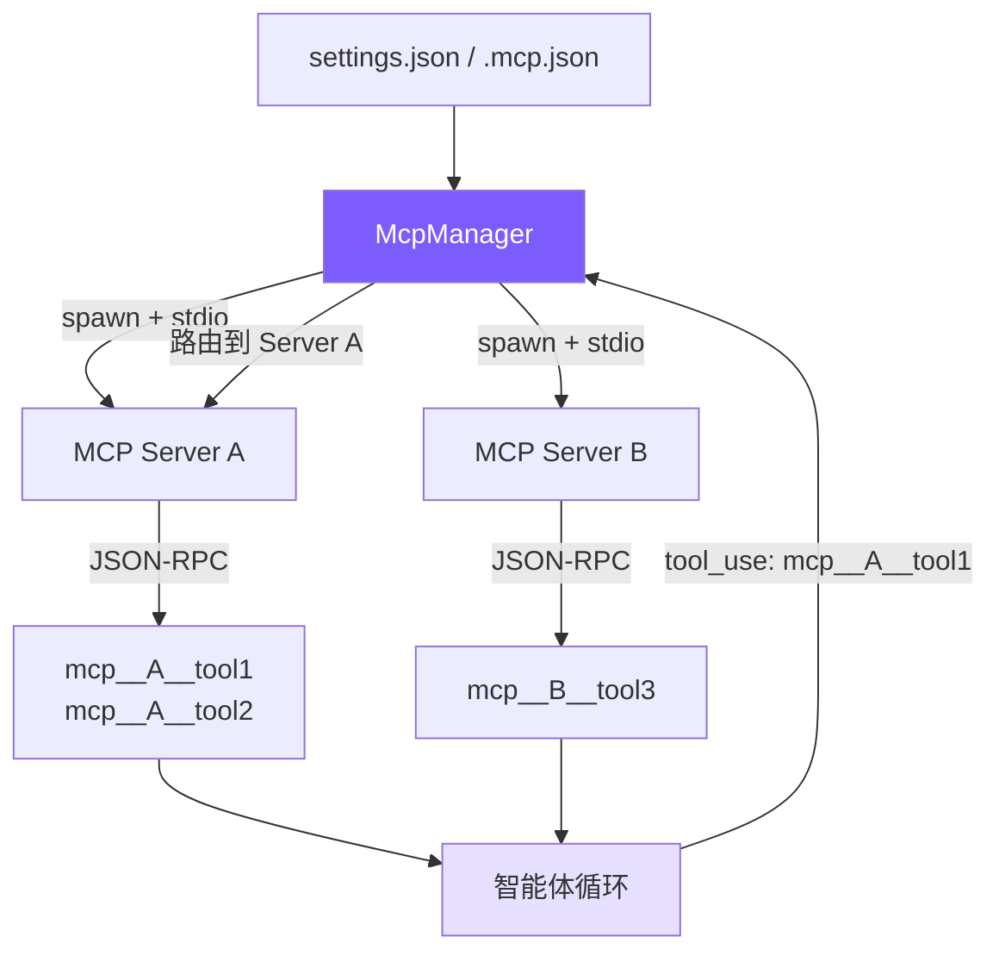

# 12. MCP 集成

## 本章目标

让 Agent 动态加载外部工具——连接数据库、Slack、GitHub 等服务，声明一个服务器地址即可，不改源码。



核心思路：**启动子进程 → JSON-RPC 握手 → 发现工具 → 前缀注册 → 透明路由**。对智能体循环来说，MCP 工具和内置工具没有区别——都是名字 + schema + 执行函数。

## Claude Code 怎么做的

MCP（Model Context Protocol）是 Anthropic 发布的开放协议，用于连接 AI 助手与外部工具。Claude Code 的 MCP 实现有以下要点：

**配置发现**：从 `settings.json`（用户级、项目级）和 `.mcp.json`（项目根目录）三处读取服务器配置，优先级后读覆盖先读。企业级还支持 MDM 策略下发。

**传输协议**：支持 stdio（子进程通信）和 SSE（HTTP 长连接）两种传输方式。stdio 是主流，SSE 用于远程服务。

**工具命名**：所有 MCP 工具以 `mcp__serverName__toolName` 格式注册，三段式命名同时解决了命名冲突和路由问题——从名字就能知道该转发到哪个服务器。

**连接生命周期**：spawn 进程 → `initialize` 握手（交换版本和能力）→ `notifications/initialized` 确认 → `tools/list` 发现工具 → 就绪。初始化和工具发现各有 15 秒超时。

**动态刷新**：Claude Code 支持运行时重新发现工具（服务器可以通知客户端工具列表已变更），我们简化为一次性发现。

**SDK 依赖**：Claude Code 使用 `@anthropic-ai/sdk` 内置的 MCP 客户端，封装了 JSON-RPC 细节。我们直接实现原始 JSON-RPC，不依赖任何 MCP SDK。

## 配置格式

用户只需在配置文件中声明 MCP 服务器，Agent 启动时自动连接：

```json
// ~/.claude/settings.json（用户级）或 .claude/settings.json（项目级）
{
  "mcpServers": {
    "filesystem": {
      "command": "npx",
      "args": ["@modelcontextprotocol/server-filesystem", "/tmp"],
      "env": {}
    },
    "github": {
      "command": "npx",
      "args": ["@modelcontextprotocol/server-github"],
      "env": {
        "GITHUB_TOKEN": "ghp_xxx"
      }
    }
  }
}
```

也可以使用项目根目录的 `.mcp.json`，格式相同。三处配置的服务器合并后一起连接，同名服务器后读覆盖先读。

配置里的 `command`、`args`、`env` 描述的是“怎么启动一个工具服务器”。Mini Claude 不关心服务器内部用什么语言写，也不关心它背后连接的是数据库、GitHub 还是本地文件系统。只要这个进程遵守 MCP 的 JSON-RPC 协议，客户端就能发现它暴露的工具并转发调用。

## 我们的实现

用 **~266 行** 的 `mini_claude/mcp_client.py` 实现完整的 MCP 客户端，无任何 SDK 依赖。

| Claude Code | 我们的实现 | 简化原因 |
|-------------|-----------|---------|
| `@anthropic-ai/sdk` MCP 客户端 | 原始 JSON-RPC（~100 行） | 无 SDK 依赖，读者能看到协议细节 |
| stdio + SSE 两种传输 | 仅 stdio | stdio 覆盖 95% 场景 |
| 动态工具刷新 | 一次性发现 | 教程场景不需要热更新 |
| 企业策略 + 3 种配置源 | settings.json + .mcp.json | 去掉企业级配置 |
| 重试 + 降级 | 静默跳过失败服务器 | 简化错误处理 |

## 关键代码

### 1. MCP 连接 — `McpConnection` 类

每个 MCP 服务器对应一个 `McpConnection` 实例，负责子进程管理和 JSON-RPC 通信。

```python
class McpConnection:
    def __init__(
        self,
        server_name: str,
        command: str,
        args: list[str] | None = None,
        env: dict[str, str] | None = None,
    ):
        # MCP 配置里的服务器名，后续会出现在 mcp__server__tool 前缀里。
        self.server_name = server_name
        # command/args/env 描述“如何启动这个 MCP 服务器进程”。
        self.command = command
        self.args = args or []
        self.env = env or {}
        # 子进程句柄；连接成功后才能通过 stdin/stdout 和服务器通信。
        self._process: asyncio.subprocess.Process | None = None
        # JSON-RPC 请求 id，自增即可，用来匹配请求和响应。
        self._next_id = 1
        # 等待中的请求表：请求 id -> Future。响应回来后按 id 找到并唤醒。
        self._pending: dict[int, asyncio.Future] = {}
        # 后台读 stdout 的任务，持续接收 MCP 服务器返回的 JSON-RPC 消息。
        self._reader_task: asyncio.Task | None = None
```

三个关键状态：`_process` 是子进程句柄，`_pending` 是请求-响应关联表（id → Future），`_reader_task` 是后台读任务，用于按行解析 JSON-RPC。

这里最重要的是 `_pending`。JSON-RPC 是异步协议，客户端可能连续发出多个请求，响应返回顺序不一定和发送顺序一致。每个请求都有自增 `id`，收到响应时用这个 `id` 找到对应 Future 并设置结果。没有这张表，客户端就不知道某条响应属于 `tools/list` 还是某次 `tools/call`。

#### 连接与消息解析

```python
async def connect(self) -> None:
    # MCP 配置里的 env 只覆盖/补充当前环境变量，不会丢掉 PATH 等基础变量。
    merged_env = {**os.environ, **self.env}
    # 启动 MCP 服务器。stdio 模式下，stdin/stdout 就是客户端和服务器的通信通道。
    self._process = await asyncio.create_subprocess_exec(
        self.command,
        *self.args,
        stdin=subprocess.PIPE,
        stdout=subprocess.PIPE,
        stderr=subprocess.PIPE,
        env=merged_env,
    )
    # 读循环必须后台运行，否则没人接收服务器返回的响应。
    self._reader_task = asyncio.create_task(self._read_loop())


async def _read_loop(self) -> None:
    assert self._process and self._process.stdout
    while True:
        # MCP stdio 约定：每一行是一条完整的 JSON-RPC 消息。
        line = await self._process.stdout.readline()
        if not line:
            # stdout 关闭通常表示服务器进程退出。
            break
        msg = json.loads(line)
        # 只有响应消息才有 id；通知消息可能没有 id。
        msg_id = msg.get("id")
        if msg_id is not None and msg_id in self._pending:
            # 找到当初发送请求时创建的 Future，并从 pending 表移除。
            future = self._pending.pop(msg_id)
            if "error" in msg:
                err = msg["error"]
                # JSON-RPC error 转成 Python 异常，让 await 的调用方感知失败。
                future.set_exception(RuntimeError(f"MCP error {err.get('code')}: {err.get('message')}"))
            else:
                # 正常响应只把 result 交给调用方，隐藏 JSON-RPC 外壳。
                future.set_result(msg.get("result"))
```

stdio 模式的核心：子进程的 stdin/stdout 作为双向通信通道，每行一个 JSON-RPC 消息。`_pending` 字典用自增 id 关联请求和响应——发送时存入 `Future`，收到响应时 `set_result()` 或 `set_exception()`。

选择“每行一个 JSON”让实现非常简单：读一行、`json.loads()`、按 `id` 分发。它不像 HTTP 那样需要端口，也不像 WebSocket 那样需要额外握手。代价是这个进程必须保持运行，且 stdout 不能随便打印非 JSON 内容，否则客户端解析会失败。

#### 请求与通知

JSON-RPC 有两种消息：**请求**（有 id，期望响应）和**通知**（无 id，发后不管）。

```python
async def _send_request(self, method: str, params: dict | None = None) -> Any:
    assert self._process and self._process.stdin
    # 给每个请求分配唯一 id；响应会带同一个 id 回来。
    req_id = self._next_id
    self._next_id += 1

    # 这就是一条标准 JSON-RPC 2.0 请求。
    msg = json.dumps({
        "jsonrpc": "2.0",
        "id": req_id,
        "method": method,
        "params": params or {},
    })
    # stdio 传输要求按行发送；末尾的 \n 是消息边界。
    self._process.stdin.write((msg + "\n").encode())
    await self._process.stdin.drain()

    # 先把 Future 存起来，再等待 _read_loop 收到响应后唤醒它。
    future = asyncio.get_event_loop().create_future()
    self._pending[req_id] = future
    return await future


def _send_notification(self, method: str, params: dict | None = None) -> None:
    if not self._process or not self._process.stdin:
        return
    # 通知没有 id，也就没有响应；常用于“我已初始化完成”这类单向事件。
    msg = json.dumps({"jsonrpc": "2.0", "method": method, "params": params or {}})
    self._process.stdin.write((msg + "\n").encode())
```

区别只在有无 `id` 字段。有 `id` 的消息写入 `pending` 等待配对；无 `id` 的直接写入 stdin 就结束。

#### 握手、发现、调用

```python
async def initialize(self) -> None:
    # initialize 是 MCP 标准握手：交换协议版本、客户端信息和能力声明。
    await self._send_request("initialize", {
        "protocolVersion": "2024-11-05",
        "capabilities": {},
        "clientInfo": {"name": "mini-claude", "version": "1.0.0"},
    })
    # MCP 要求 initialize 成功后再发 initialized 通知，表示客户端准备就绪。
    self._send_notification("notifications/initialized")


async def list_tools(self) -> list[dict]:
    # 请求服务器声明它支持哪些工具，以及每个工具的参数 schema。
    result = await self._send_request("tools/list")
    return [
        {
            "name": tool["name"],
            "description": tool.get("description", ""),
            "inputSchema": tool.get("inputSchema"),
            # 记录来源服务器，后面生成 mcp__server__tool 名字时要用。
            "serverName": self.server_name,
        }
        for tool in result.get("tools", [])
    ]


async def call_tool(self, name: str, args: dict) -> str:
    # 注意这里传给服务器的是原始工具名，不带 mcp__server__ 前缀。
    result = await self._send_request("tools/call", {"name": name, "arguments": args})
    if isinstance(result, dict) and isinstance(result.get("content"), list):
        # 当前教程只处理文本内容；图片、资源等 MCP 内容类型先忽略。
        return "\n".join(c["text"] for c in result["content"] if c.get("type") == "text")
    # 非标准返回兜底转成 JSON 字符串，仍然作为工具结果返回给模型。
    return json.dumps(result)
```

三步标准流程：`initialize`（版本协商）→ `listTools`（工具发现）→ `callTool`（执行调用）。MCP 协议要求 `initialize` 之后必须发 `notifications/initialized` 通知，告诉服务器客户端准备就绪。

`callTool` 的返回值处理值得注意：MCP 返回 `{ content: [{ type: "text", text: "..." }] }` 格式，我们只提取 `text` 类型的内容拼接返回——图片等其他类型暂不处理。

### 2. MCP 管理器 — `McpManager` 类

管理所有 MCP 连接的生命周期，对外提供统一接口。

#### 配置加载

```python
def _load_configs(self) -> dict[str, dict]:
    # 合并后的服务器配置；key 是 server name，value 是 command/args/env。
    merged: dict[str, dict] = {}

    # 1. 用户级配置，适合放通用 MCP server。
    global_path = Path.home() / ".claude" / "settings.json"
    self._merge_config_file(global_path, merged)

    # 2. 项目级配置，适合放当前项目专用 server。
    project_path = Path.cwd() / ".claude" / "settings.json"
    self._merge_config_file(project_path, merged)

    # 3. Claude Code 约定的项目根 MCP 配置。
    mcp_json_path = Path.cwd() / ".mcp.json"
    self._merge_config_file(mcp_json_path, merged)

    return merged


def _merge_config_file(self, path: Path, target: dict[str, dict]) -> None:
    if not path.exists():
        return
    raw = json.loads(path.read_text())
    # settings.json 通常包在 mcpServers 下；.mcp.json 也可能直接就是 server 字典。
    servers = raw.get("mcpServers", raw)
    for name, config in servers.items():
        # 只接受包含 command 的 server 配置，跳过其他无关字段。
        if isinstance(config, dict) and "command" in config:
            # 同名 server 后读覆盖先读，实现项目配置覆盖用户配置。
            target[name] = config
```

三处配置依次读取、合并，同名服务器后读覆盖先读。`raw.get("mcpServers", raw)` 这行兼容两种格式：`settings.json` 的 `mcpServers` 嵌套结构和 `.mcp.json` 的扁平结构。

#### 连接与发现

```python
async def load_and_connect(self) -> None:
    if self._connected:
        # 避免同一个 Agent 多次 chat 时重复启动 MCP 服务器。
        return
    self._connected = True

    configs = self._load_configs()
    # 初始化和工具发现都用这个超时，防止某个服务器卡住整个启动流程。
    timeout = 15.0

    for name, config in configs.items():
        # 每个 MCP server 一个独立连接和子进程。
        conn = McpConnection(name, config["command"], config.get("args"), config.get("env"))
        try:
            await conn.connect()
            # wait_for 是 Python asyncio 的超时包装。
            await asyncio.wait_for(conn.initialize(), timeout=timeout)
            server_tools = await asyncio.wait_for(conn.list_tools(), timeout=timeout)
            # 只有握手和工具发现都成功，才把连接纳入可用连接池。
            self._connections[name] = conn
            self._tools.extend(server_tools)
            print(f"[mcp] Connected to '{name}' — {len(server_tools)} tools", flush=True)
        except Exception as exc:
            # 单个 server 失败不影响其他 server，也不影响内置工具。
            print(f"[mcp] Failed to connect to '{name}': {exc}", flush=True)
            conn.close()
```

`asyncio.wait_for` 实现超时。为什么是 15 秒？MCP 服务器常用 `npx` 启动，首次运行需要下载包，但也不应该无限等待。每个服务器独立连接，一个失败不影响其他。

#### 工具定义转换

```python
def get_tool_definitions(self) -> list[dict]:
    return [
        {
            # 给 MCP 工具加三段式前缀，避免和内置工具或其他 server 的工具重名。
            "name": f"mcp__{tool['serverName']}__{tool['name']}",
            # 没有描述时补一个可读的默认描述，避免模型看到空说明。
            "description": tool.get("description") or f"MCP tool {tool['name']}",
            # MCP 的 inputSchema 转成 Anthropic 工具定义使用的 input_schema。
            "input_schema": tool.get("inputSchema") or {"type": "object", "properties": {}},
        }
        for tool in self._tools
    ]
```

关键操作：把 MCP 原始工具名转换成三段式前缀名。`filesystem` 服务器的 `read_file` 工具变成 `mcp__filesystem__read_file`。返回的格式直接符合 Anthropic API 的 tool 定义规范，可以直接拼接到工具列表里。

#### 路由与调用

```python
def is_mcp_tool(self, name: str) -> bool:
    # 所有 MCP 工具统一以前缀识别，agent.py 不需要额外查表。
    return name.startswith("mcp__")


async def call_tool(self, prefixed_name: str, args: dict) -> str:
    # prefixed_name 形如 mcp__filesystem__read_file。
    parts = prefixed_name.split("__")
    if len(parts) < 3:
        raise ValueError(f"Invalid MCP tool name: {prefixed_name}")

    # 第二段是服务器名；第三段开始才是原始 MCP 工具名。
    server_name = parts[1]
    # 工具名本身可能包含 __，所以不能只取 parts[2]。
    tool_name = "__".join(parts[2:])
    conn = self._connections.get(server_name)
    if not conn:
        raise RuntimeError(f"MCP server '{server_name}' not connected")
    # 路由到对应服务器后，用原始工具名发 tools/call。
    return await conn.call_tool(tool_name, args)
```

路由逻辑非常简洁：从前缀名中拆出服务器名和工具名，找到对应连接，转发调用。`"__".join(parts[2:])` 处理工具名本身可能包含 `__` 的情况（虽然罕见，但协议不禁止）。

### 3. Agent 集成

MCP 对智能体循环的侵入极小——只有两处改动。

#### 首次 chat 时懒加载

```python
async def chat(self, user_message: str) -> None:
    if not self._mcp_initialized and not self.is_sub_agent:
        # 首次 chat 才连接 MCP，避免 Agent 创建时就产生外部进程启动成本。
        self._mcp_initialized = True
        try:
            # 读取配置、启动服务器、握手、发现工具。
            await self._mcp_manager.load_and_connect()
            mcp_defs = self._mcp_manager.get_tool_definitions()
            if mcp_defs:
                # MCP 工具直接追加到当前工具池，对模型来说就是普通工具。
                self.tools = self.tools + mcp_defs
        except Exception as exc:
            # MCP 是增强能力，初始化失败不应该阻止普通对话和内置工具使用。
            print(f"[mcp] Init failed: {exc}", flush=True)

    self._aborted = False
    ...
```

三个设计决策：

1. **懒加载**（首次 chat 时，而非构造函数里）：用户可能只是想问个快问题，不需要付 MCP 连接的启动成本
2. **只在主 Agent 加载**：子 Agent 继承主 Agent 的工具列表，不需要重复连接
3. **失败不崩溃**：MCP 连接失败只输出日志，Agent 继续用内置工具工作

MCP 被设计成增强能力，而不是启动前提。一个项目即使配置了 GitHub MCP，用户也可能只是想解释本地函数；如果 GitHub token 过期就让整个 CLI 无法启动，体验会很差。因此当前实现把 MCP 初始化错误降级为日志，保证内置工具仍然可用。

#### 工具调用路由

```python
async def _execute_tool_call(self, name: str, inp: dict) -> str:
    # 这些工具依赖 Agent 当前状态，所以先在 agent.py 内部处理。
    if name in ("enter_plan_mode", "exit_plan_mode"):
        return await self._execute_plan_mode_tool(name)
    if name == "agent":
        return await self._execute_agent_tool(inp)
    if name == "skill":
        return await self._execute_skill_tool(inp)
    # MCP 工具只多一层路由，真正执行发生在外部 MCP server 里。
    if self._mcp_manager.is_mcp_tool(name):
        return await self._mcp_manager.call_tool(name, inp)
    # 剩下的是无状态内置工具，交给 tools.py 的统一执行器。
    return await execute_tool(name, inp, self._read_file_state)
```

一行 `if` 判断，一行转发调用。MCP 工具对智能体循环来说完全透明——模型看到的是 `mcp__filesystem__read_file`，发出 tool_use 调用，得到文本结果，跟内置工具没有任何区别。

透明路由的好处是主循环不用为每类外部服务写特殊逻辑。工具名里的 `mcp__server__tool` 已经包含服务器名和工具名，`McpManager.call_tool()` 只需要拆开名字，找到对应连接，再发送 `tools/call` 请求。新增 MCP 服务器不会改变 `agent.py` 的循环结构。

## 关键设计决策

### 为什么用 JSON-RPC over stdio 而不是 HTTP？

stdio 的优势是**零配置**：不需要端口管理、不需要发现服务、进程生命周期自动绑定到父进程。子进程退出时所有 `_pending` 请求都会被设置为异常，不存在连接泄漏。HTTP 方案需要处理端口冲突、进程发现、心跳检测，复杂度高一个数量级。

### 为什么用三段式前缀名（`mcp__server__tool`）？

一个名字同时解决两个问题：**避免冲突**（不同服务器可能有同名工具）和**嵌入路由信息**（从名字直接提取服务器名，无需额外映射表）。Claude Code 用完全相同的命名方案。

### 为什么 15 秒超时？

MCP 服务器常用 `npx` 启动，首次运行需要下载 npm 包，通常需要 3-8 秒。15 秒足够覆盖大多数情况，但不至于让用户等太久。超时后静默跳过该服务器，Agent 继续用其他可用工具工作。

### 为什么懒连接（首次 chat 时而非启动时）？

用户可能启动 Agent 只是想问一句"这个函数是什么意思"，根本用不到 MCP 工具。懒连接让这种场景零开销。代价是第一次需要 MCP 工具时会有几秒延迟，但只发生一次。

### 为什么不用 MCP SDK？

`@anthropic-ai/sdk` 提供了 MCP 客户端封装，但直接用原始 JSON-RPC 有两个好处：**零依赖**（不增加包体积）和**教学价值**（读者能看到协议的完整细节，理解 MCP 到底在做什么）。整个 JSON-RPC 通信只有 ~60 行代码，足够简单。

## 简化对比

| 维度 | Claude Code | mini-claude |
|------|------------|-------------|
| MCP SDK | `@anthropic-ai/sdk` 内置客户端 | 原始 JSON-RPC（无 SDK 依赖） |
| 服务器协议 | stdio + SSE | 仅 stdio |
| 工具发现 | 动态刷新（服务器可通知变更） | 一次性发现 |
| 配置来源 | settings.json + .mcp.json + 企业策略 | settings.json + .mcp.json |
| 错误处理 | 重试 + 降级 | 静默跳过失败服务器 |
| 连接时机 | 首次 chat 时懒加载 | 首次 chat 时懒加载 |
| 子 Agent 支持 | 独立 MCP 连接 | 主 Agent 专属，子 Agent 不连接 |

---

> **下一章**：完整的架构对比——从 ~3400 行到 50 万行，差距在哪里，以及下一步可以做什么。

## 本章小结：MCP 是给工具系统接外设

MCP 可以理解成“工具插件协议”。内置工具只能覆盖文件、shell、搜索、网络请求等基础能力；如果想访问数据库、浏览器、GitHub、Slack，就不适合把所有逻辑都写进 `tools.py`。MCP 的作用是让外部进程声明自己的工具，Mini Claude 发现后把它们接进同一个工具调用循环。

实现上，`mcp_client.py` 分成 `McpConnection` 和 `McpManager`。`McpConnection` 负责启动一个服务器进程，并用标准输入输出上的 JSON-RPC 发送 `initialize`、`tools/list`、`tools/call`。`McpManager` 负责读取配置、管理多个连接、给外部工具加上 `mcp__server__tool` 前缀，避免和内置工具重名。

相关概念是“透明路由”。模型看到的 MCP 工具仍然是普通工具 schema；调用时只是工具名多了前缀。`Agent._execute_tool_call()` 发现名字是 MCP 工具，就转发给 manager。对主循环来说，MCP 工具和内置工具没有本质区别：输入是参数字典，输出是文本结果。
